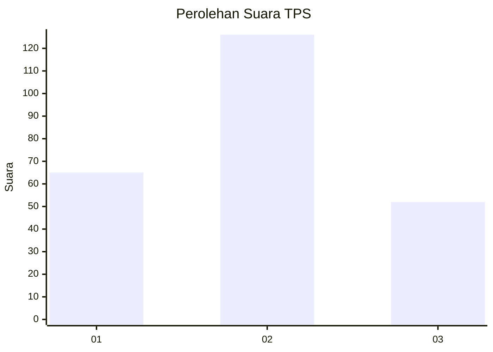
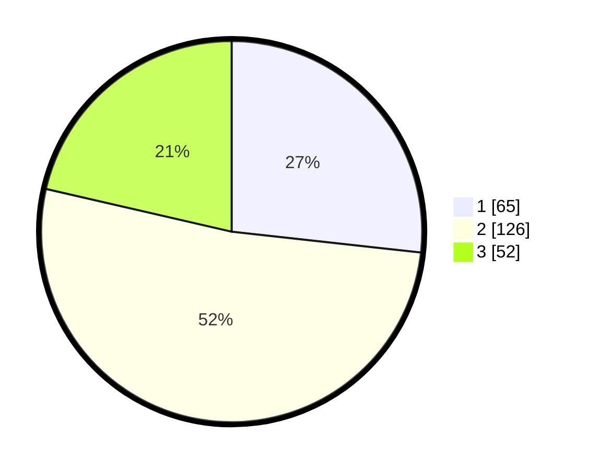

# Hasil

## Grafik

## Tabel

| No. | Nama Paslon    | Suara | Suara (raw) | Persentase |
|:--- |:-------------- | -----:| -----------:| ----------:|
| 1   | ANIES MUHAIMIN | 65    | [65][p-1]   | 26,75      |
| 2   | PRABOWO GIBRAN | 126   | [126][p-2]  | 51,85      |
| 3   | GANJAR MAHFUD  | 52    | [52][p-3]   | 21,40      |

[p-1]: https://github.com/gigit-pemilu/pemilu-2024-35-jawa-timur/blob/main/pilpres/hitung-suara/sub/35-jawa-timur/sub/07-malang/sub/22-dau/sub/2010-sumbersekar/sub/003-tps/sub/paslon-1.txt
[p-2]: https://github.com/gigit-pemilu/pemilu-2024-35-jawa-timur/blob/main/pilpres/hitung-suara/sub/35-jawa-timur/sub/07-malang/sub/22-dau/sub/2010-sumbersekar/sub/003-tps/sub/paslon-2.txt
[p-3]: https://github.com/gigit-pemilu/pemilu-2024-35-jawa-timur/blob/main/pilpres/hitung-suara/sub/35-jawa-timur/sub/07-malang/sub/22-dau/sub/2010-sumbersekar/sub/003-tps/sub/paslon-3.txt

## Foto C Plano

https://sirekap-obj-formc.kpu.go.id/2891/pemilu/ppwp/35/07/22/20/10/3507222010003-20240215-001257--dbd8f405-d2a2-45eb-980a-e66fa895ac57.jpg

https://sirekap-obj-formc.kpu.go.id/2891/pemilu/ppwp/35/07/22/20/10/3507222010003-20240215-001446--a9b16232-7ffd-48a4-8137-aa32ef237ac7.jpg

https://sirekap-obj-formc.kpu.go.id/2891/pemilu/ppwp/35/07/22/20/10/3507222010003-20240215-001543--9cc35c6b-2612-4f99-a0a1-320e395d1943.jpg

## Metadata

| Key        | Value               |
| ---------- | ------------------- |
| Time Stamp | 2024-02-25 15:00:00 |

