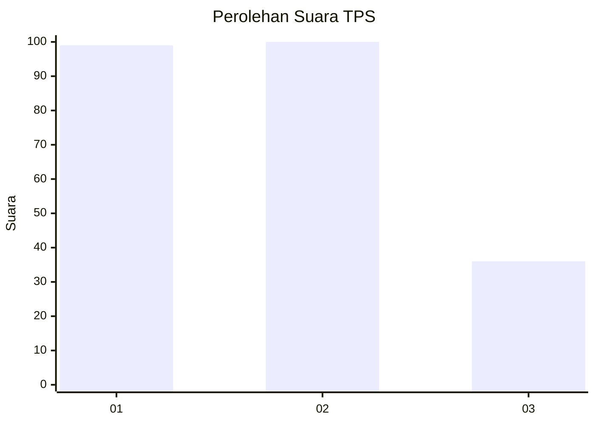
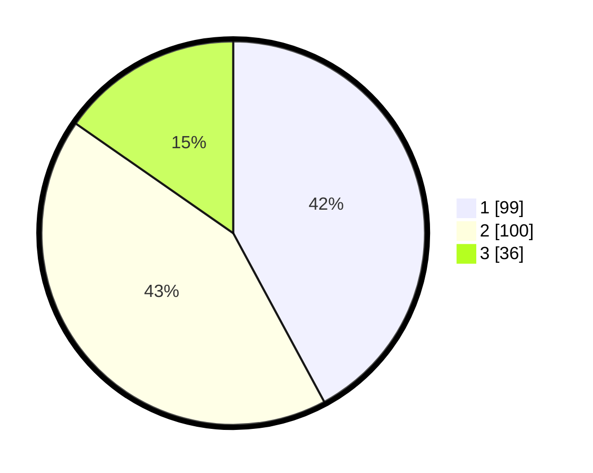

# Hasil

## Grafik

## Tabel

| No. | Nama Paslon    | Suara | Suara (raw) | Persentase |
|:--- |:-------------- | -----:| -----------:| ----------:|
| 1   | ANIES MUHAIMIN | 99    | [99][p-1]   | 42,13      |
| 2   | PRABOWO GIBRAN | 100   | [100][p-2]  | 42,55      |
| 3   | GANJAR MAHFUD  | 36    | [36][p-3]   | 15,32      |

[p-1]: https://github.com/gigit-pemilu/pemilu-2024/blob/main/pilpres/hitung-suara/sub/35-jawa-timur/sub/07-malang/sub/22-dau/sub/2010-sumbersekar/sub/007-tps/sub/paslon-1.txt
[p-2]: https://github.com/gigit-pemilu/pemilu-2024/blob/main/pilpres/hitung-suara/sub/35-jawa-timur/sub/07-malang/sub/22-dau/sub/2010-sumbersekar/sub/007-tps/sub/paslon-2.txt
[p-3]: https://github.com/gigit-pemilu/pemilu-2024/blob/main/pilpres/hitung-suara/sub/35-jawa-timur/sub/07-malang/sub/22-dau/sub/2010-sumbersekar/sub/007-tps/sub/paslon-3.txt

## Foto C Plano

https://sirekap-obj-formc.kpu.go.id/ead9/pemilu/ppwp/35/07/22/20/10/3507222010007-20240214-155805--995b79bc-5585-496f-b731-3f45fb577222.jpg

https://sirekap-obj-formc.kpu.go.id/ead9/pemilu/ppwp/35/07/22/20/10/3507222010007-20240214-155146--6a30300b-297c-4c71-b242-7c975d691f51.jpg

## Metadata

| Key        | Value               |
| ---------- | ------------------- |
| Time Stamp | 2024-02-25 12:00:00 |

