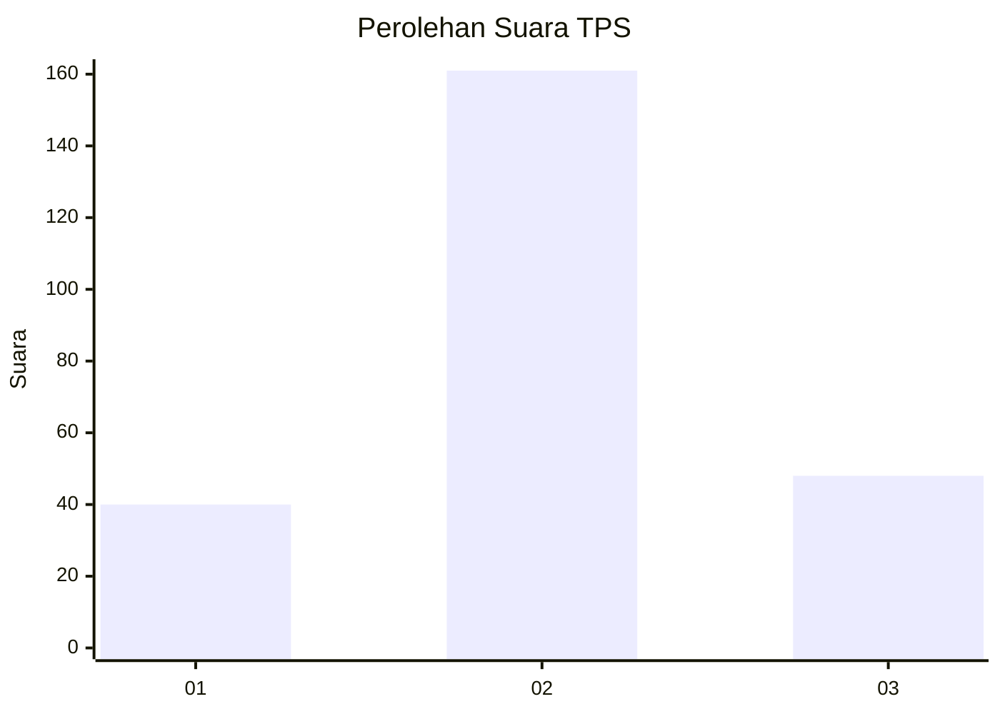
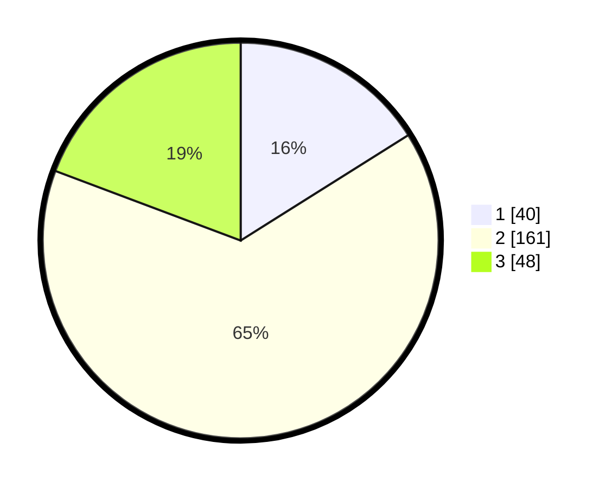

# Hasil

## Grafik

## Tabel

| No. | Nama Paslon    | Suara | Suara (raw) | Persentase |
|:--- |:-------------- | -----:| -----------:| ----------:|
| 1   | ANIES MUHAIMIN | 40    | [40][p-1]   | 16,06      |
| 2   | PRABOWO GIBRAN | 161   | [161][p-2]  | 64,66      |
| 3   | GANJAR MAHFUD  | 48    | [48][p-3]   | 19,28      |

[p-1]: https://github.com/gigit-pemilu/pemilu-2024-35-jawa-timur/blob/main/pilpres/hitung-suara/sub/35-jawa-timur/sub/07-malang/sub/22-dau/sub/2010-sumbersekar/sub/008-tps/sub/paslon-1.txt
[p-2]: https://github.com/gigit-pemilu/pemilu-2024-35-jawa-timur/blob/main/pilpres/hitung-suara/sub/35-jawa-timur/sub/07-malang/sub/22-dau/sub/2010-sumbersekar/sub/008-tps/sub/paslon-2.txt
[p-3]: https://github.com/gigit-pemilu/pemilu-2024-35-jawa-timur/blob/main/pilpres/hitung-suara/sub/35-jawa-timur/sub/07-malang/sub/22-dau/sub/2010-sumbersekar/sub/008-tps/sub/paslon-3.txt

## Foto C Plano

https://sirekap-obj-formc.kpu.go.id/1c77/pemilu/ppwp/35/07/22/20/10/3507222010008-20240215-025922--5d3cccdf-269a-42ea-ade1-3dd9e6c1619a.jpg

https://sirekap-obj-formc.kpu.go.id/1c77/pemilu/ppwp/35/07/22/20/10/3507222010008-20240215-030008--c64ddc3b-d1f6-4049-8d1d-1462bad2175a.jpg

https://sirekap-obj-formc.kpu.go.id/1c77/pemilu/ppwp/35/07/22/20/10/3507222010008-20240215-030111--b99d6ac1-4851-427a-a4ca-76ea5cf8ff75.jpg

## Metadata

| Key        | Value               |
| ---------- | ------------------- |
| Time Stamp | 2024-02-26 11:00:00 |

