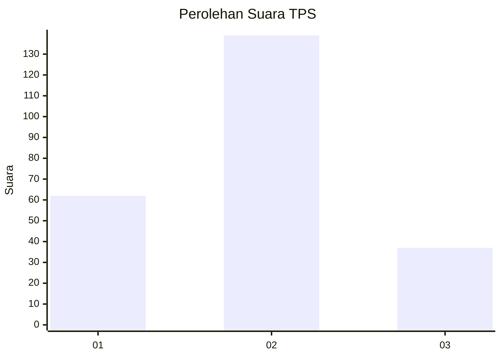

# Hasil

## Grafik

## Tabel

| No. | Nama Paslon    | Suara | Suara (raw) | Persentase |
|:--- |:-------------- | -----:| -----------:| ----------:|
| 1   | ANIES MUHAIMIN | 62    | [62][p-1]   | 26,05      |
| 2   | PRABOWO GIBRAN | 139   | [139][p-2]  | 58,40      |
| 3   | GANJAR MAHFUD  | 37    | [37][p-3]   | 15,55      |

[p-1]: https://github.com/gigit-pemilu/pemilu-2024/blob/main/pilpres/hitung-suara/sub/35-jawa-timur/sub/07-malang/sub/22-dau/sub/2010-sumbersekar/sub/010-tps/sub/paslon-1.txt
[p-2]: https://github.com/gigit-pemilu/pemilu-2024/blob/main/pilpres/hitung-suara/sub/35-jawa-timur/sub/07-malang/sub/22-dau/sub/2010-sumbersekar/sub/010-tps/sub/paslon-2.txt
[p-3]: https://github.com/gigit-pemilu/pemilu-2024/blob/main/pilpres/hitung-suara/sub/35-jawa-timur/sub/07-malang/sub/22-dau/sub/2010-sumbersekar/sub/010-tps/sub/paslon-3.txt

## Foto C Plano

https://sirekap-obj-formc.kpu.go.id/5c9e/pemilu/ppwp/35/07/22/20/10/3507222010010-20240214-224010--7f12c18d-9815-4d54-916c-5284155e98c7.jpg

https://sirekap-obj-formc.kpu.go.id/5c9e/pemilu/ppwp/35/07/22/20/10/3507222010010-20240214-224229--9e05becc-223f-4561-ac33-8cef87ee8313.jpg

https://sirekap-obj-formc.kpu.go.id/5c9e/pemilu/ppwp/35/07/22/20/10/3507222010010-20240214-224503--2f10ea9c-43e3-4da0-9fd6-0a10d7a61471.jpg

## Metadata

| Key        | Value               |
| ---------- | ------------------- |
| Time Stamp | 2024-02-25 13:00:00 |

