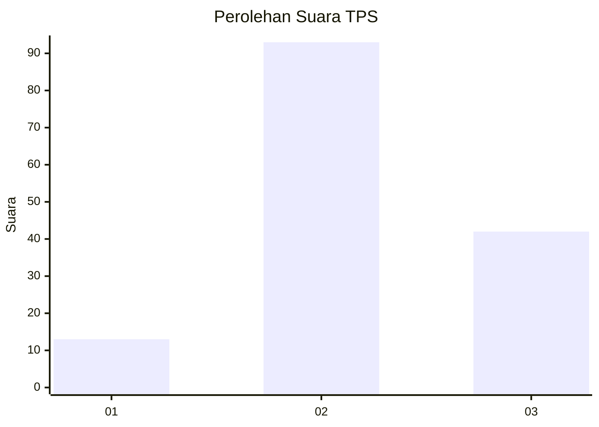
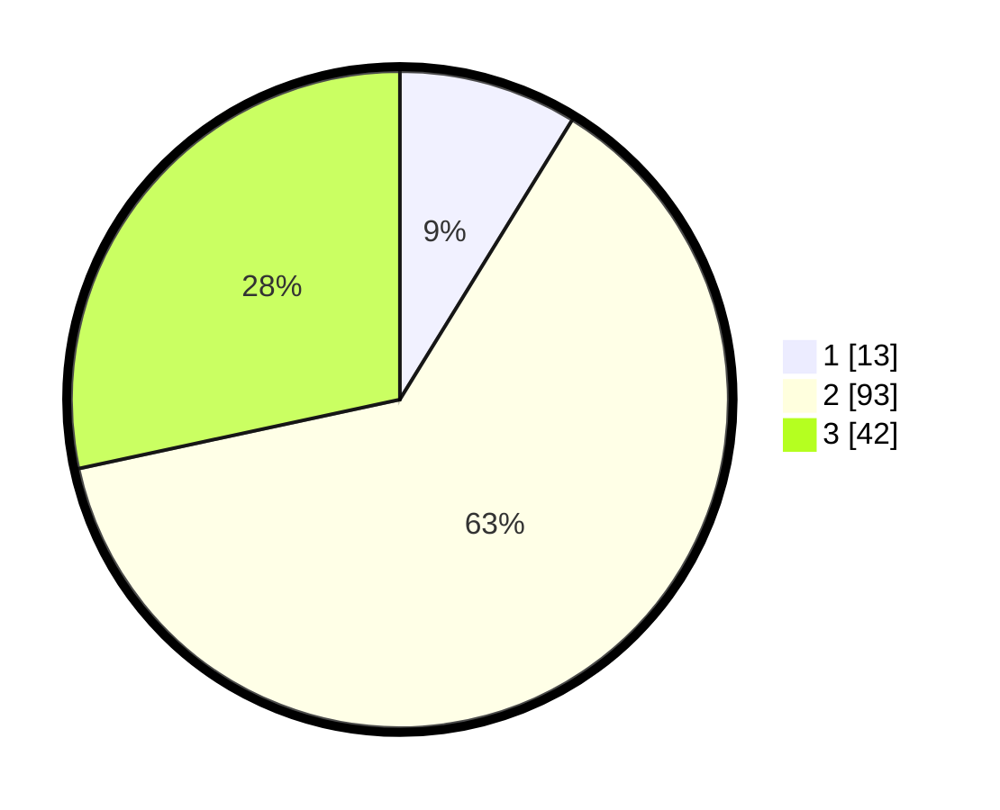

# Hasil

## Grafik

## Tabel

| No. | Nama Paslon    | Suara | Suara (raw) | Persentase |
|:--- |:-------------- | -----:| -----------:| ----------:|
| 1   | ANIES MUHAIMIN | 13    | [13][p-1]   | 8,78       |
| 2   | PRABOWO GIBRAN | 93    | [93][p-2]   | 62,84      |
| 3   | GANJAR MAHFUD  | 42    | [42][p-3]   | 28,38      |

[p-1]: https://github.com/gigit-pemilu/pemilu-2024/blob/main/pilpres/hitung-suara/sub/35-jawa-timur/sub/07-malang/sub/22-dau/sub/2010-sumbersekar/sub/016-tps/sub/paslon-1.txt
[p-2]: https://github.com/gigit-pemilu/pemilu-2024/blob/main/pilpres/hitung-suara/sub/35-jawa-timur/sub/07-malang/sub/22-dau/sub/2010-sumbersekar/sub/016-tps/sub/paslon-2.txt
[p-3]: https://github.com/gigit-pemilu/pemilu-2024/blob/main/pilpres/hitung-suara/sub/35-jawa-timur/sub/07-malang/sub/22-dau/sub/2010-sumbersekar/sub/016-tps/sub/paslon-3.txt

## Foto C Plano

https://sirekap-obj-formc.kpu.go.id/c302/pemilu/ppwp/35/07/22/20/10/3507222010016-20240214-141224--ca24a804-b135-42d4-8631-6628662dab61.jpg

https://sirekap-obj-formc.kpu.go.id/c302/pemilu/ppwp/35/07/22/20/10/3507222010016-20240214-141602--645b42dc-c83d-4d87-93cc-13271ac20c18.jpg

https://sirekap-obj-formc.kpu.go.id/c302/pemilu/ppwp/35/07/22/20/10/3507222010016-20240214-141743--2fd15f2d-dfc2-4189-a7de-a0546571c6df.jpg

## Metadata

| Key        | Value               |
| ---------- | ------------------- |
| Time Stamp | 2024-02-24 22:31:28 |

