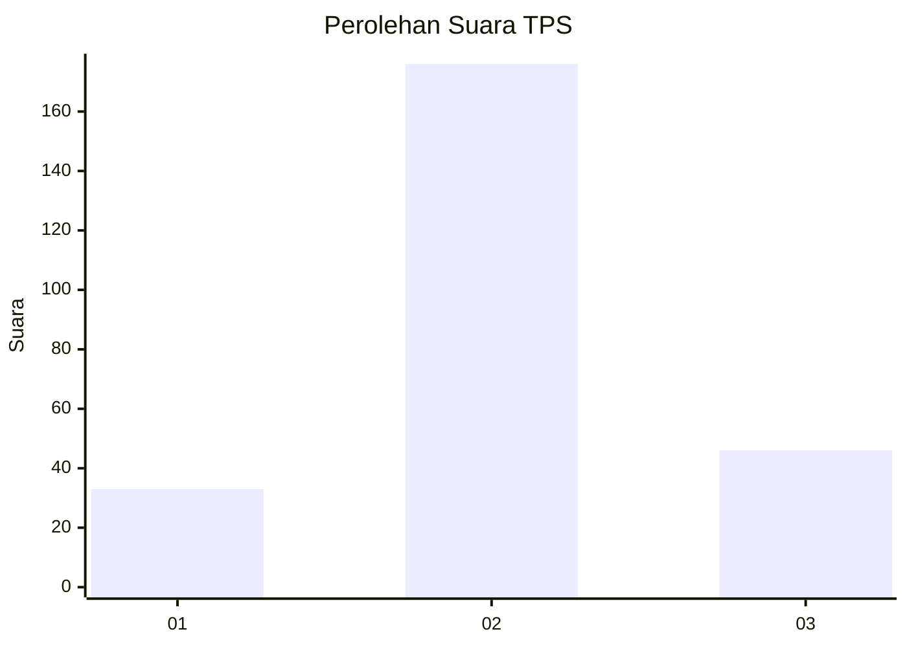
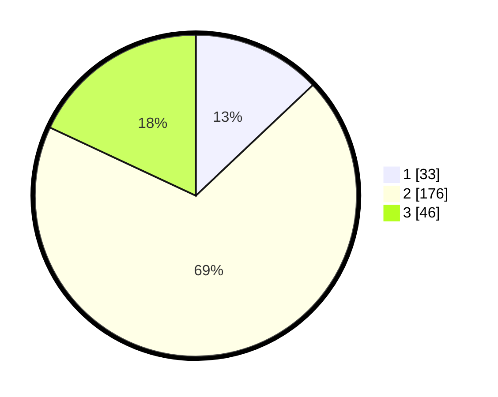

# Hasil

## Grafik

## Tabel

| No. | Nama Paslon    | Suara | Suara (raw) | Persentase |
|:--- |:-------------- | -----:| -----------:| ----------:|
| 1   | ANIES MUHAIMIN | 33    | [33][p-1]   | 12,94      |
| 2   | PRABOWO GIBRAN | 176   | [176][p-2]  | 69,02      |
| 3   | GANJAR MAHFUD  | 46    | [46][p-3]   | 18,04      |

[p-1]: https://github.com/gigit-pemilu/pemilu-2024-35-jawa-timur/blob/main/pilpres/hitung-suara/sub/35-jawa-timur/sub/07-malang/sub/23-karangploso/sub/2001-tegalgondo/sub/001-tps/sub/paslon-1.txt
[p-2]: https://github.com/gigit-pemilu/pemilu-2024-35-jawa-timur/blob/main/pilpres/hitung-suara/sub/35-jawa-timur/sub/07-malang/sub/23-karangploso/sub/2001-tegalgondo/sub/001-tps/sub/paslon-2.txt
[p-3]: https://github.com/gigit-pemilu/pemilu-2024-35-jawa-timur/blob/main/pilpres/hitung-suara/sub/35-jawa-timur/sub/07-malang/sub/23-karangploso/sub/2001-tegalgondo/sub/001-tps/sub/paslon-3.txt

## Foto C Plano

https://sirekap-obj-formc.kpu.go.id/60e6/pemilu/ppwp/35/07/23/20/01/3507232001001-20240214-185930--6020df23-ea23-4647-ad00-71116ad2ec3d.jpg

https://sirekap-obj-formc.kpu.go.id/60e6/pemilu/ppwp/35/07/23/20/01/3507232001001-20240214-185656--a1255fd8-00b0-4772-acaf-358a2564a4c8.jpg

https://sirekap-obj-formc.kpu.go.id/60e6/pemilu/ppwp/35/07/23/20/01/3507232001001-20240214-184954--5f8f2ef8-9b2c-46ae-972d-3b23f8daec50.jpg

## Metadata

| Key        | Value               |
| ---------- | ------------------- |
| Time Stamp | 2024-02-16 08:00:28 |

## DATA PEMILIH TETAP

Jumlah pemilih dalam DPT: **282**.
 * L: **149**.
 * P: **133**.

## DATA PENGGUNA HAK PILIH

Jumlah pengguna hak pilih dalam DPT: **243**.
 * L: **130**.
 * P: **113**.

Jumlah pengguna hak pilih dalam DPTb: **15**.
 * L: **5**.
 * P: **10**.

Jumlah pengguna hak pilih dalam DPK: **3**.
 * L: **2**.
 * P: **1**.

Jumlah pengguna hak pilih: **261**.
 * L: **137**.
 * P: **124**.

## JUMLAH SUARA SAH DAN TIDAK SAH

JUMLAH SELURUH SUARA SAH: **255**.

JUMLAH SUARA TIDAK SAH: **6**.

JUMLAH SELURUH SUARA SAH DAN SUARA TIDAK SAH: **261**.

