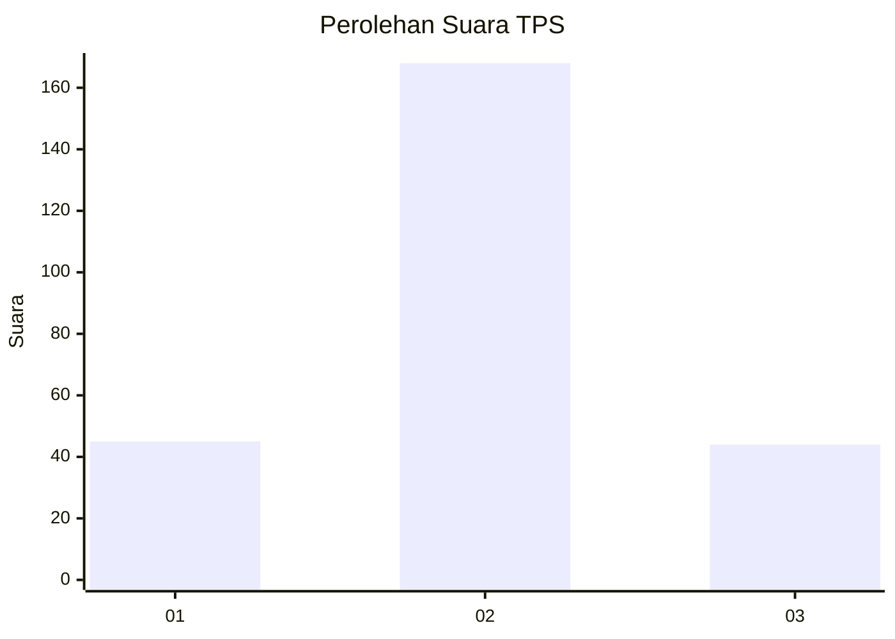
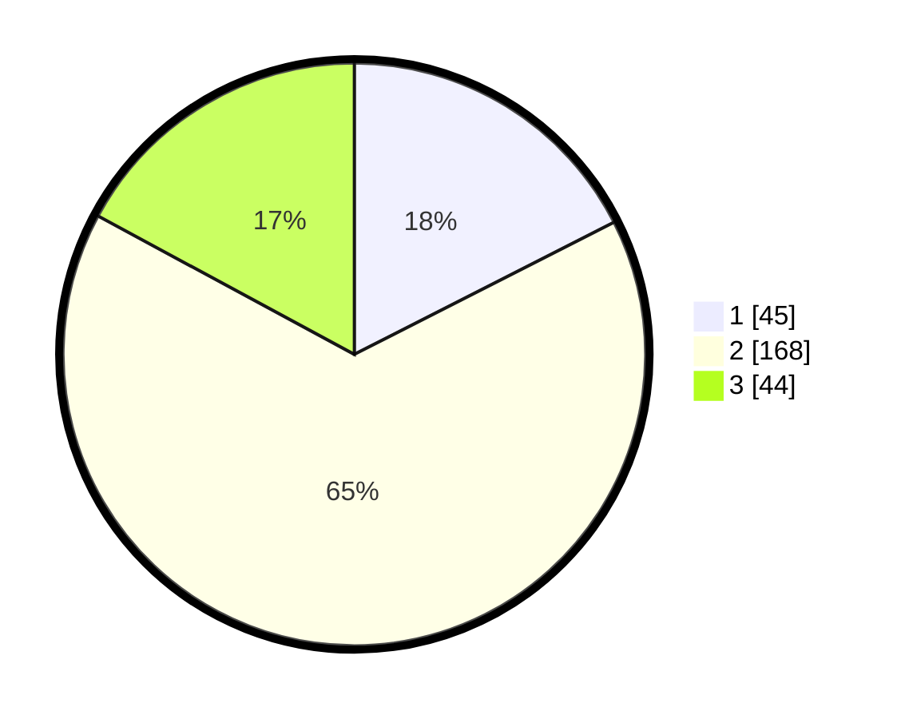

# Hasil

## Grafik

## Tabel

| No. | Nama Paslon    | Suara | Suara (raw) | Persentase |
|:--- |:-------------- | -----:| -----------:| ----------:|
| 1   | ANIES MUHAIMIN | 45    | [45][p-1]   | 17,51      |
| 2   | PRABOWO GIBRAN | 168   | [168][p-2]  | 65,37      |
| 3   | GANJAR MAHFUD  | 44    | [44][p-3]   | 17,12      |

[p-1]: https://github.com/gigit-pemilu/pemilu-2024/blob/main/pilpres/hitung-suara/sub/35-jawa-timur/sub/07-malang/sub/23-karangploso/sub/2001-tegalgondo/sub/002-tps/sub/paslon-1.txt
[p-2]: https://github.com/gigit-pemilu/pemilu-2024/blob/main/pilpres/hitung-suara/sub/35-jawa-timur/sub/07-malang/sub/23-karangploso/sub/2001-tegalgondo/sub/002-tps/sub/paslon-2.txt
[p-3]: https://github.com/gigit-pemilu/pemilu-2024/blob/main/pilpres/hitung-suara/sub/35-jawa-timur/sub/07-malang/sub/23-karangploso/sub/2001-tegalgondo/sub/002-tps/sub/paslon-3.txt

## Foto C Plano

https://sirekap-obj-formc.kpu.go.id/5939/pemilu/ppwp/35/07/23/20/01/3507232001002-20240214-214934--9cb06964-416b-4496-a59c-14e744a731cb.jpg

https://sirekap-obj-formc.kpu.go.id/5939/pemilu/ppwp/35/07/23/20/01/3507232001002-20240214-215011--c49b7281-0f5f-49b9-92bc-2bf15a404394.jpg

https://sirekap-obj-formc.kpu.go.id/5939/pemilu/ppwp/35/07/23/20/01/3507232001002-20240214-215044--9defd713-750d-49ab-bbc2-5ea7a0cc3d6b.jpg

## Metadata

| Key        | Value               |
| ---------- | ------------------- |
| Time Stamp | 2024-02-15 15:00:29 |

## DATA PEMILIH TETAP

Jumlah pemilih dalam DPT: **291**.
 * L: **148**.
 * P: **143**.

## DATA PENGGUNA HAK PILIH

Jumlah pengguna hak pilih dalam DPT: **248**.
 * L: **119**.
 * P: **129**.

Jumlah pengguna hak pilih dalam DPTb: **11**.
 * L: **3**.
 * P: **8**.

Jumlah pengguna hak pilih dalam DPK: **0**.
 * L: **0**.
 * P: **0**.

Jumlah pengguna hak pilih: **259**.
 * L: **122**.
 * P: **137**.

## JUMLAH SUARA SAH DAN TIDAK SAH

JUMLAH SELURUH SUARA SAH: **257**.

JUMLAH SUARA TIDAK SAH: **2**.

JUMLAH SELURUH SUARA SAH DAN SUARA TIDAK SAH: **259**.

