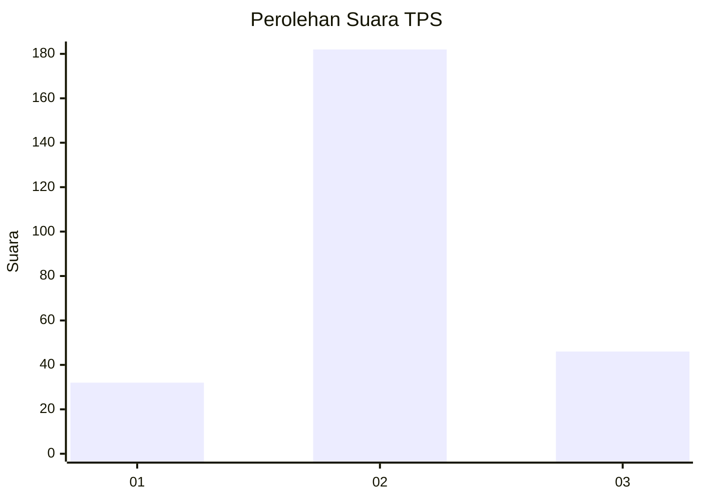
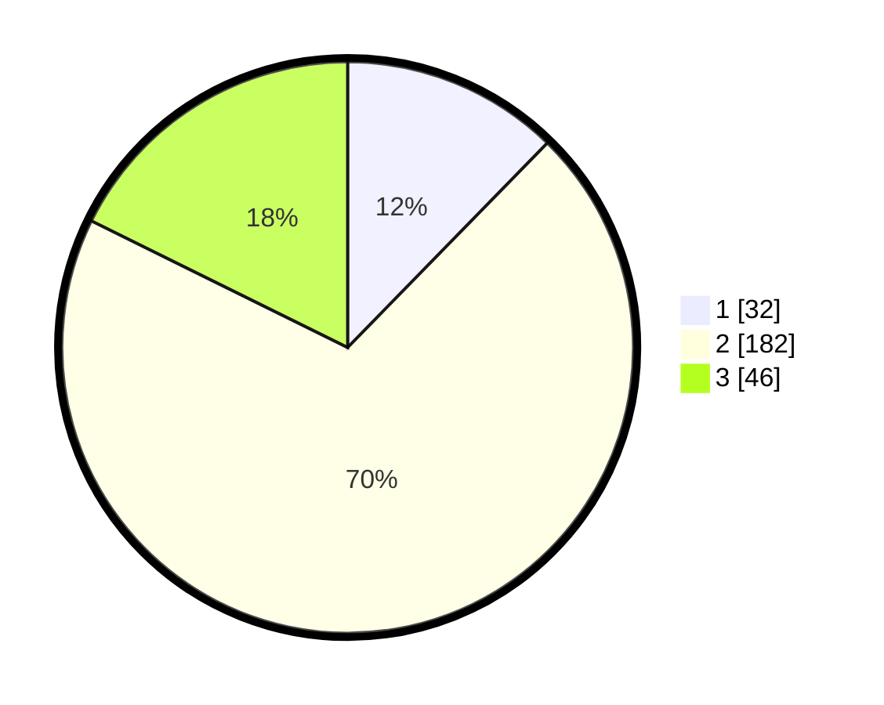

# Hasil

## Grafik

## Tabel

| No. | Nama Paslon    | Suara | Suara (raw) | Persentase |
|:--- |:-------------- | -----:| -----------:| ----------:|
| 1   | ANIES MUHAIMIN | 32    | [32][p-1]   | 12,31      |
| 2   | PRABOWO GIBRAN | 182   | [182][p-2]  | 70,00      |
| 3   | GANJAR MAHFUD  | 46    | [46][p-3]   | 17,69      |

[p-1]: https://github.com/gigit-pemilu/pemilu-2024/blob/main/pilpres/hitung-suara/sub/35-jawa-timur/sub/07-malang/sub/23-karangploso/sub/2001-tegalgondo/sub/003-tps/sub/paslon-1.txt
[p-2]: https://github.com/gigit-pemilu/pemilu-2024/blob/main/pilpres/hitung-suara/sub/35-jawa-timur/sub/07-malang/sub/23-karangploso/sub/2001-tegalgondo/sub/003-tps/sub/paslon-2.txt
[p-3]: https://github.com/gigit-pemilu/pemilu-2024/blob/main/pilpres/hitung-suara/sub/35-jawa-timur/sub/07-malang/sub/23-karangploso/sub/2001-tegalgondo/sub/003-tps/sub/paslon-3.txt

## Foto C Plano

https://sirekap-obj-formc.kpu.go.id/fee0/pemilu/ppwp/35/07/23/20/01/3507232001003-20240215-023104--cf1fc47c-ab5a-4ece-bc47-328fd709c819.jpg

https://sirekap-obj-formc.kpu.go.id/fee0/pemilu/ppwp/35/07/23/20/01/3507232001003-20240215-023544--6d7fe516-96e6-43ba-9382-065168d0458c.jpg

https://sirekap-obj-formc.kpu.go.id/fee0/pemilu/ppwp/35/07/23/20/01/3507232001003-20240215-023659--eb34901f-3647-4b16-b945-d4d0d67ba86e.jpg

## Metadata

| Key        | Value               |
| ---------- | ------------------- |
| Time Stamp | 2024-02-15 19:00:26 |

## DATA PEMILIH TETAP

Jumlah pemilih dalam DPT: **294**.
 * L: **136**.
 * P: **158**.

## DATA PENGGUNA HAK PILIH

Jumlah pengguna hak pilih dalam DPT: **259**.
 * L: **116**.
 * P: **143**.

Jumlah pengguna hak pilih dalam DPTb: **5**.
 * L: **2**.
 * P: **3**.

Jumlah pengguna hak pilih dalam DPK: **1**.
 * L: **1**.
 * P: **0**.

Jumlah pengguna hak pilih: **265**.
 * L: **119**.
 * P: **146**.

## JUMLAH SUARA SAH DAN TIDAK SAH

JUMLAH SELURUH SUARA SAH: **260**.

JUMLAH SUARA TIDAK SAH: **5**.

JUMLAH SELURUH SUARA SAH DAN SUARA TIDAK SAH: **265**.

