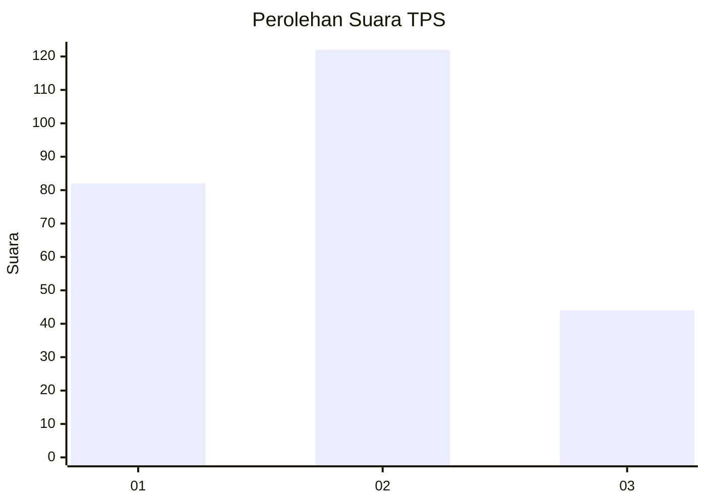
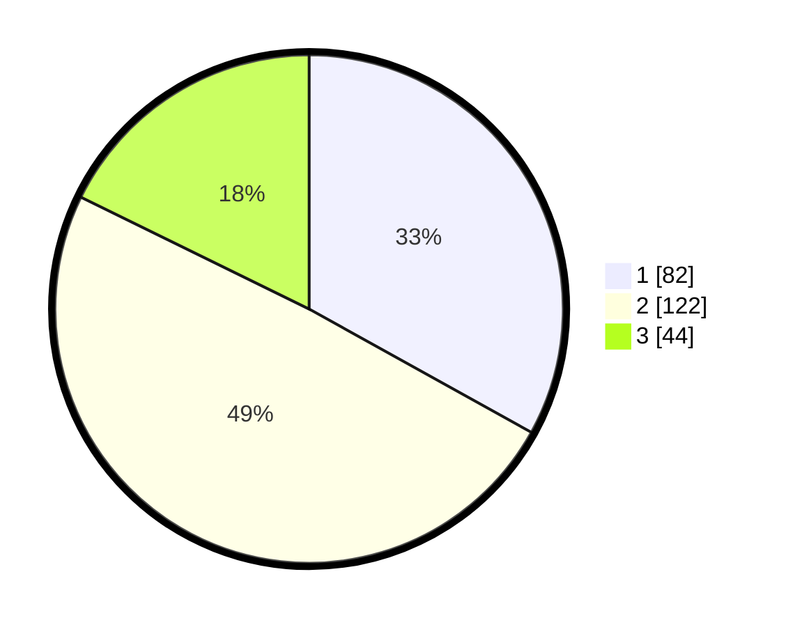

# Hasil

## Grafik

## Tabel

| No. | Nama Paslon    | Suara | Suara (raw) | Persentase |
|:--- |:-------------- | -----:| -----------:| ----------:|
| 1   | ANIES MUHAIMIN | 82    | [82][p-1]   | 33,06      |
| 2   | PRABOWO GIBRAN | 122   | [122][p-2]  | 49,19      |
| 3   | GANJAR MAHFUD  | 44    | [44][p-3]   | 17,74      |

[p-1]: https://github.com/gigit-pemilu/pemilu-2024/blob/main/pilpres/hitung-suara/sub/35-jawa-timur/sub/07-malang/sub/23-karangploso/sub/2001-tegalgondo/sub/005-tps/sub/paslon-1.txt
[p-2]: https://github.com/gigit-pemilu/pemilu-2024/blob/main/pilpres/hitung-suara/sub/35-jawa-timur/sub/07-malang/sub/23-karangploso/sub/2001-tegalgondo/sub/005-tps/sub/paslon-2.txt
[p-3]: https://github.com/gigit-pemilu/pemilu-2024/blob/main/pilpres/hitung-suara/sub/35-jawa-timur/sub/07-malang/sub/23-karangploso/sub/2001-tegalgondo/sub/005-tps/sub/paslon-3.txt

## Foto C Plano

https://sirekap-obj-formc.kpu.go.id/d93b/pemilu/ppwp/35/07/23/20/01/3507232001005-20240218-115727--2cf16b94-29ac-40e3-a2a6-e2a8a3acbd98.jpg

https://sirekap-obj-formc.kpu.go.id/d93b/pemilu/ppwp/35/07/23/20/01/3507232001005-20240218-115804--f5412456-e1c8-4b1b-8174-151725e525cd.jpg

https://sirekap-obj-formc.kpu.go.id/d93b/pemilu/ppwp/35/07/23/20/01/3507232001005-20240218-115904--11b7c8f8-eda7-4d56-8cc2-43336b9bc3f5.jpg

## Metadata

| Key        | Value               |
| ---------- | ------------------- |
| Time Stamp | 2024-02-19 06:16:00 |

## DATA PEMILIH TETAP

Jumlah pemilih dalam DPT: **293**.
 * L: **145**.
 * P: **148**.

## DATA PENGGUNA HAK PILIH

Jumlah pengguna hak pilih dalam DPT: **245**.
 * L: **115**.
 * P: **130**.

Jumlah pengguna hak pilih dalam DPTb: **12**.
 * L: **2**.
 * P: **10**.

Jumlah pengguna hak pilih dalam DPK: **1**.
 * L: **0**.
 * P: **1**.

Jumlah pengguna hak pilih: **258**.
 * L: **117**.
 * P: **141**.

## JUMLAH SUARA SAH DAN TIDAK SAH

JUMLAH SELURUH SUARA SAH: **248**.

JUMLAH SUARA TIDAK SAH: **10**.

JUMLAH SELURUH SUARA SAH DAN SUARA TIDAK SAH: **258**.

