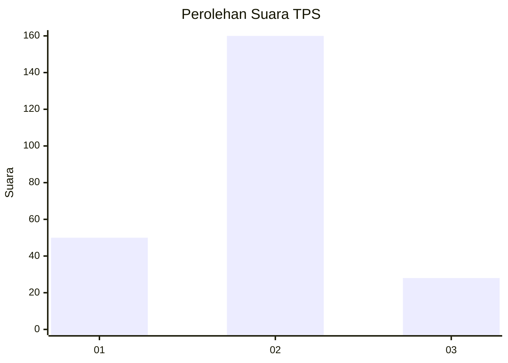
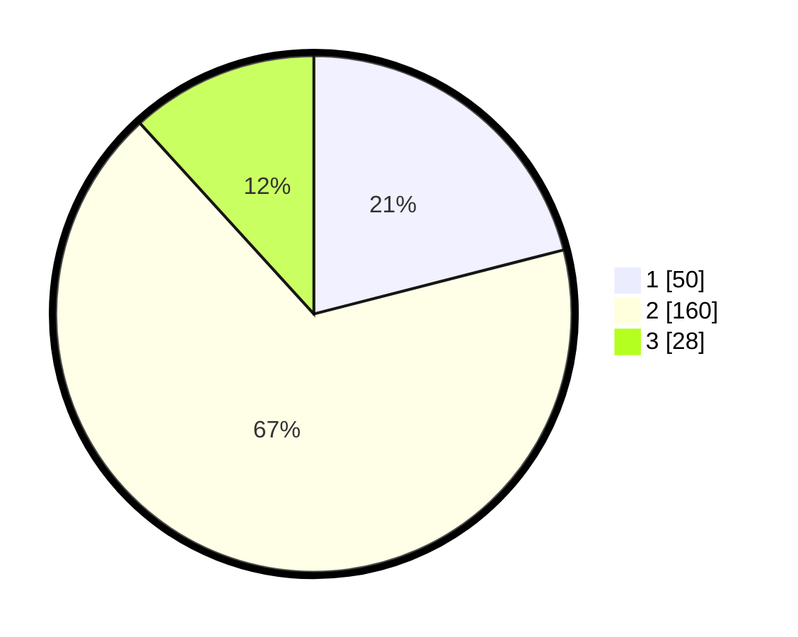

# Hasil

## Grafik

## Tabel

| No. | Nama Paslon    | Suara | Suara (raw) | Persentase |
|:--- |:-------------- | -----:| -----------:| ----------:|
| 1   | ANIES MUHAIMIN | 50    | [50][p-1]   | 21,01      |
| 2   | PRABOWO GIBRAN | 160   | [160][p-2]  | 67,23      |
| 3   | GANJAR MAHFUD  | 28    | [28][p-3]   | 11,76      |

[p-1]: https://github.com/gigit-pemilu/pemilu-2024/blob/main/pilpres/hitung-suara/sub/35-jawa-timur/sub/07-malang/sub/23-karangploso/sub/2002-kepuharjo/sub/001-tps/sub/paslon-1.txt
[p-2]: https://github.com/gigit-pemilu/pemilu-2024/blob/main/pilpres/hitung-suara/sub/35-jawa-timur/sub/07-malang/sub/23-karangploso/sub/2002-kepuharjo/sub/001-tps/sub/paslon-2.txt
[p-3]: https://github.com/gigit-pemilu/pemilu-2024/blob/main/pilpres/hitung-suara/sub/35-jawa-timur/sub/07-malang/sub/23-karangploso/sub/2002-kepuharjo/sub/001-tps/sub/paslon-3.txt

## Foto C Plano

https://sirekap-obj-formc.kpu.go.id/4bbb/pemilu/ppwp/35/07/23/20/02/3507232002001-20240215-001734--9556d967-3b8d-4cf6-be25-f803cc03f08e.jpg

https://sirekap-obj-formc.kpu.go.id/4bbb/pemilu/ppwp/35/07/23/20/02/3507232002001-20240215-001942--831cefe8-6f80-43ac-b84b-550b2ce72865.jpg

https://sirekap-obj-formc.kpu.go.id/4bbb/pemilu/ppwp/35/07/23/20/02/3507232002001-20240215-002050--f490777e-50dc-405f-bd2b-d34a0f596a27.jpg

## Metadata

| Key        | Value               |
| ---------- | ------------------- |
| Time Stamp | 2024-02-17 01:07:28 |

