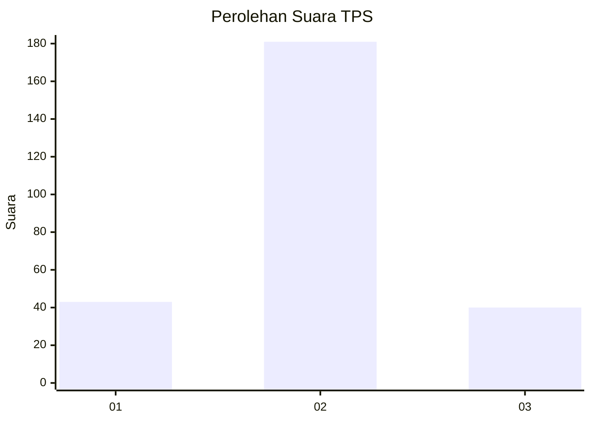

# Hasil

## Grafik

## Tabel

| No. | Nama Paslon    | Suara | Suara (raw) | Persentase |
|:--- |:-------------- | -----:| -----------:| ----------:|
| 1   | ANIES MUHAIMIN | 43    | [43][p-1]   | 16,29      |
| 2   | PRABOWO GIBRAN | 181   | [181][p-2]  | 68,56      |
| 3   | GANJAR MAHFUD  | 40    | [40][p-3]   | 15,15      |

[p-1]: https://github.com/gigit-pemilu/pemilu-2024-35-jawa-timur/blob/main/pilpres/hitung-suara/sub/35-jawa-timur/sub/07-malang/sub/23-karangploso/sub/2002-kepuharjo/sub/011-tps/sub/paslon-1.txt
[p-2]: https://github.com/gigit-pemilu/pemilu-2024-35-jawa-timur/blob/main/pilpres/hitung-suara/sub/35-jawa-timur/sub/07-malang/sub/23-karangploso/sub/2002-kepuharjo/sub/011-tps/sub/paslon-2.txt
[p-3]: https://github.com/gigit-pemilu/pemilu-2024-35-jawa-timur/blob/main/pilpres/hitung-suara/sub/35-jawa-timur/sub/07-malang/sub/23-karangploso/sub/2002-kepuharjo/sub/011-tps/sub/paslon-3.txt

## Foto C Plano

https://sirekap-obj-formc.kpu.go.id/4029/pemilu/ppwp/35/07/23/20/02/3507232002011-20240216-083423--65a591d9-9cc0-4706-a22c-e20c051b2026.jpg

https://sirekap-obj-formc.kpu.go.id/4029/pemilu/ppwp/35/07/23/20/02/3507232002011-20240215-230950--b74d8d92-be04-41d3-8025-dd9bf8eed51e.jpg

https://sirekap-obj-formc.kpu.go.id/4029/pemilu/ppwp/35/07/23/20/02/3507232002011-20240215-231248--bc16afc8-fa12-4190-a395-700333649e07.jpg

## Metadata

| Key        | Value               |
| ---------- | ------------------- |
| Time Stamp | 2024-02-17 01:07:28 |

