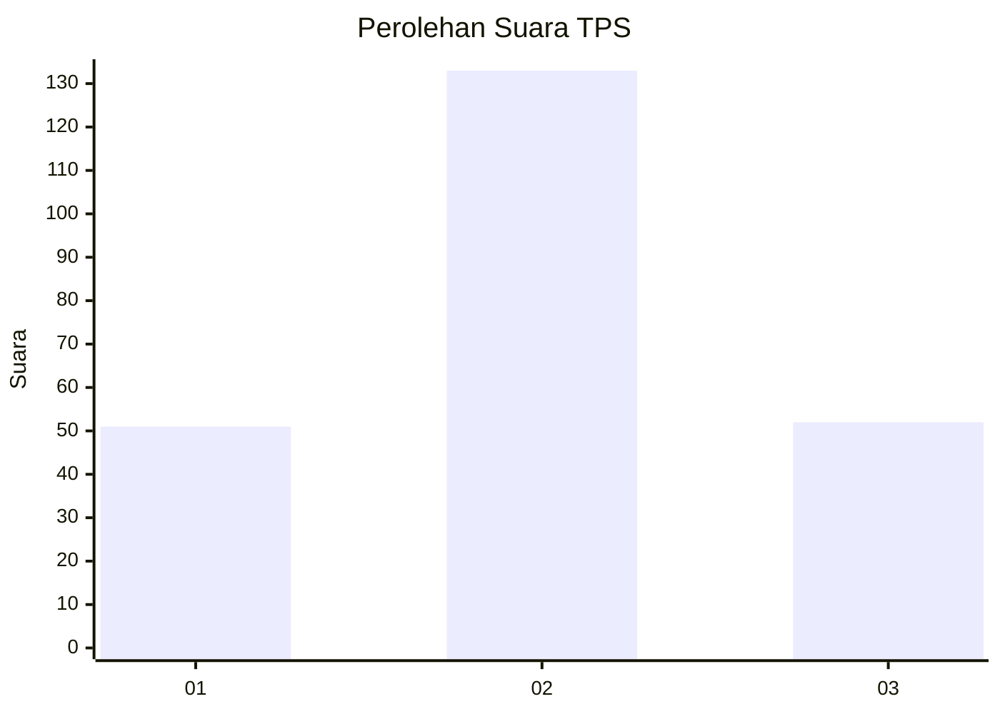
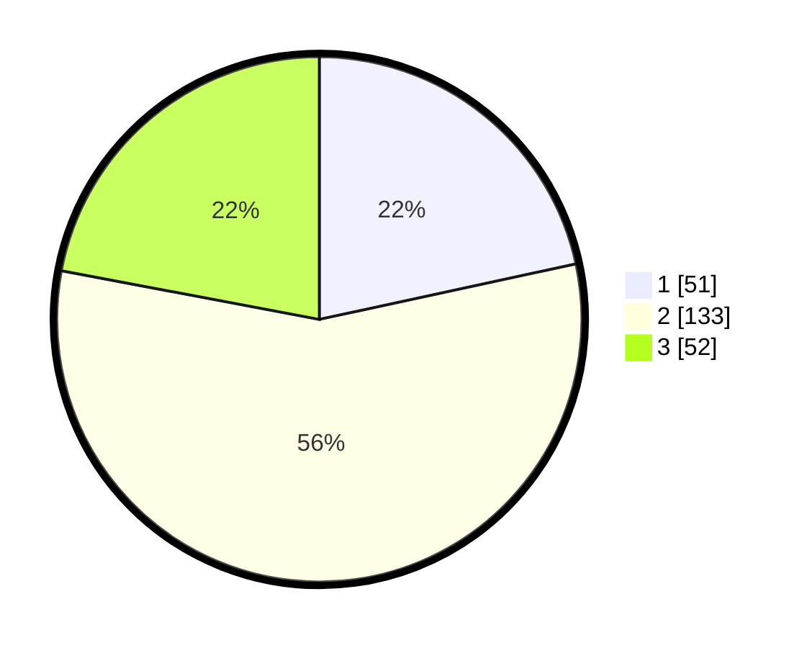

# Hasil

## Grafik

## Tabel

| No. | Nama Paslon    | Suara | Suara (raw) | Persentase |
|:--- |:-------------- | -----:| -----------:| ----------:|
| 1   | ANIES MUHAIMIN | 51    | [51][p-1]   | 21,61      |
| 2   | PRABOWO GIBRAN | 133   | [133][p-2]  | 56,36      |
| 3   | GANJAR MAHFUD  | 52    | [52][p-3]   | 22,03      |

[p-1]: https://github.com/gigit-pemilu/pemilu-2024/blob/main/pilpres/hitung-suara/sub/35-jawa-timur/sub/07-malang/sub/23-karangploso/sub/2002-kepuharjo/sub/012-tps/sub/paslon-1.txt
[p-2]: https://github.com/gigit-pemilu/pemilu-2024/blob/main/pilpres/hitung-suara/sub/35-jawa-timur/sub/07-malang/sub/23-karangploso/sub/2002-kepuharjo/sub/012-tps/sub/paslon-2.txt
[p-3]: https://github.com/gigit-pemilu/pemilu-2024/blob/main/pilpres/hitung-suara/sub/35-jawa-timur/sub/07-malang/sub/23-karangploso/sub/2002-kepuharjo/sub/012-tps/sub/paslon-3.txt

## Foto C Plano

https://sirekap-obj-formc.kpu.go.id/6d51/pemilu/ppwp/35/07/23/20/02/3507232002012-20240214-185630--600a4ca3-9923-44c3-8f1b-f41f09d583db.jpg

https://sirekap-obj-formc.kpu.go.id/6d51/pemilu/ppwp/35/07/23/20/02/3507232002012-20240214-190009--aa7c7308-230d-46d7-b985-027e2bc17caf.jpg

https://sirekap-obj-formc.kpu.go.id/6d51/pemilu/ppwp/35/07/23/20/02/3507232002012-20240214-190125--22ca4261-83a8-4340-94ae-866d458d3bbf.jpg

## Metadata

| Key        | Value               |
| ---------- | ------------------- |
| Time Stamp | 2024-02-17 01:22:58 |

