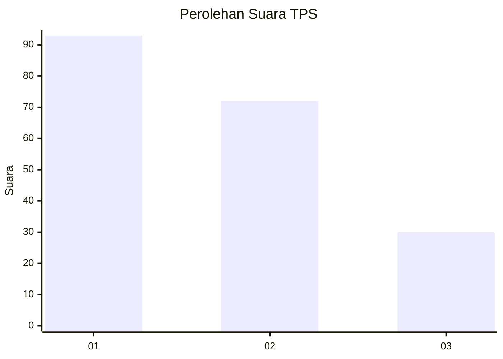
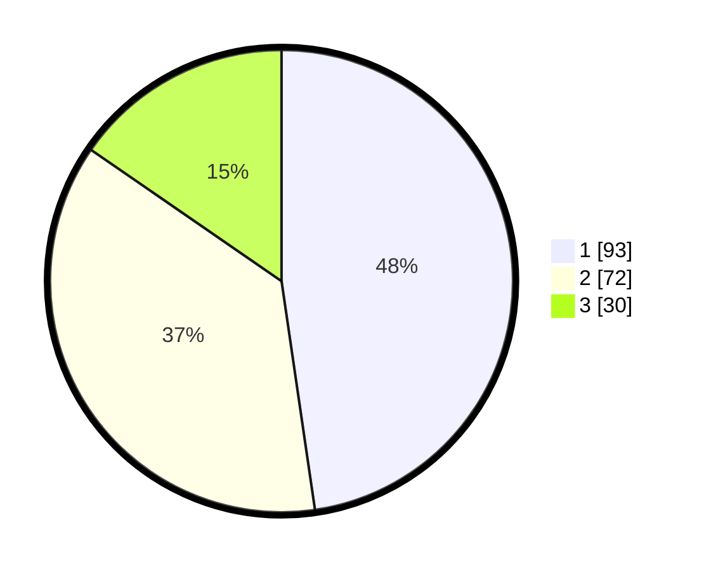

# Hasil

## Grafik

## Tabel

| No. | Nama Paslon    | Suara | Suara (raw) | Persentase |
|:--- |:-------------- | -----:| -----------:| ----------:|
| 1   | ANIES MUHAIMIN | 93    | [93][p-1]   | 47,69      |
| 2   | PRABOWO GIBRAN | 72    | [72][p-2]   | 36,92      |
| 3   | GANJAR MAHFUD  | 30    | [30][p-3]   | 15,38      |

[p-1]: https://github.com/gigit-pemilu/pemilu-2024/blob/main/pilpres/hitung-suara/sub/35-jawa-timur/sub/07-malang/sub/23-karangploso/sub/2002-kepuharjo/sub/014-tps/sub/paslon-1.txt
[p-2]: https://github.com/gigit-pemilu/pemilu-2024/blob/main/pilpres/hitung-suara/sub/35-jawa-timur/sub/07-malang/sub/23-karangploso/sub/2002-kepuharjo/sub/014-tps/sub/paslon-2.txt
[p-3]: https://github.com/gigit-pemilu/pemilu-2024/blob/main/pilpres/hitung-suara/sub/35-jawa-timur/sub/07-malang/sub/23-karangploso/sub/2002-kepuharjo/sub/014-tps/sub/paslon-3.txt

## Foto C Plano

https://sirekap-obj-formc.kpu.go.id/a8e3/pemilu/ppwp/35/07/23/20/02/3507232002014-20240214-231514--ccacaee0-bda0-44b4-a7ef-b63ba433d499.jpg

https://sirekap-obj-formc.kpu.go.id/a8e3/pemilu/ppwp/35/07/23/20/02/3507232002014-20240214-231623--17f85eb3-4166-4746-b530-7b35ab9c67a3.jpg

https://sirekap-obj-formc.kpu.go.id/a8e3/pemilu/ppwp/35/07/23/20/02/3507232002014-20240214-231817--bd3a073d-a19f-4d86-a19a-313593145679.jpg

## Metadata

| Key        | Value               |
| ---------- | ------------------- |
| Time Stamp | 2024-02-16 23:45:47 |

