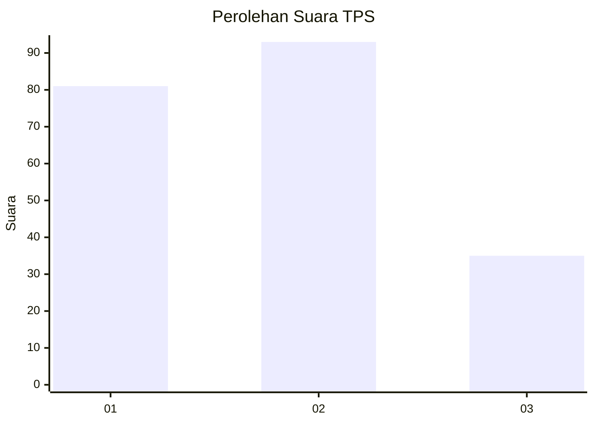
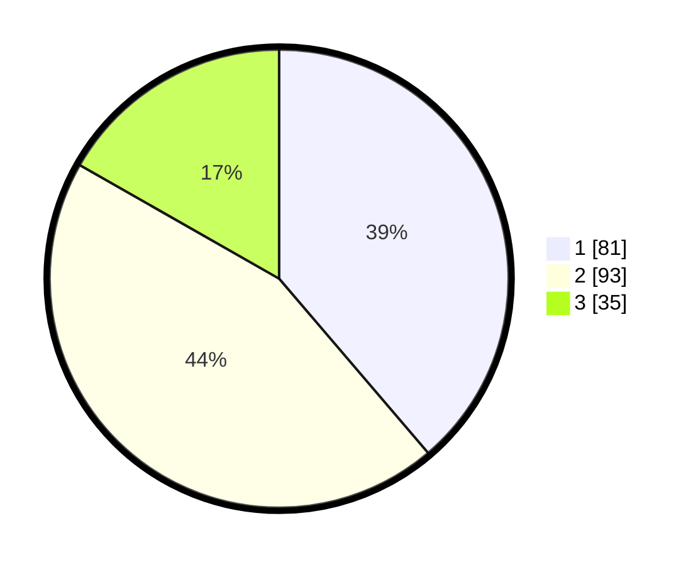

# Hasil

## Grafik

## Tabel

| No. | Nama Paslon    | Suara | Suara (raw) | Persentase |
|:--- |:-------------- | -----:| -----------:| ----------:|
| 1   | ANIES MUHAIMIN | 81    | [81][p-1]   | 38,76      |
| 2   | PRABOWO GIBRAN | 93    | [93][p-2]   | 44,50      |
| 3   | GANJAR MAHFUD  | 35    | [35][p-3]   | 16,75      |

[p-1]: https://github.com/gigit-pemilu/pemilu-2024-35-jawa-timur/blob/main/pilpres/hitung-suara/sub/35-jawa-timur/sub/07-malang/sub/23-karangploso/sub/2003-ngenep/sub/034-tps/sub/paslon-1.txt
[p-2]: https://github.com/gigit-pemilu/pemilu-2024-35-jawa-timur/blob/main/pilpres/hitung-suara/sub/35-jawa-timur/sub/07-malang/sub/23-karangploso/sub/2003-ngenep/sub/034-tps/sub/paslon-2.txt
[p-3]: https://github.com/gigit-pemilu/pemilu-2024-35-jawa-timur/blob/main/pilpres/hitung-suara/sub/35-jawa-timur/sub/07-malang/sub/23-karangploso/sub/2003-ngenep/sub/034-tps/sub/paslon-3.txt

## Foto C Plano

https://sirekap-obj-formc.kpu.go.id/625f/pemilu/ppwp/35/07/23/20/03/3507232003034-20240218-214624--917f0bc3-3c9e-4b85-9f3d-99ff680d582f.jpg

https://sirekap-obj-formc.kpu.go.id/625f/pemilu/ppwp/35/07/23/20/03/3507232003034-20240220-000025--14569e1b-074f-412d-bb3a-a917f3ee02bf.jpg

https://sirekap-obj-formc.kpu.go.id/625f/pemilu/ppwp/35/07/23/20/03/3507232003034-20240220-000542--62541bb4-e09a-4943-9b5a-ef4bea945c07.jpg

## Metadata

| Key        | Value               |
| ---------- | ------------------- |
| Time Stamp | 2024-02-21 19:00:00 |

