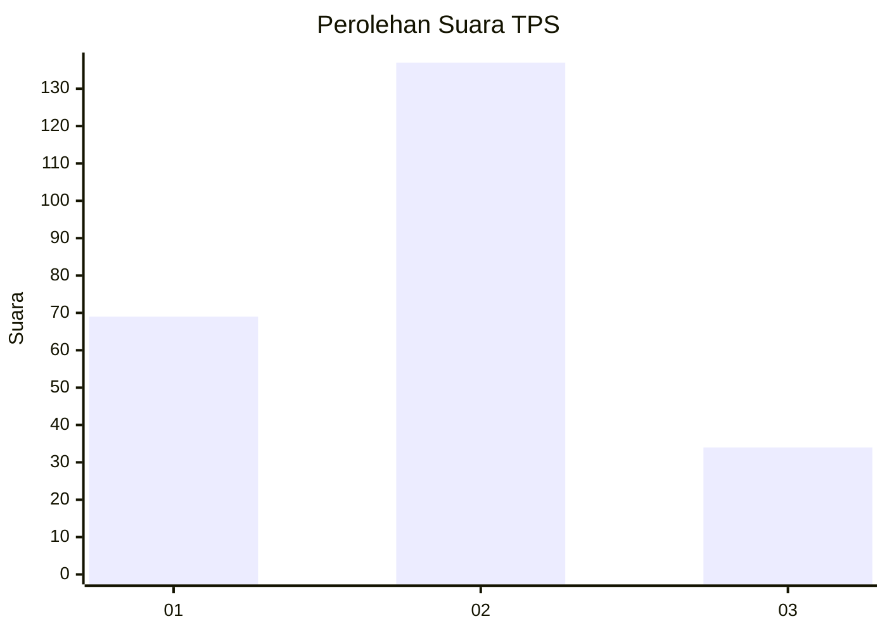
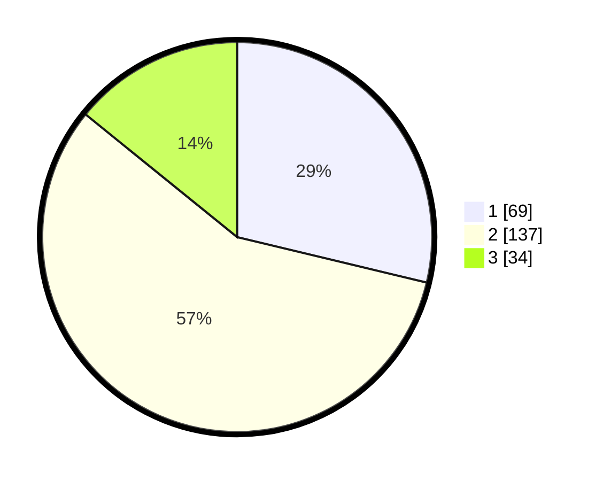

# Hasil

## Grafik

## Tabel

| No. | Nama Paslon    | Suara | Suara (raw) | Persentase |
|:--- |:-------------- | -----:| -----------:| ----------:|
| 1   | ANIES MUHAIMIN | 69    | [69][p-1]   | 28,75      |
| 2   | PRABOWO GIBRAN | 137   | [137][p-2]  | 57,08      |
| 3   | GANJAR MAHFUD  | 34    | [34][p-3]   | 14,17      |

[p-1]: https://github.com/gigit-pemilu/pemilu-2024/blob/main/pilpres/hitung-suara/sub/35-jawa-timur/sub/07-malang/sub/23-karangploso/sub/2004-ngijo/sub/003-tps/sub/paslon-1.txt
[p-2]: https://github.com/gigit-pemilu/pemilu-2024/blob/main/pilpres/hitung-suara/sub/35-jawa-timur/sub/07-malang/sub/23-karangploso/sub/2004-ngijo/sub/003-tps/sub/paslon-2.txt
[p-3]: https://github.com/gigit-pemilu/pemilu-2024/blob/main/pilpres/hitung-suara/sub/35-jawa-timur/sub/07-malang/sub/23-karangploso/sub/2004-ngijo/sub/003-tps/sub/paslon-3.txt

## Foto C Plano

https://sirekap-obj-formc.kpu.go.id/c355/pemilu/ppwp/35/07/23/20/04/3507232004003-20240214-200657--17dd66cb-7ced-4990-a0fb-fe9190220d45.jpg

https://sirekap-obj-formc.kpu.go.id/c355/pemilu/ppwp/35/07/23/20/04/3507232004003-20240214-200750--393c10c7-d199-49dc-bd88-70abc315b591.jpg

https://sirekap-obj-formc.kpu.go.id/c355/pemilu/ppwp/35/07/23/20/04/3507232004003-20240214-200826--a1f527e6-e859-4ae2-a222-f788d83fb978.jpg

## Metadata

| Key        | Value               |
| ---------- | ------------------- |
| Time Stamp | 2024-02-17 03:00:02 |

