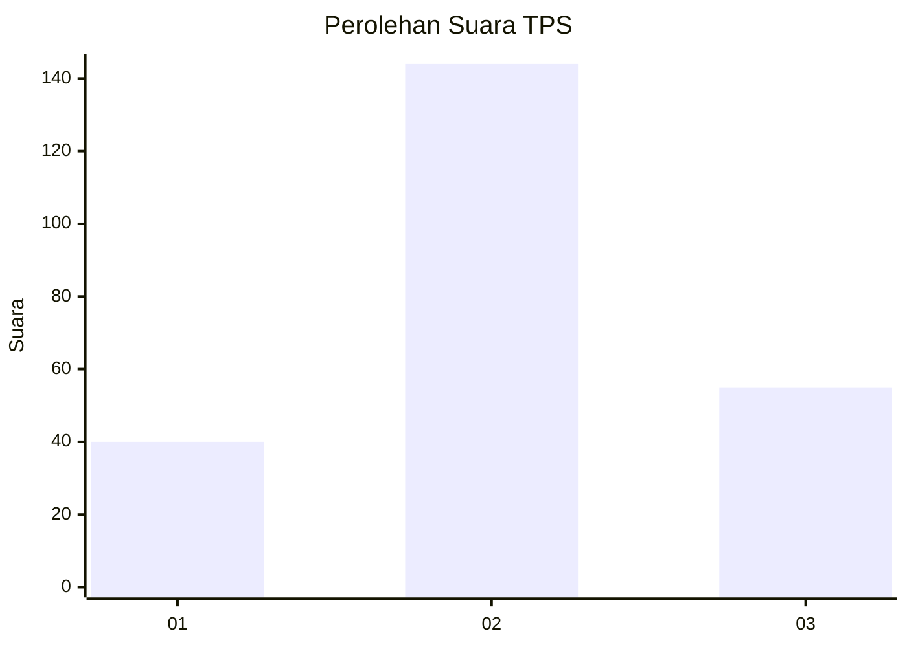
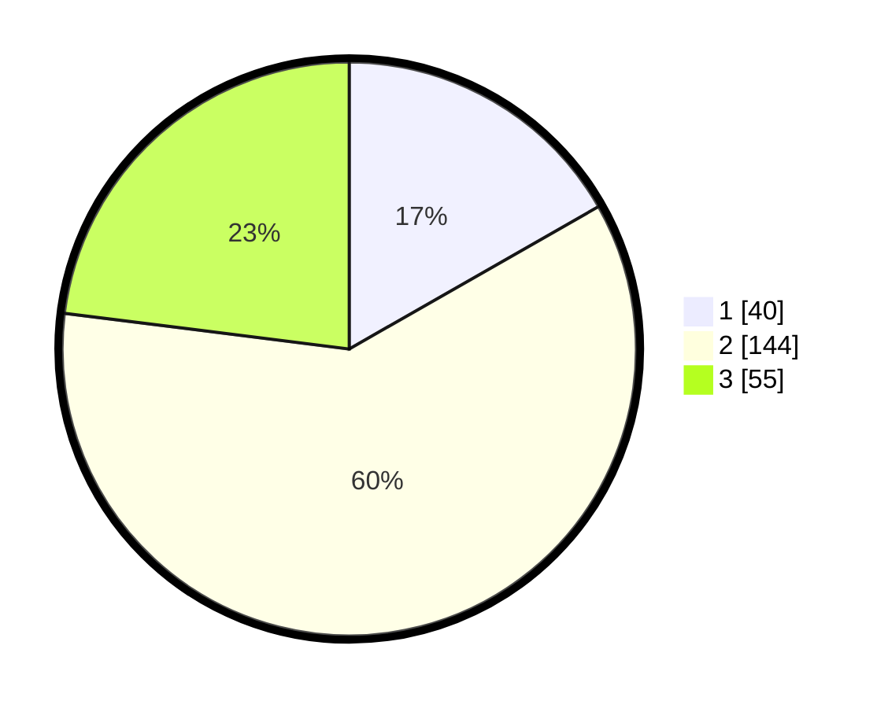

# Hasil

## Grafik

## Tabel

| No. | Nama Paslon    | Suara | Suara (raw) | Persentase |
|:--- |:-------------- | -----:| -----------:| ----------:|
| 1   | ANIES MUHAIMIN | 40    | [40][p-1]   | 16,74      |
| 2   | PRABOWO GIBRAN | 144   | [144][p-2]  | 60,25      |
| 3   | GANJAR MAHFUD  | 55    | [55][p-3]   | 23,01      |

[p-1]: https://github.com/gigit-pemilu/pemilu-2024/blob/main/pilpres/hitung-suara/sub/35-jawa-timur/sub/07-malang/sub/23-karangploso/sub/2004-ngijo/sub/005-tps/sub/paslon-1.txt
[p-2]: https://github.com/gigit-pemilu/pemilu-2024/blob/main/pilpres/hitung-suara/sub/35-jawa-timur/sub/07-malang/sub/23-karangploso/sub/2004-ngijo/sub/005-tps/sub/paslon-2.txt
[p-3]: https://github.com/gigit-pemilu/pemilu-2024/blob/main/pilpres/hitung-suara/sub/35-jawa-timur/sub/07-malang/sub/23-karangploso/sub/2004-ngijo/sub/005-tps/sub/paslon-3.txt

## Foto C Plano

https://sirekap-obj-formc.kpu.go.id/d725/pemilu/ppwp/35/07/23/20/04/3507232004005-20240214-235829--3a1cebc4-f726-45da-afd2-c629f3b84a3f.jpg

https://sirekap-obj-formc.kpu.go.id/d725/pemilu/ppwp/35/07/23/20/04/3507232004005-20240214-235936--492a26a4-5062-4d91-9e67-a2a6d8ed9da5.jpg

https://sirekap-obj-formc.kpu.go.id/d725/pemilu/ppwp/35/07/23/20/04/3507232004005-20240215-000019--59167756-ab65-437d-816a-332afa44f0c4.jpg

## Metadata

| Key        | Value               |
| ---------- | ------------------- |
| Time Stamp | 2024-02-17 03:00:02 |

