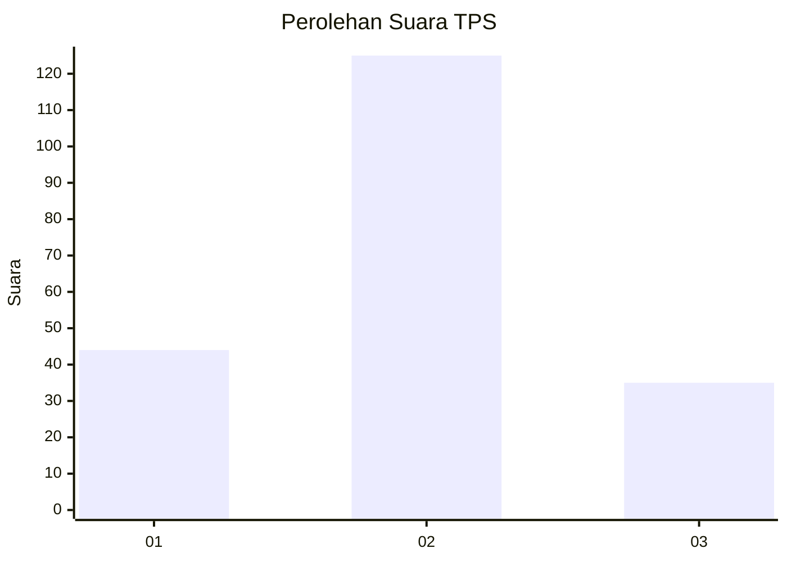

# Hasil

## Grafik

## Tabel

| No. | Nama Paslon    | Suara | Suara (raw) | Persentase |
|:--- |:-------------- | -----:| -----------:| ----------:|
| 1   | ANIES MUHAIMIN | 44    | [44][p-1]   | 21,57      |
| 2   | PRABOWO GIBRAN | 125   | [125][p-2]  | 61,27      |
| 3   | GANJAR MAHFUD  | 35    | [35][p-3]   | 17,16      |

[p-1]: https://github.com/gigit-pemilu/pemilu-2024-35-jawa-timur/blob/main/pilpres/hitung-suara/sub/35-jawa-timur/sub/07-malang/sub/23-karangploso/sub/2004-ngijo/sub/042-tps/sub/paslon-1.txt
[p-2]: https://github.com/gigit-pemilu/pemilu-2024-35-jawa-timur/blob/main/pilpres/hitung-suara/sub/35-jawa-timur/sub/07-malang/sub/23-karangploso/sub/2004-ngijo/sub/042-tps/sub/paslon-2.txt
[p-3]: https://github.com/gigit-pemilu/pemilu-2024-35-jawa-timur/blob/main/pilpres/hitung-suara/sub/35-jawa-timur/sub/07-malang/sub/23-karangploso/sub/2004-ngijo/sub/042-tps/sub/paslon-3.txt

## Foto C Plano

https://sirekap-obj-formc.kpu.go.id/5689/pemilu/ppwp/35/07/23/20/04/3507232004042-20240220-022232--2e7cb3c6-8e0d-4e9b-a44f-f66e471063d6.jpg

https://sirekap-obj-formc.kpu.go.id/5689/pemilu/ppwp/35/07/23/20/04/3507232004042-20240220-022706--c48ec95b-c228-4ad1-a20c-07bde3cab14f.jpg

https://sirekap-obj-formc.kpu.go.id/5689/pemilu/ppwp/35/07/23/20/04/3507232004042-20240220-022848--d2cb9aaf-3eb4-4eb7-bc2d-3d0d847fb994.jpg

## Metadata

| Key        | Value               |
| ---------- | ------------------- |
| Time Stamp | 2024-03-01 22:00:00 |

