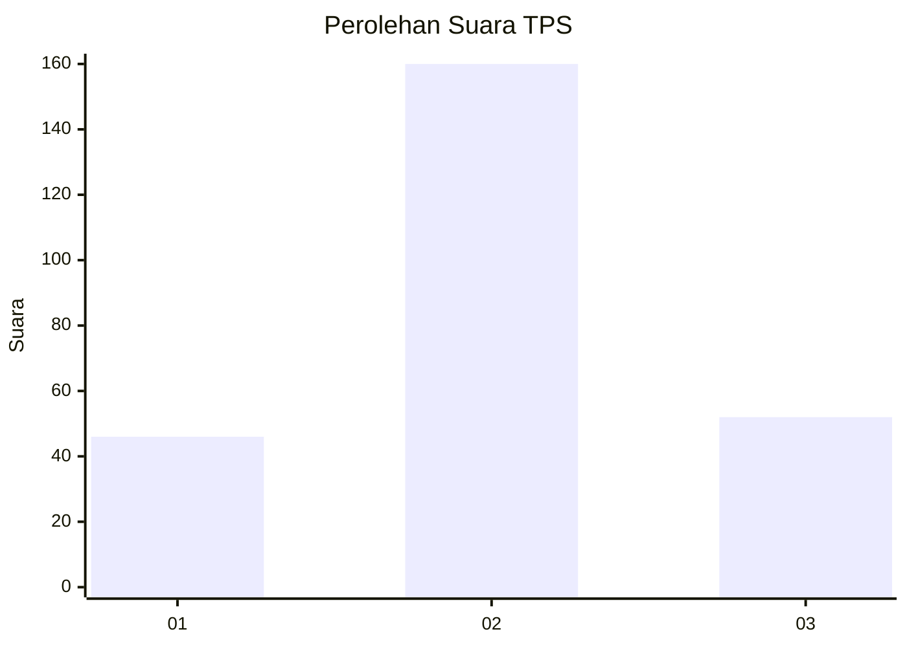
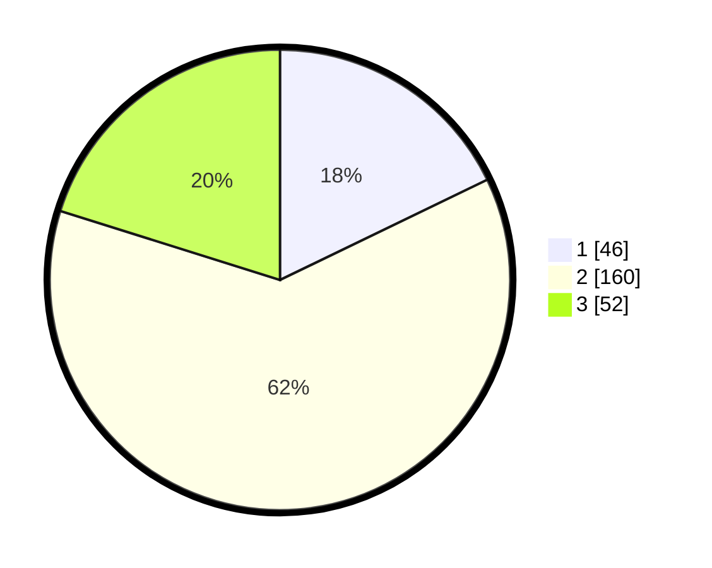

# Hasil

## Grafik

## Tabel

| No. | Nama Paslon    | Suara | Suara (raw) | Persentase |
|:--- |:-------------- | -----:| -----------:| ----------:|
| 1   | ANIES MUHAIMIN | 46    | [46][p-1]   | 17,83      |
| 2   | PRABOWO GIBRAN | 160   | [160][p-2]  | 62,02      |
| 3   | GANJAR MAHFUD  | 52    | [52][p-3]   | 20,16      |

[p-1]: https://github.com/gigit-pemilu/pemilu-2024/blob/main/pilpres/hitung-suara/sub/35-jawa-timur/sub/07-malang/sub/23-karangploso/sub/2005-ampeldento/sub/003-tps/sub/paslon-1.txt
[p-2]: https://github.com/gigit-pemilu/pemilu-2024/blob/main/pilpres/hitung-suara/sub/35-jawa-timur/sub/07-malang/sub/23-karangploso/sub/2005-ampeldento/sub/003-tps/sub/paslon-2.txt
[p-3]: https://github.com/gigit-pemilu/pemilu-2024/blob/main/pilpres/hitung-suara/sub/35-jawa-timur/sub/07-malang/sub/23-karangploso/sub/2005-ampeldento/sub/003-tps/sub/paslon-3.txt

## Foto C Plano

https://sirekap-obj-formc.kpu.go.id/088b/pemilu/ppwp/35/07/23/20/05/3507232005003-20240218-122750--383652cc-e434-4217-a001-842710878bae.jpg

https://sirekap-obj-formc.kpu.go.id/088b/pemilu/ppwp/35/07/23/20/05/3507232005003-20240218-122831--6bc149ba-30f5-4792-9a32-1bbdf0a154e4.jpg

https://sirekap-obj-formc.kpu.go.id/088b/pemilu/ppwp/35/07/23/20/05/3507232005003-20240218-122910--4c2d5a47-6053-4836-811f-15c71a9854b0.jpg

## Metadata

| Key        | Value               |
| ---------- | ------------------- |
| Time Stamp | 2024-02-19 06:16:00 |

## DATA PEMILIH TETAP

Jumlah pemilih dalam DPT: **286**.
 * L: **137**.
 * P: **149**.

## DATA PENGGUNA HAK PILIH

Jumlah pengguna hak pilih dalam DPT: **242**.
 * L: **112**.
 * P: **128**.

Jumlah pengguna hak pilih dalam DPTb: **16**.
 * L: **3**.
 * P: **13**.

Jumlah pengguna hak pilih dalam DPK: **5**.
 * L: **3**.
 * P: **2**.

Jumlah pengguna hak pilih: **263**.
 * L: **120**.
 * P: **243**.

## JUMLAH SUARA SAH DAN TIDAK SAH

JUMLAH SELURUH SUARA SAH: **258**.

JUMLAH SUARA TIDAK SAH: **4**.

JUMLAH SELURUH SUARA SAH DAN SUARA TIDAK SAH: **263**.

