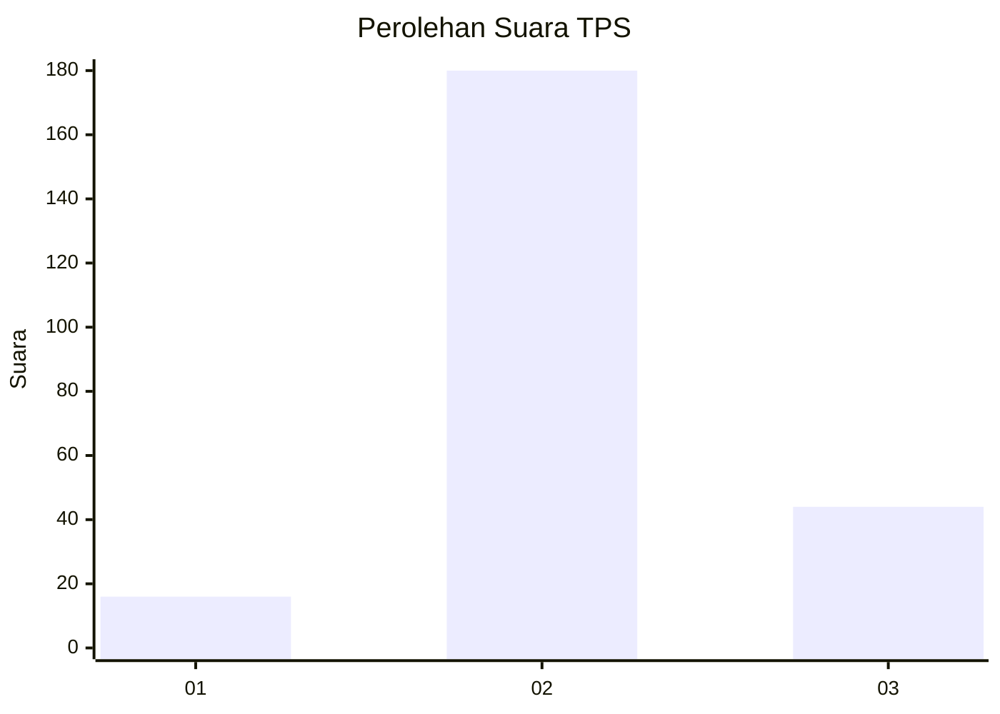
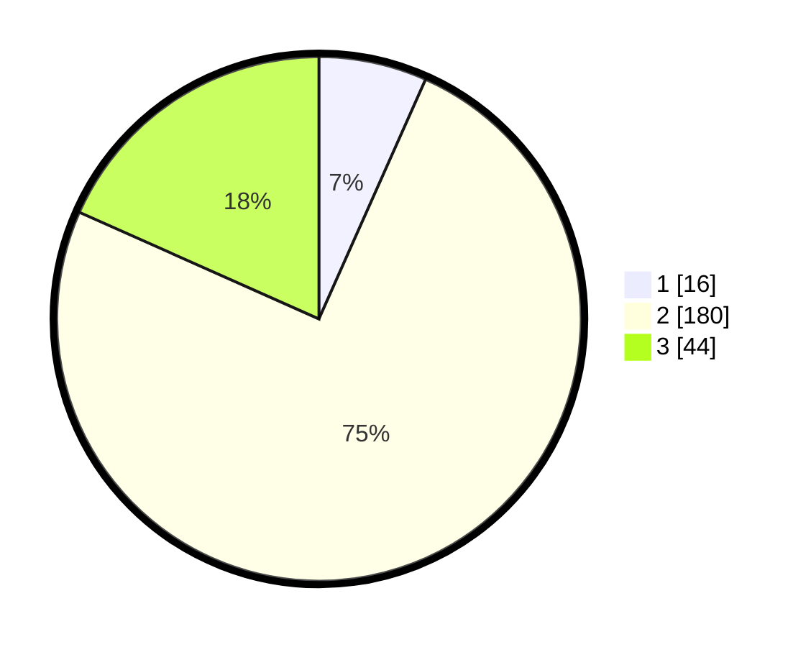

# Hasil

## Grafik

## Tabel

| No. | Nama Paslon    | Suara | Suara (raw) | Persentase |
|:--- |:-------------- | -----:| -----------:| ----------:|
| 1   | ANIES MUHAIMIN | 16    | [16][p-1]   | 6,67       |
| 2   | PRABOWO GIBRAN | 180   | [180][p-2]  | 75,00      |
| 3   | GANJAR MAHFUD  | 44    | [44][p-3]   | 18,33      |

[p-1]: https://github.com/gigit-pemilu/pemilu-2024/blob/main/pilpres/hitung-suara/sub/35-jawa-timur/sub/07-malang/sub/23-karangploso/sub/2005-ampeldento/sub/006-tps/sub/paslon-1.txt
[p-2]: https://github.com/gigit-pemilu/pemilu-2024/blob/main/pilpres/hitung-suara/sub/35-jawa-timur/sub/07-malang/sub/23-karangploso/sub/2005-ampeldento/sub/006-tps/sub/paslon-2.txt
[p-3]: https://github.com/gigit-pemilu/pemilu-2024/blob/main/pilpres/hitung-suara/sub/35-jawa-timur/sub/07-malang/sub/23-karangploso/sub/2005-ampeldento/sub/006-tps/sub/paslon-3.txt

## Foto C Plano

https://sirekap-obj-formc.kpu.go.id/dbca/pemilu/ppwp/35/07/23/20/05/3507232005006-20240218-172946--a38fe209-5847-4e86-8bd4-c9545fc78702.jpg

https://sirekap-obj-formc.kpu.go.id/dbca/pemilu/ppwp/35/07/23/20/05/3507232005006-20240218-173108--c690510e-a5a4-4992-89ec-4bd6a8bc63aa.jpg

https://sirekap-obj-formc.kpu.go.id/dbca/pemilu/ppwp/35/07/23/20/05/3507232005006-20240218-173205--a0e49caa-037d-4814-acad-59c1c94e6026.jpg

## Metadata

| Key        | Value               |
| ---------- | ------------------- |
| Time Stamp | 2024-02-19 06:16:00 |

## DATA PEMILIH TETAP

Jumlah pemilih dalam DPT: **206**.
 * L: **474**.
 * P: **657**.

## DATA PENGGUNA HAK PILIH

Jumlah pengguna hak pilih dalam DPT: **245**.
 * L: **24**.
 * P: **652**.

Jumlah pengguna hak pilih dalam DPTb: **777**.
 * L: **400**.
 * P: **292**.

Jumlah pengguna hak pilih dalam DPK: **466**.
 * L: **2**.
 * P: **44**.

Jumlah pengguna hak pilih: **444**.
 * L: **424**.
 * P: **444**.

## JUMLAH SUARA SAH DAN TIDAK SAH

JUMLAH SELURUH SUARA SAH: **240**.

JUMLAH SUARA TIDAK SAH: **10**.

JUMLAH SELURUH SUARA SAH DAN SUARA TIDAK SAH: **250**.

