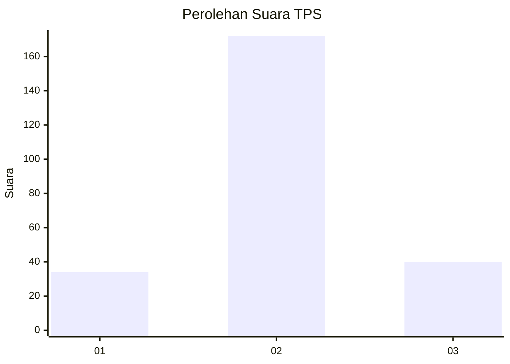
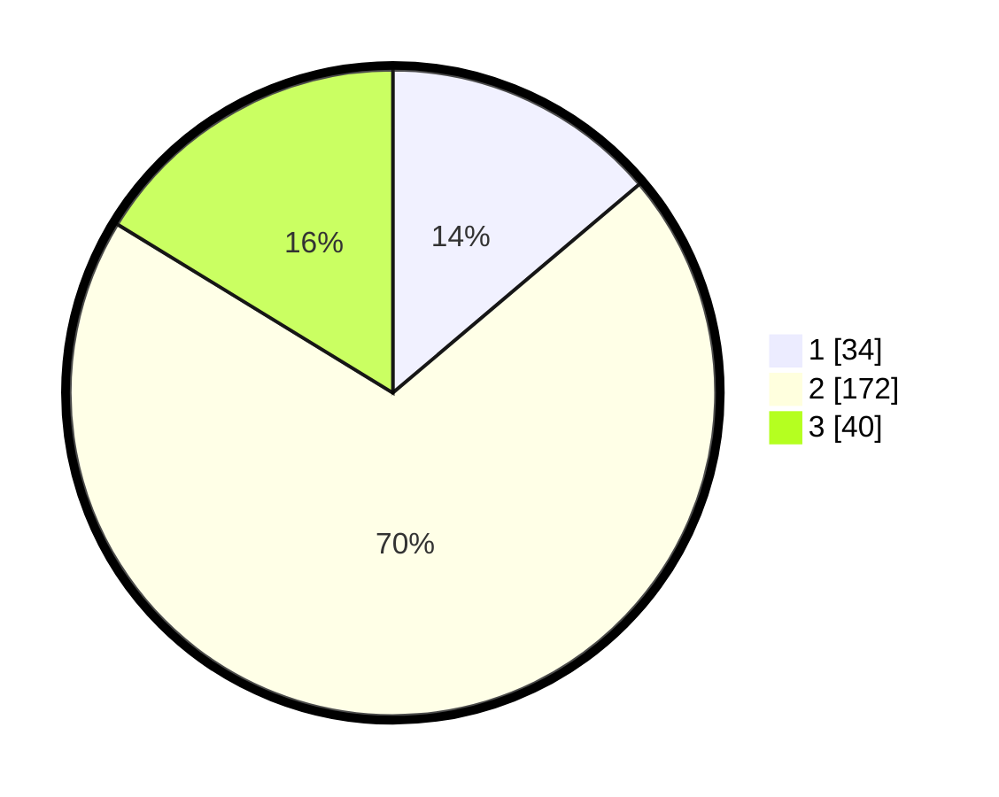

# Hasil

## Grafik

## Tabel

| No. | Nama Paslon    | Suara | Suara (raw) | Persentase |
|:--- |:-------------- | -----:| -----------:| ----------:|
| 1   | ANIES MUHAIMIN | 34    | [34][p-1]   | 13,82      |
| 2   | PRABOWO GIBRAN | 172   | [172][p-2]  | 69,92      |
| 3   | GANJAR MAHFUD  | 40    | [40][p-3]   | 16,26      |

[p-1]: https://github.com/gigit-pemilu/pemilu-2024/blob/main/pilpres/hitung-suara/sub/35-jawa-timur/sub/07-malang/sub/23-karangploso/sub/2008-donowarih/sub/003-tps/sub/paslon-1.txt
[p-2]: https://github.com/gigit-pemilu/pemilu-2024/blob/main/pilpres/hitung-suara/sub/35-jawa-timur/sub/07-malang/sub/23-karangploso/sub/2008-donowarih/sub/003-tps/sub/paslon-2.txt
[p-3]: https://github.com/gigit-pemilu/pemilu-2024/blob/main/pilpres/hitung-suara/sub/35-jawa-timur/sub/07-malang/sub/23-karangploso/sub/2008-donowarih/sub/003-tps/sub/paslon-3.txt

## Foto C Plano

https://sirekap-obj-formc.kpu.go.id/06c8/pemilu/ppwp/35/07/23/20/08/3507232008003-20240214-211649--0fd4838a-d905-4247-b945-fc2b16ef3501.jpg

https://sirekap-obj-formc.kpu.go.id/06c8/pemilu/ppwp/35/07/23/20/08/3507232008003-20240214-211758--4766eed7-cfed-4340-8779-d47c978262a9.jpg

https://sirekap-obj-formc.kpu.go.id/06c8/pemilu/ppwp/35/07/23/20/08/3507232008003-20240214-212509--ca337b46-fac9-4f30-a284-fd31ae9cb442.jpg

## Metadata

| Key        | Value               |
| ---------- | ------------------- |
| Time Stamp | 2024-02-17 03:00:02 |

