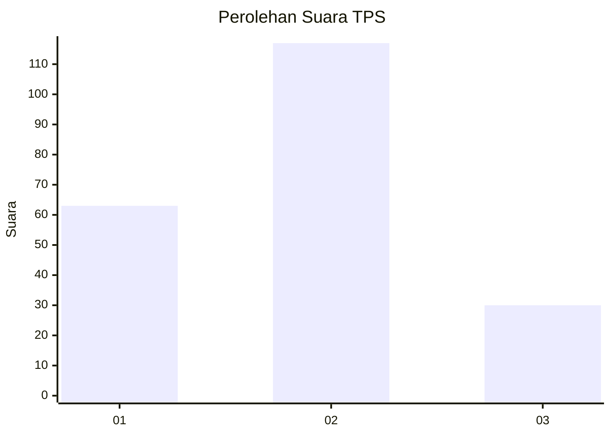
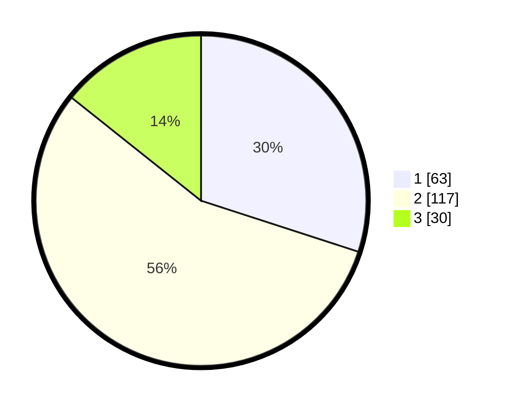

# Hasil

## Grafik

## Tabel

| No. | Nama Paslon    | Suara | Suara (raw) | Persentase |
|:--- |:-------------- | -----:| -----------:| ----------:|
| 1   | ANIES MUHAIMIN | 63    | [63][p-1]   | 30,00      |
| 2   | PRABOWO GIBRAN | 117   | [117][p-2]  | 55,71      |
| 3   | GANJAR MAHFUD  | 30    | [30][p-3]   | 14,29      |

[p-1]: https://github.com/gigit-pemilu/pemilu-2024-35-jawa-timur/blob/main/pilpres/hitung-suara/sub/35-jawa-timur/sub/07-malang/sub/24-singosari/sub/1011-pagentan/sub/015-tps/sub/paslon-1.txt
[p-2]: https://github.com/gigit-pemilu/pemilu-2024-35-jawa-timur/blob/main/pilpres/hitung-suara/sub/35-jawa-timur/sub/07-malang/sub/24-singosari/sub/1011-pagentan/sub/015-tps/sub/paslon-2.txt
[p-3]: https://github.com/gigit-pemilu/pemilu-2024-35-jawa-timur/blob/main/pilpres/hitung-suara/sub/35-jawa-timur/sub/07-malang/sub/24-singosari/sub/1011-pagentan/sub/015-tps/sub/paslon-3.txt

## Foto C Plano

https://sirekap-obj-formc.kpu.go.id/48a4/pemilu/ppwp/35/07/24/10/11/3507241011015-20240215-174113--02038254-0d48-409c-b814-5ca3717fdb9a.jpg

https://sirekap-obj-formc.kpu.go.id/48a4/pemilu/ppwp/35/07/24/10/11/3507241011015-20240215-213215--81a46cca-469b-4e0f-b931-ec2c9d4ba107.jpg

https://sirekap-obj-formc.kpu.go.id/48a4/pemilu/ppwp/35/07/24/10/11/3507241011015-20240215-213323--a6ead35e-d8fe-4517-8929-d2b82d08b550.jpg

## Metadata

| Key        | Value               |
| ---------- | ------------------- |
| Time Stamp | 2024-02-17 10:00:02 |

