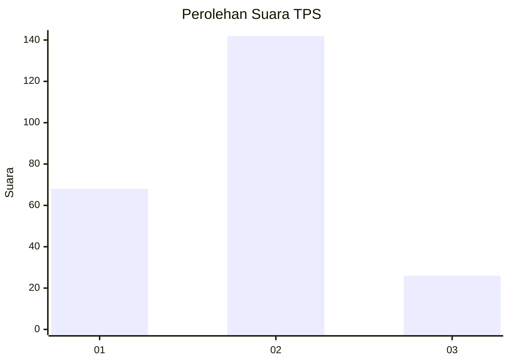
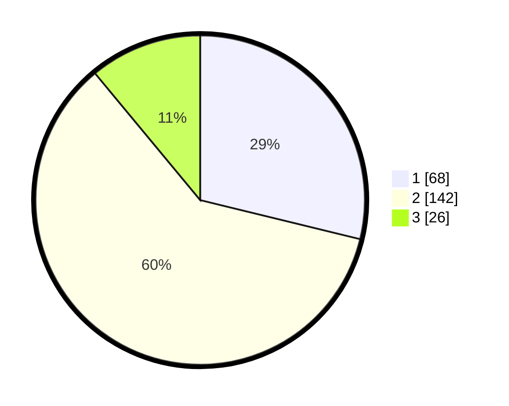

# Hasil

## Grafik

## Tabel

| No. | Nama Paslon    | Suara | Suara (raw) | Persentase |
|:--- |:-------------- | -----:| -----------:| ----------:|
| 1   | ANIES MUHAIMIN | 68    | [68][p-1]   | 28,81      |
| 2   | PRABOWO GIBRAN | 142   | [142][p-2]  | 60,17      |
| 3   | GANJAR MAHFUD  | 26    | [26][p-3]   | 11,02      |

[p-1]: https://github.com/gigit-pemilu/pemilu-2024/blob/main/pilpres/hitung-suara/sub/35-jawa-timur/sub/07-malang/sub/24-singosari/sub/1011-pagentan/sub/019-tps/sub/paslon-1.txt
[p-2]: https://github.com/gigit-pemilu/pemilu-2024/blob/main/pilpres/hitung-suara/sub/35-jawa-timur/sub/07-malang/sub/24-singosari/sub/1011-pagentan/sub/019-tps/sub/paslon-2.txt
[p-3]: https://github.com/gigit-pemilu/pemilu-2024/blob/main/pilpres/hitung-suara/sub/35-jawa-timur/sub/07-malang/sub/24-singosari/sub/1011-pagentan/sub/019-tps/sub/paslon-3.txt

## Foto C Plano

https://sirekap-obj-formc.kpu.go.id/eacf/pemilu/ppwp/35/07/24/10/11/3507241011019-20240215-000525--4181e643-d6b9-4d42-862a-b9f227648fc6.jpg

https://sirekap-obj-formc.kpu.go.id/eacf/pemilu/ppwp/35/07/24/10/11/3507241011019-20240215-000620--ea639d48-5b59-44de-80ad-e4d4c7c4ed61.jpg

https://sirekap-obj-formc.kpu.go.id/eacf/pemilu/ppwp/35/07/24/10/11/3507241011019-20240215-000720--5e44fa2c-9939-4cc9-b695-12a1c95d6426.jpg

## Metadata

| Key        | Value               |
| ---------- | ------------------- |
| Time Stamp | 2024-02-19 06:16:00 |

