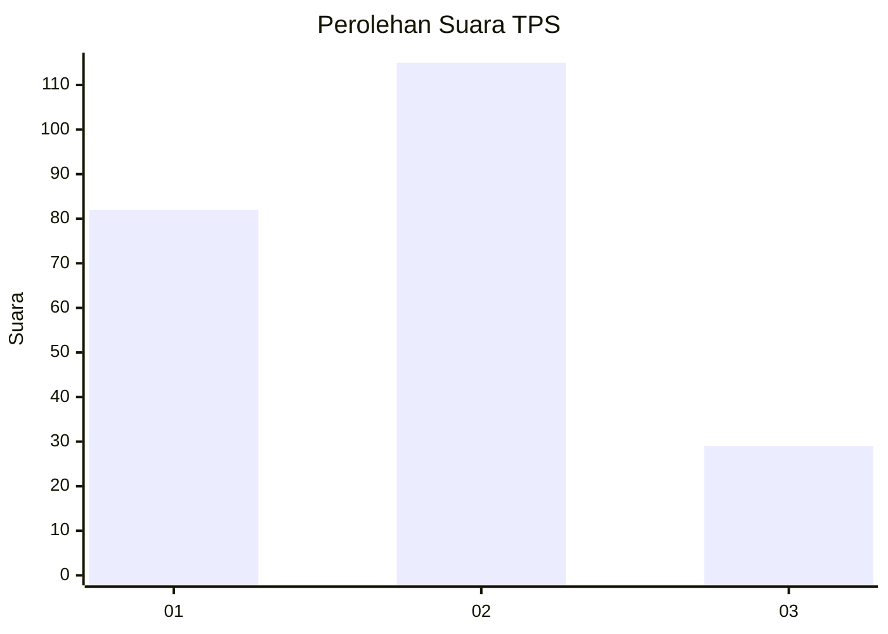
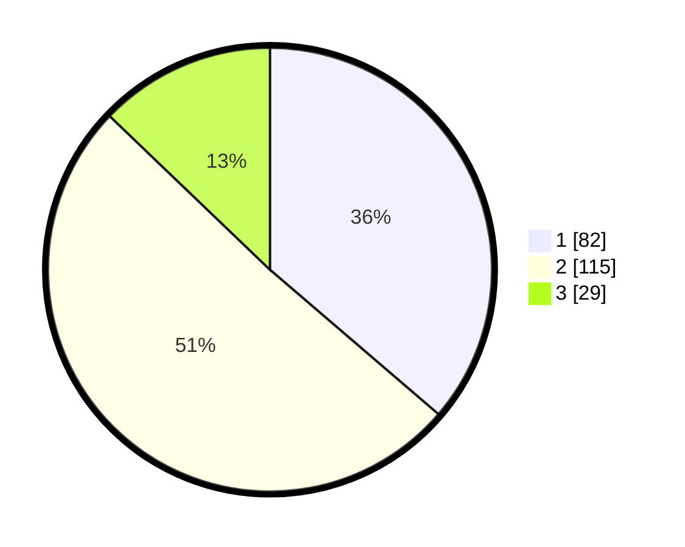

# Hasil

## Grafik

## Tabel

| No. | Nama Paslon    | Suara | Suara (raw) | Persentase |
|:--- |:-------------- | -----:| -----------:| ----------:|
| 1   | ANIES MUHAIMIN | 82    | [82][p-1]   | 36,28      |
| 2   | PRABOWO GIBRAN | 115   | [115][p-2]  | 50,88      |
| 3   | GANJAR MAHFUD  | 29    | [29][p-3]   | 12,83      |

[p-1]: https://github.com/gigit-pemilu/pemilu-2024-35-jawa-timur/blob/main/pilpres/hitung-suara/sub/35-jawa-timur/sub/07-malang/sub/24-singosari/sub/1011-pagentan/sub/020-tps/sub/paslon-1.txt
[p-2]: https://github.com/gigit-pemilu/pemilu-2024-35-jawa-timur/blob/main/pilpres/hitung-suara/sub/35-jawa-timur/sub/07-malang/sub/24-singosari/sub/1011-pagentan/sub/020-tps/sub/paslon-2.txt
[p-3]: https://github.com/gigit-pemilu/pemilu-2024-35-jawa-timur/blob/main/pilpres/hitung-suara/sub/35-jawa-timur/sub/07-malang/sub/24-singosari/sub/1011-pagentan/sub/020-tps/sub/paslon-3.txt

## Foto C Plano

https://sirekap-obj-formc.kpu.go.id/5ace/pemilu/ppwp/35/07/24/10/11/3507241011020-20240215-061021--6f2045cb-88b4-4c29-abf0-32dc7b546ed2.jpg

https://sirekap-obj-formc.kpu.go.id/5ace/pemilu/ppwp/35/07/24/10/11/3507241011020-20240215-003954--4bdc87a2-2c5c-4796-b6ba-33570b2f3326.jpg

https://sirekap-obj-formc.kpu.go.id/5ace/pemilu/ppwp/35/07/24/10/11/3507241011020-20240215-004142--35eb8012-39cd-4f96-acdd-9d8f738c451d.jpg

## Metadata

| Key        | Value               |
| ---------- | ------------------- |
| Time Stamp | 2024-02-15 23:29:50 |

