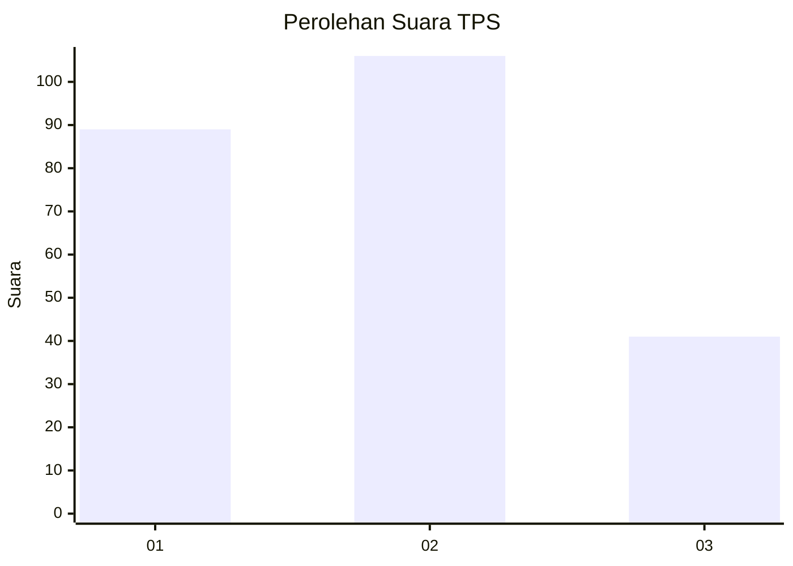
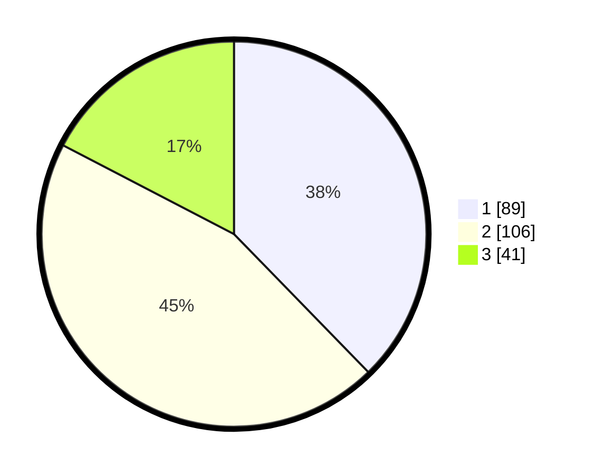

# Hasil

## Grafik

## Tabel

| No. | Nama Paslon    | Suara | Suara (raw) | Persentase |
|:--- |:-------------- | -----:| -----------:| ----------:|
| 1   | ANIES MUHAIMIN | 89    | [89][p-1]   | 37,71      |
| 2   | PRABOWO GIBRAN | 106   | [106][p-2]  | 44,92      |
| 3   | GANJAR MAHFUD  | 41    | [41][p-3]   | 17,37      |

[p-1]: https://github.com/gigit-pemilu/pemilu-2024/blob/main/pilpres/hitung-suara/sub/35-jawa-timur/sub/07-malang/sub/24-singosari/sub/1011-pagentan/sub/021-tps/sub/paslon-1.txt
[p-2]: https://github.com/gigit-pemilu/pemilu-2024/blob/main/pilpres/hitung-suara/sub/35-jawa-timur/sub/07-malang/sub/24-singosari/sub/1011-pagentan/sub/021-tps/sub/paslon-2.txt
[p-3]: https://github.com/gigit-pemilu/pemilu-2024/blob/main/pilpres/hitung-suara/sub/35-jawa-timur/sub/07-malang/sub/24-singosari/sub/1011-pagentan/sub/021-tps/sub/paslon-3.txt

## Foto C Plano

https://sirekap-obj-formc.kpu.go.id/1cf6/pemilu/ppwp/35/07/24/10/11/3507241011021-20240215-024423--75746ae3-0e48-46a2-b7d6-1741c1d8152b.jpg

https://sirekap-obj-formc.kpu.go.id/1cf6/pemilu/ppwp/35/07/24/10/11/3507241011021-20240215-024509--3675e382-857c-4063-9e54-5413fbf9bc8f.jpg

https://sirekap-obj-formc.kpu.go.id/1cf6/pemilu/ppwp/35/07/24/10/11/3507241011021-20240215-024549--fd1b5e2b-faa8-4c6f-b6f1-39adb6b50ad5.jpg

## Metadata

| Key        | Value               |
| ---------- | ------------------- |
| Time Stamp | 2024-02-19 06:16:00 |

