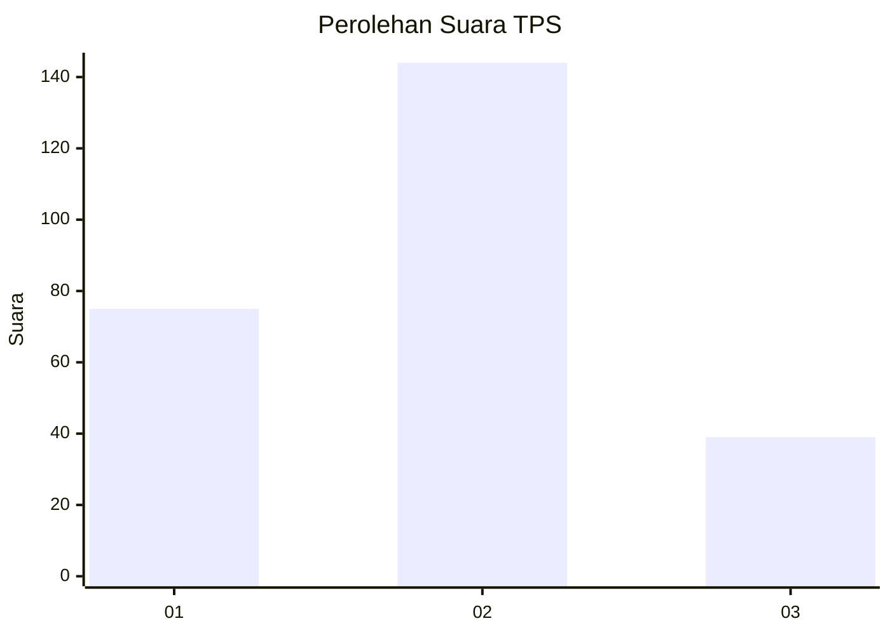
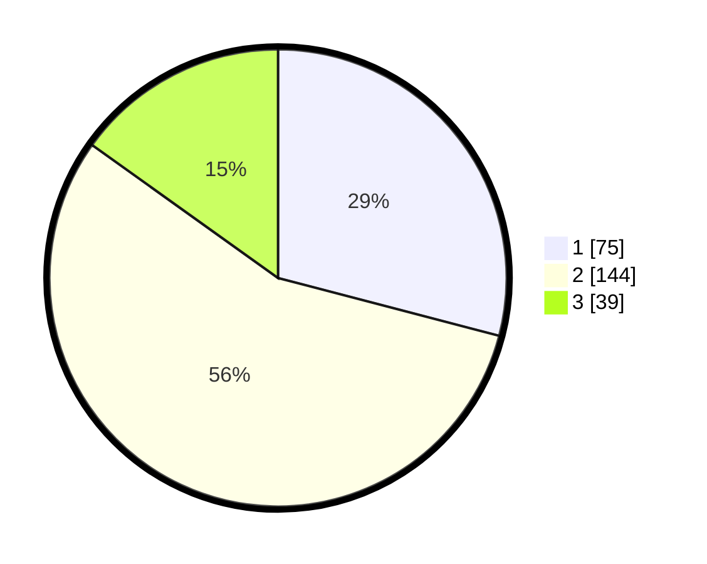

# Hasil

## Grafik

## Tabel

| No. | Nama Paslon    | Suara | Suara (raw) | Persentase |
|:--- |:-------------- | -----:| -----------:| ----------:|
| 1   | ANIES MUHAIMIN | 75    | [75][p-1]   | 29,07      |
| 2   | PRABOWO GIBRAN | 144   | [144][p-2]  | 55,81      |
| 3   | GANJAR MAHFUD  | 39    | [39][p-3]   | 15,12      |

[p-1]: https://github.com/gigit-pemilu/pemilu-2024/blob/main/pilpres/hitung-suara/sub/35-jawa-timur/sub/07-malang/sub/24-singosari/sub/1011-pagentan/sub/025-tps/sub/paslon-1.txt
[p-2]: https://github.com/gigit-pemilu/pemilu-2024/blob/main/pilpres/hitung-suara/sub/35-jawa-timur/sub/07-malang/sub/24-singosari/sub/1011-pagentan/sub/025-tps/sub/paslon-2.txt
[p-3]: https://github.com/gigit-pemilu/pemilu-2024/blob/main/pilpres/hitung-suara/sub/35-jawa-timur/sub/07-malang/sub/24-singosari/sub/1011-pagentan/sub/025-tps/sub/paslon-3.txt

## Foto C Plano

https://sirekap-obj-formc.kpu.go.id/482a/pemilu/ppwp/35/07/24/10/11/3507241011025-20240218-080023--aa4269d2-47c7-464d-a0ea-842b936e2be1.jpg

https://sirekap-obj-formc.kpu.go.id/482a/pemilu/ppwp/35/07/24/10/11/3507241011025-20240215-085007--dd57ea36-7d51-4771-866b-11b5868103e2.jpg

https://sirekap-obj-formc.kpu.go.id/482a/pemilu/ppwp/35/07/24/10/11/3507241011025-20240215-085100--959d389c-45fa-4413-a0bf-c91cc72e6282.jpg

## Metadata

| Key        | Value               |
| ---------- | ------------------- |
| Time Stamp | 2024-02-19 06:16:00 |

