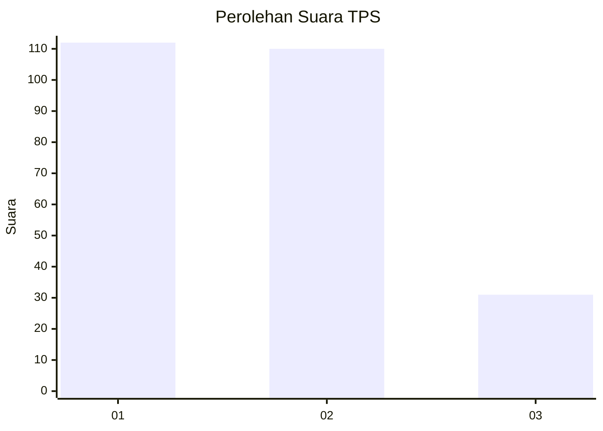
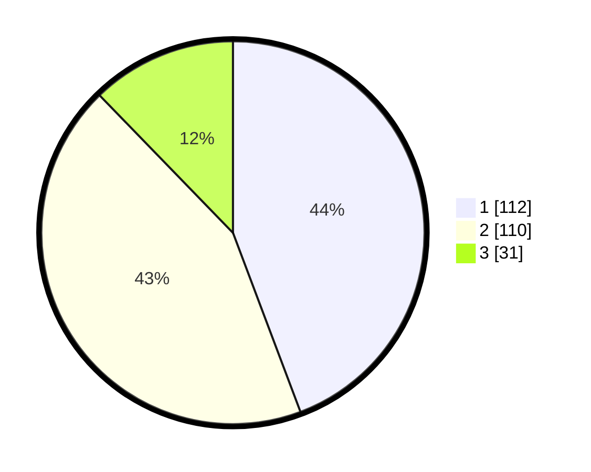

# Hasil

## Grafik

## Tabel

| No. | Nama Paslon    | Suara | Suara (raw) | Persentase |
|:--- |:-------------- | -----:| -----------:| ----------:|
| 1   | ANIES MUHAIMIN | 112   | [112][p-1]  | 44,27      |
| 2   | PRABOWO GIBRAN | 110   | [110][p-2]  | 43,48      |
| 3   | GANJAR MAHFUD  | 31    | [31][p-3]   | 12,25      |

[p-1]: https://github.com/gigit-pemilu/pemilu-2024-35-jawa-timur/blob/main/pilpres/hitung-suara/sub/35-jawa-timur/sub/07-malang/sub/24-singosari/sub/1011-pagentan/sub/029-tps/sub/paslon-1.txt
[p-2]: https://github.com/gigit-pemilu/pemilu-2024-35-jawa-timur/blob/main/pilpres/hitung-suara/sub/35-jawa-timur/sub/07-malang/sub/24-singosari/sub/1011-pagentan/sub/029-tps/sub/paslon-2.txt
[p-3]: https://github.com/gigit-pemilu/pemilu-2024-35-jawa-timur/blob/main/pilpres/hitung-suara/sub/35-jawa-timur/sub/07-malang/sub/24-singosari/sub/1011-pagentan/sub/029-tps/sub/paslon-3.txt

## Foto C Plano

https://sirekap-obj-formc.kpu.go.id/90f5/pemilu/ppwp/35/07/24/10/11/3507241011029-20240215-043009--33ffd487-562c-4d3a-9e0d-a653602f6d96.jpg

https://sirekap-obj-formc.kpu.go.id/90f5/pemilu/ppwp/35/07/24/10/11/3507241011029-20240215-043023--5d14a61d-98a9-44c2-ab7f-60cf5b6086d8.jpg

https://sirekap-obj-formc.kpu.go.id/90f5/pemilu/ppwp/35/07/24/10/11/3507241011029-20240215-043036--4d15c76f-19a8-46a8-8e9f-fd455d8539be.jpg

## Metadata

| Key        | Value               |
| ---------- | ------------------- |
| Time Stamp | 2024-02-15 17:30:25 |

