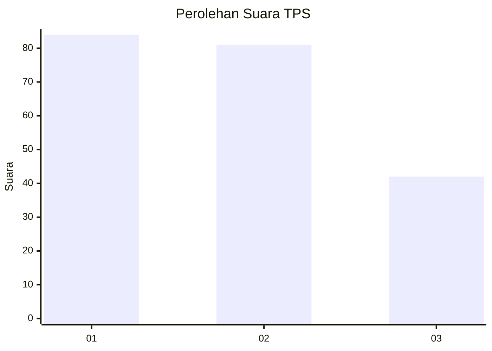
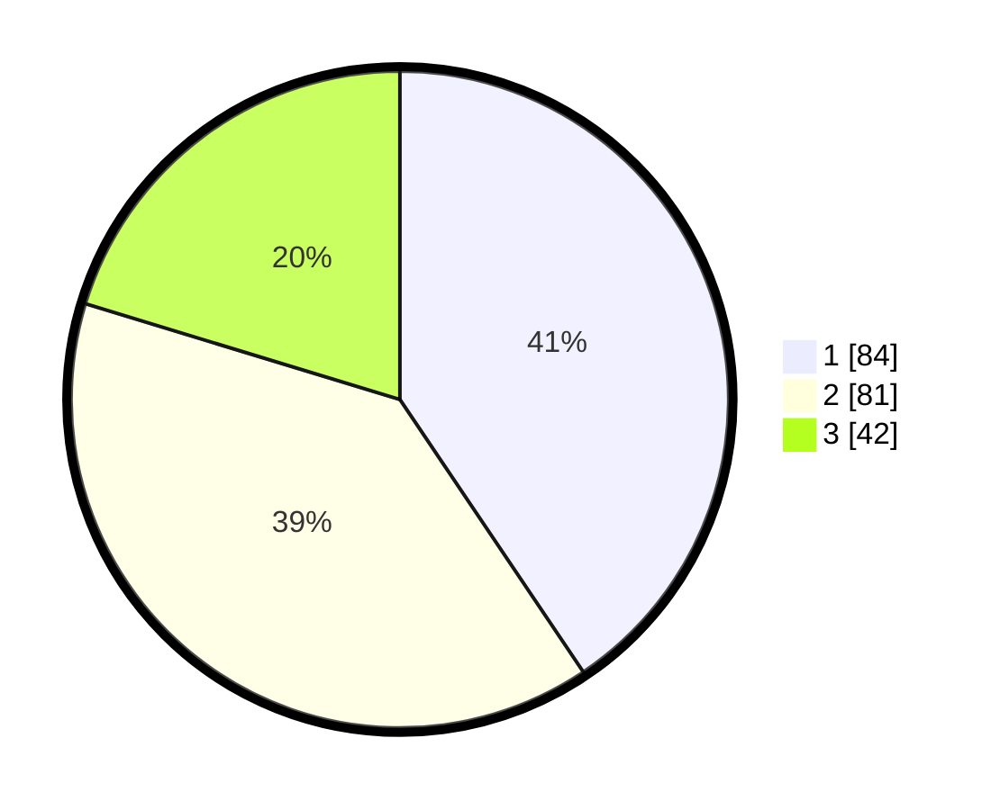

# Hasil

## Grafik

## Tabel

| No. | Nama Paslon    | Suara | Suara (raw) | Persentase |
|:--- |:-------------- | -----:| -----------:| ----------:|
| 1   | ANIES MUHAIMIN | 84    | [84][p-1]   | 40,58      |
| 2   | PRABOWO GIBRAN | 81    | [81][p-2]   | 39,13      |
| 3   | GANJAR MAHFUD  | 42    | [42][p-3]   | 20,29      |

[p-1]: https://github.com/gigit-pemilu/pemilu-2024/blob/main/pilpres/hitung-suara/sub/35-jawa-timur/sub/07-malang/sub/24-singosari/sub/1011-pagentan/sub/033-tps/sub/paslon-1.txt
[p-2]: https://github.com/gigit-pemilu/pemilu-2024/blob/main/pilpres/hitung-suara/sub/35-jawa-timur/sub/07-malang/sub/24-singosari/sub/1011-pagentan/sub/033-tps/sub/paslon-2.txt
[p-3]: https://github.com/gigit-pemilu/pemilu-2024/blob/main/pilpres/hitung-suara/sub/35-jawa-timur/sub/07-malang/sub/24-singosari/sub/1011-pagentan/sub/033-tps/sub/paslon-3.txt

## Foto C Plano

https://sirekap-obj-formc.kpu.go.id/608e/pemilu/ppwp/35/07/24/10/11/3507241011033-20240214-231728--328a9f41-c479-452a-961a-7e2019b6f911.jpg

https://sirekap-obj-formc.kpu.go.id/608e/pemilu/ppwp/35/07/24/10/11/3507241011033-20240214-231650--90a7b5d5-7dbf-4696-b710-cf47d59a9066.jpg

https://sirekap-obj-formc.kpu.go.id/608e/pemilu/ppwp/35/07/24/10/11/3507241011033-20240214-231551--9812cf29-a30c-4795-abd2-3bb153194b2a.jpg

## Metadata

| Key        | Value               |
| ---------- | ------------------- |
| Time Stamp | 2024-02-15 17:30:25 |

