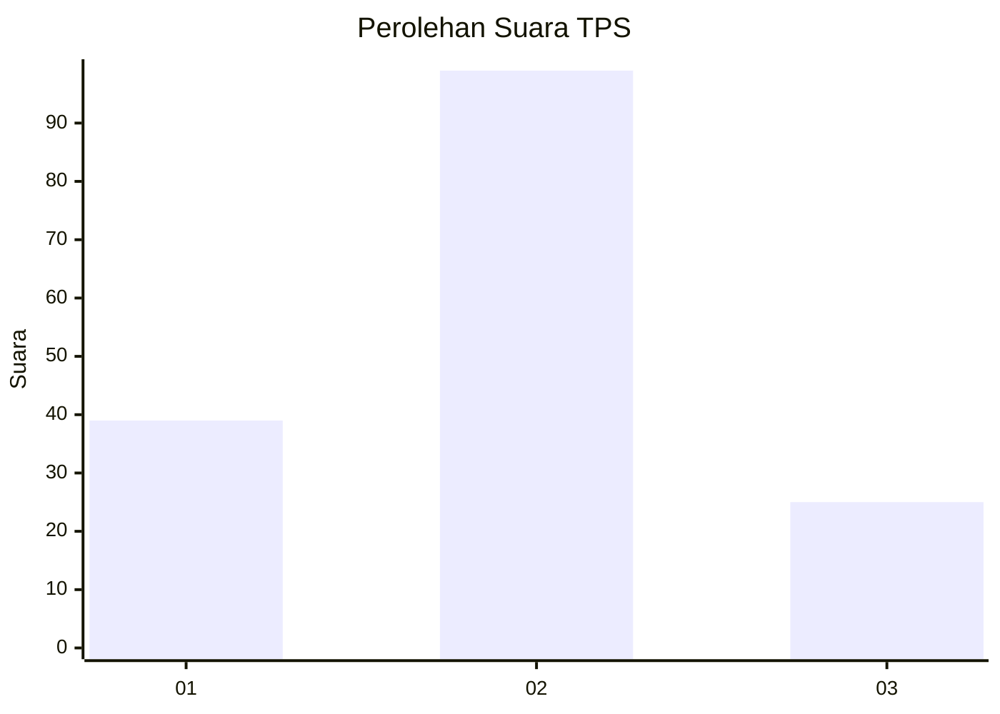
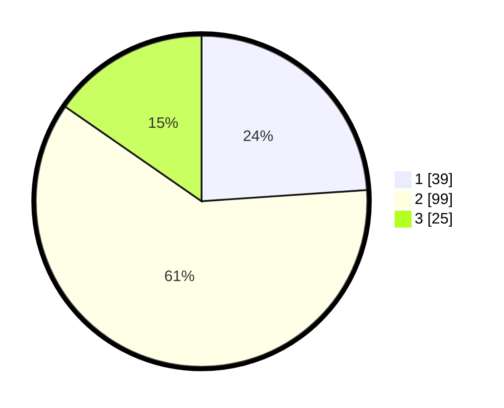

# Hasil

## Grafik

## Tabel

| No. | Nama Paslon    | Suara | Suara (raw) | Persentase |
|:--- |:-------------- | -----:| -----------:| ----------:|
| 1   | ANIES MUHAIMIN | 39    | [39][p-1]   | 23,93      |
| 2   | PRABOWO GIBRAN | 99    | [99][p-2]   | 60,74      |
| 3   | GANJAR MAHFUD  | 25    | [25][p-3]   | 15,34      |

[p-1]: https://github.com/gigit-pemilu/pemilu-2024-35-jawa-timur/blob/main/pilpres/hitung-suara/sub/35-jawa-timur/sub/07-malang/sub/24-singosari/sub/1011-pagentan/sub/037-tps/sub/paslon-1.txt
[p-2]: https://github.com/gigit-pemilu/pemilu-2024-35-jawa-timur/blob/main/pilpres/hitung-suara/sub/35-jawa-timur/sub/07-malang/sub/24-singosari/sub/1011-pagentan/sub/037-tps/sub/paslon-2.txt
[p-3]: https://github.com/gigit-pemilu/pemilu-2024-35-jawa-timur/blob/main/pilpres/hitung-suara/sub/35-jawa-timur/sub/07-malang/sub/24-singosari/sub/1011-pagentan/sub/037-tps/sub/paslon-3.txt

## Foto C Plano

https://sirekap-obj-formc.kpu.go.id/f826/pemilu/ppwp/35/07/24/10/11/3507241011037-20240214-160101--fdd170f9-288d-407b-9d3c-760e64a5b0e6.jpg

https://sirekap-obj-formc.kpu.go.id/f826/pemilu/ppwp/35/07/24/10/11/3507241011037-20240214-233314--e308189c-510a-4ed0-b6a8-3b78062d160b.jpg

https://sirekap-obj-formc.kpu.go.id/f826/pemilu/ppwp/35/07/24/10/11/3507241011037-20240215-081632--7d4e7702-6afc-4ce0-8ece-3559beb8cf3e.jpg

## Metadata

| Key        | Value               |
| ---------- | ------------------- |
| Time Stamp | 2024-02-15 09:00:24 |

