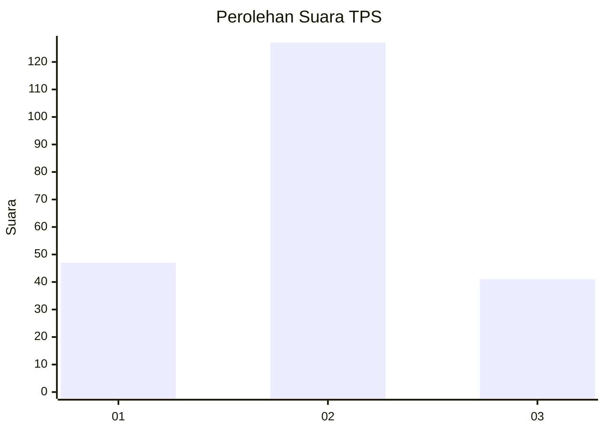
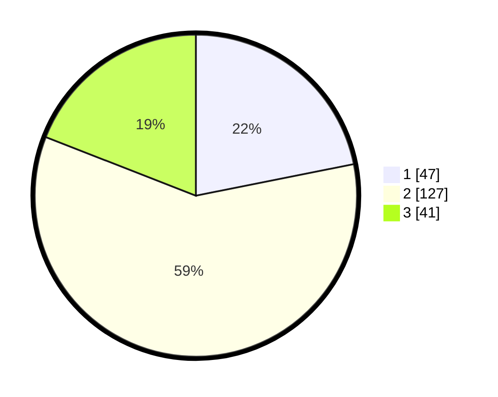

# Hasil

## Grafik

## Tabel

| No. | Nama Paslon    | Suara | Suara (raw) | Persentase |
|:--- |:-------------- | -----:| -----------:| ----------:|
| 1   | ANIES MUHAIMIN | 47    | [47][p-1]   | 21,86      |
| 2   | PRABOWO GIBRAN | 127   | [127][p-2]  | 59,07      |
| 3   | GANJAR MAHFUD  | 41    | [41][p-3]   | 19,07      |

[p-1]: https://github.com/gigit-pemilu/pemilu-2024/blob/main/pilpres/hitung-suara/sub/35-jawa-timur/sub/07-malang/sub/24-singosari/sub/1014-losari/sub/003-tps/sub/paslon-1.txt
[p-2]: https://github.com/gigit-pemilu/pemilu-2024/blob/main/pilpres/hitung-suara/sub/35-jawa-timur/sub/07-malang/sub/24-singosari/sub/1014-losari/sub/003-tps/sub/paslon-2.txt
[p-3]: https://github.com/gigit-pemilu/pemilu-2024/blob/main/pilpres/hitung-suara/sub/35-jawa-timur/sub/07-malang/sub/24-singosari/sub/1014-losari/sub/003-tps/sub/paslon-3.txt

## Foto C Plano

https://sirekap-obj-formc.kpu.go.id/f1f9/pemilu/ppwp/35/07/24/10/14/3507241014003-20240215-174518--746ae64a-3790-4639-8630-e1eb059701e0.jpg

https://sirekap-obj-formc.kpu.go.id/f1f9/pemilu/ppwp/35/07/24/10/14/3507241014003-20240215-033310--a41b6589-b84e-4bcf-86a9-8ebf2b34f67b.jpg

https://sirekap-obj-formc.kpu.go.id/f1f9/pemilu/ppwp/35/07/24/10/14/3507241014003-20240215-174557--6d8771c8-79c5-4bcc-ab78-e1fa577f6c8d.jpg

## Metadata

| Key        | Value               |
| ---------- | ------------------- |
| Time Stamp | 2024-02-19 06:16:00 |

