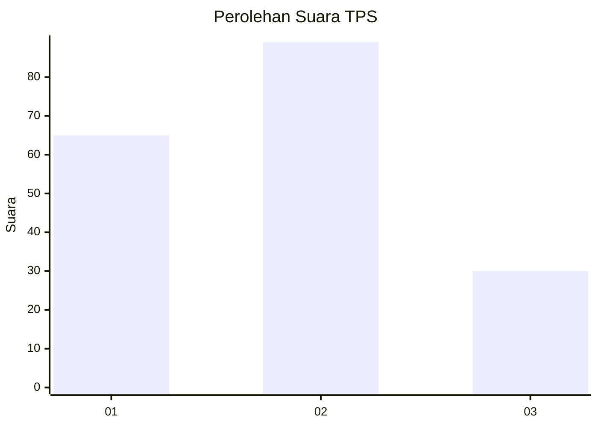
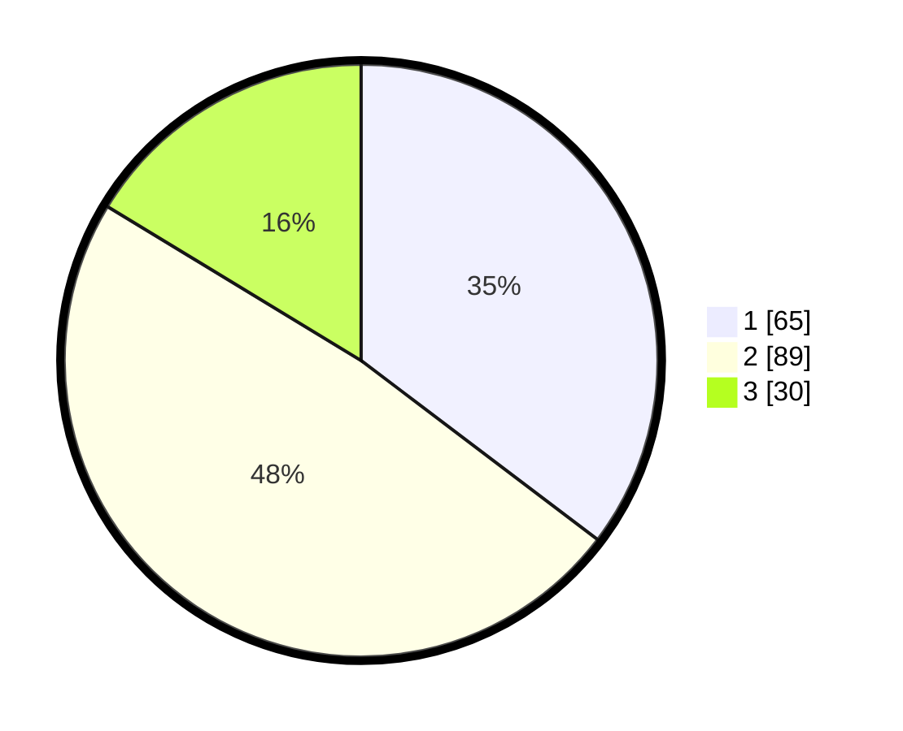

# Hasil

## Grafik

## Tabel

| No. | Nama Paslon    | Suara | Suara (raw) | Persentase |
|:--- |:-------------- | -----:| -----------:| ----------:|
| 1   | ANIES MUHAIMIN | 65    | [65][p-1]   | 35,33      |
| 2   | PRABOWO GIBRAN | 89    | [89][p-2]   | 48,37      |
| 3   | GANJAR MAHFUD  | 30    | [30][p-3]   | 16,30      |

[p-1]: https://github.com/gigit-pemilu/pemilu-2024-35-jawa-timur/blob/main/pilpres/hitung-suara/sub/35-jawa-timur/sub/07-malang/sub/24-singosari/sub/1015-candirenggo/sub/001-tps/sub/paslon-1.txt
[p-2]: https://github.com/gigit-pemilu/pemilu-2024-35-jawa-timur/blob/main/pilpres/hitung-suara/sub/35-jawa-timur/sub/07-malang/sub/24-singosari/sub/1015-candirenggo/sub/001-tps/sub/paslon-2.txt
[p-3]: https://github.com/gigit-pemilu/pemilu-2024-35-jawa-timur/blob/main/pilpres/hitung-suara/sub/35-jawa-timur/sub/07-malang/sub/24-singosari/sub/1015-candirenggo/sub/001-tps/sub/paslon-3.txt

## Foto C Plano

https://sirekap-obj-formc.kpu.go.id/3139/pemilu/ppwp/35/07/24/10/15/3507241015001-20240214-235147--bddd7e8a-d0d1-4511-a838-66f8de55a35c.jpg

https://sirekap-obj-formc.kpu.go.id/3139/pemilu/ppwp/35/07/24/10/15/3507241015001-20240214-235404--a1ebe2a4-4df5-475f-898e-e379a679e9e7.jpg

https://sirekap-obj-formc.kpu.go.id/3139/pemilu/ppwp/35/07/24/10/15/3507241015001-20240214-235410--a4520fb0-9681-4a1b-bee2-4cea24f83323.jpg

## Metadata

| Key        | Value               |
| ---------- | ------------------- |
| Time Stamp | 2024-02-17 00:28:35 |

