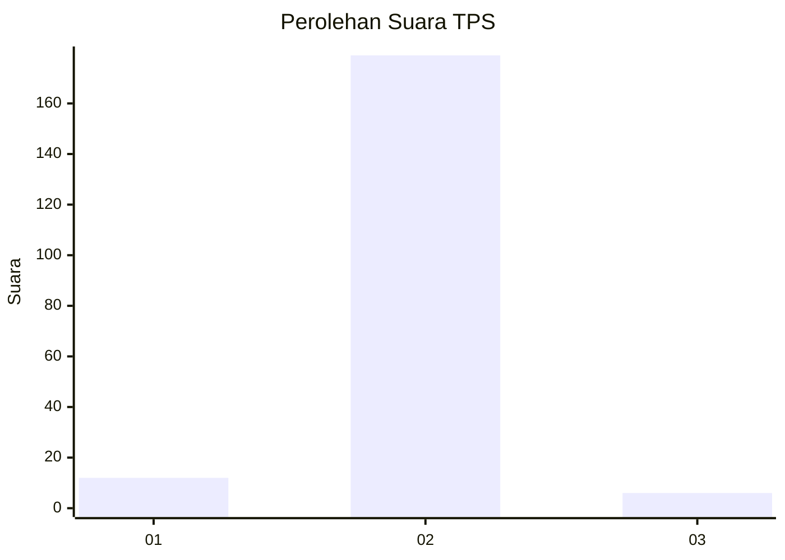
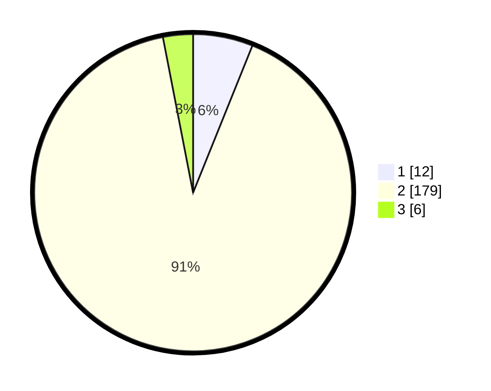

# Hasil

## Grafik

## Tabel

| No. | Nama Paslon    | Suara | Suara (raw) | Persentase |
|:--- |:-------------- | -----:| -----------:| ----------:|
| 1   | ANIES MUHAIMIN | 12    | [12][p-1]   | 6,09       |
| 2   | PRABOWO GIBRAN | 179   | [179][p-2]  | 90,86      |
| 3   | GANJAR MAHFUD  | 6     | [6][p-3]    | 3,05       |

[p-1]: https://github.com/gigit-pemilu/pemilu-2024/blob/main/pilpres/hitung-suara/sub/35-jawa-timur/sub/07-malang/sub/24-singosari/sub/1015-candirenggo/sub/008-tps/sub/paslon-1.txt
[p-2]: https://github.com/gigit-pemilu/pemilu-2024/blob/main/pilpres/hitung-suara/sub/35-jawa-timur/sub/07-malang/sub/24-singosari/sub/1015-candirenggo/sub/008-tps/sub/paslon-2.txt
[p-3]: https://github.com/gigit-pemilu/pemilu-2024/blob/main/pilpres/hitung-suara/sub/35-jawa-timur/sub/07-malang/sub/24-singosari/sub/1015-candirenggo/sub/008-tps/sub/paslon-3.txt

## Foto C Plano

https://sirekap-obj-formc.kpu.go.id/cd4a/pemilu/ppwp/35/07/24/10/15/3507241015008-20240214-225640--0a9f0041-b3ab-408a-8c5a-b0ff48601baa.jpg

https://sirekap-obj-formc.kpu.go.id/cd4a/pemilu/ppwp/35/07/24/10/15/3507241015008-20240214-225747--fe415946-b1a5-481f-adf2-3ac8abe7697a.jpg

https://sirekap-obj-formc.kpu.go.id/cd4a/pemilu/ppwp/35/07/24/10/15/3507241015008-20240214-225858--c8355b5d-a4eb-46da-95c0-2154f405a609.jpg

## Metadata

| Key        | Value               |
| ---------- | ------------------- |
| Time Stamp | 2024-02-17 00:30:00 |

