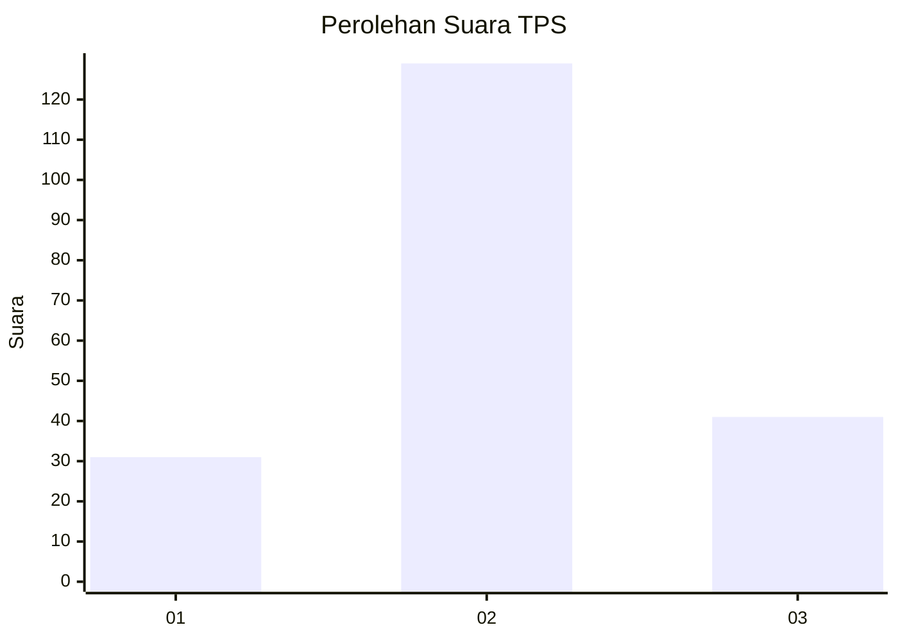
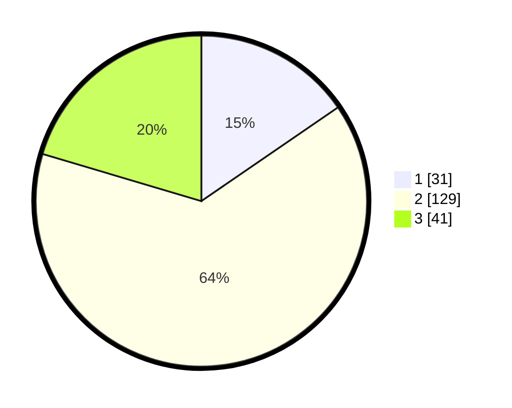

# Hasil

## Grafik

## Tabel

| No. | Nama Paslon    | Suara | Suara (raw) | Persentase |
|:--- |:-------------- | -----:| -----------:| ----------:|
| 1   | ANIES MUHAIMIN | 31    | [31][p-1]   | 15,42      |
| 2   | PRABOWO GIBRAN | 129   | [129][p-2]  | 64,18      |
| 3   | GANJAR MAHFUD  | 41    | [41][p-3]   | 20,40      |

[p-1]: https://github.com/gigit-pemilu/pemilu-2024/blob/main/pilpres/hitung-suara/sub/35-jawa-timur/sub/07-malang/sub/24-singosari/sub/1015-candirenggo/sub/025-tps/sub/paslon-1.txt
[p-2]: https://github.com/gigit-pemilu/pemilu-2024/blob/main/pilpres/hitung-suara/sub/35-jawa-timur/sub/07-malang/sub/24-singosari/sub/1015-candirenggo/sub/025-tps/sub/paslon-2.txt
[p-3]: https://github.com/gigit-pemilu/pemilu-2024/blob/main/pilpres/hitung-suara/sub/35-jawa-timur/sub/07-malang/sub/24-singosari/sub/1015-candirenggo/sub/025-tps/sub/paslon-3.txt

## Foto C Plano

https://sirekap-obj-formc.kpu.go.id/6628/pemilu/ppwp/35/07/24/10/15/3507241015025-20240214-195535--1a75d9a2-16f0-4edd-b304-f9248eae063a.jpg

https://sirekap-obj-formc.kpu.go.id/6628/pemilu/ppwp/35/07/24/10/15/3507241015025-20240214-201725--7d79785e-f11a-4174-baf2-1899f55b2966.jpg

https://sirekap-obj-formc.kpu.go.id/6628/pemilu/ppwp/35/07/24/10/15/3507241015025-20240214-224005--c00b6295-8364-46c0-8a0b-4f7ef90ee4cf.jpg

## Metadata

| Key        | Value               |
| ---------- | ------------------- |
| Time Stamp | 2024-02-15 04:00:24 |

