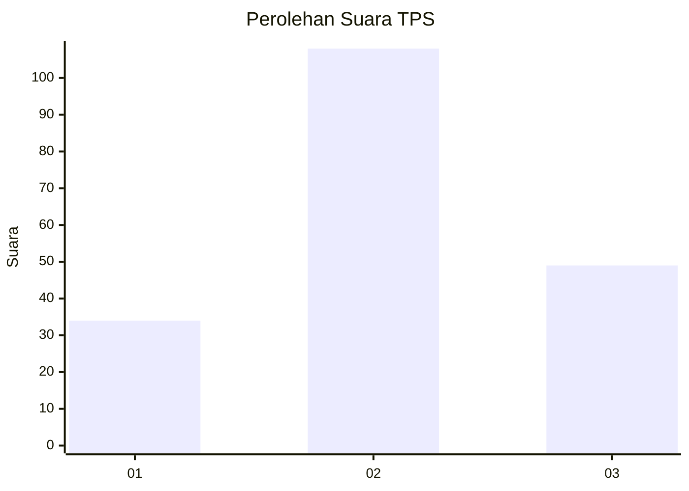
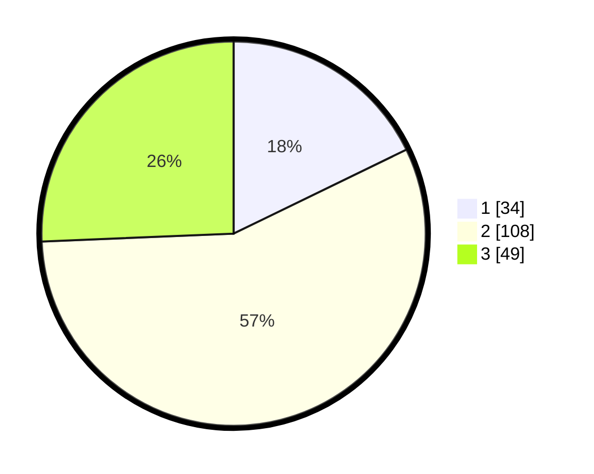

# Hasil

## Grafik

## Tabel

| No. | Nama Paslon    | Suara | Suara (raw) | Persentase |
|:--- |:-------------- | -----:| -----------:| ----------:|
| 1   | ANIES MUHAIMIN | 34    | [34][p-1]   | 17,80      |
| 2   | PRABOWO GIBRAN | 108   | [108][p-2]  | 56,54      |
| 3   | GANJAR MAHFUD  | 49    | [49][p-3]   | 25,65      |

[p-1]: https://github.com/gigit-pemilu/pemilu-2024/blob/main/pilpres/hitung-suara/sub/35-jawa-timur/sub/07-malang/sub/24-singosari/sub/2001-wonorejo/sub/002-tps/sub/paslon-1.txt
[p-2]: https://github.com/gigit-pemilu/pemilu-2024/blob/main/pilpres/hitung-suara/sub/35-jawa-timur/sub/07-malang/sub/24-singosari/sub/2001-wonorejo/sub/002-tps/sub/paslon-2.txt
[p-3]: https://github.com/gigit-pemilu/pemilu-2024/blob/main/pilpres/hitung-suara/sub/35-jawa-timur/sub/07-malang/sub/24-singosari/sub/2001-wonorejo/sub/002-tps/sub/paslon-3.txt

## Foto C Plano

https://sirekap-obj-formc.kpu.go.id/459c/pemilu/ppwp/35/07/24/20/01/3507242001002-20240215-005903--5a5290c4-e329-4098-b68a-b1131640d62d.jpg

https://sirekap-obj-formc.kpu.go.id/459c/pemilu/ppwp/35/07/24/20/01/3507242001002-20240215-051541--28db6072-6f37-407f-9cae-0c7baaaec989.jpg

https://sirekap-obj-formc.kpu.go.id/459c/pemilu/ppwp/35/07/24/20/01/3507242001002-20240215-051709--16a9321b-1277-478e-b6b0-72920330a4be.jpg

## Metadata

| Key        | Value               |
| ---------- | ------------------- |
| Time Stamp | 2024-02-17 17:30:00 |

