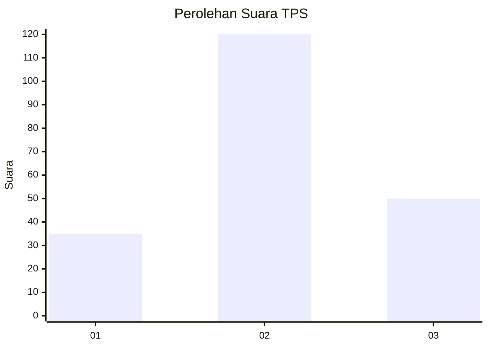
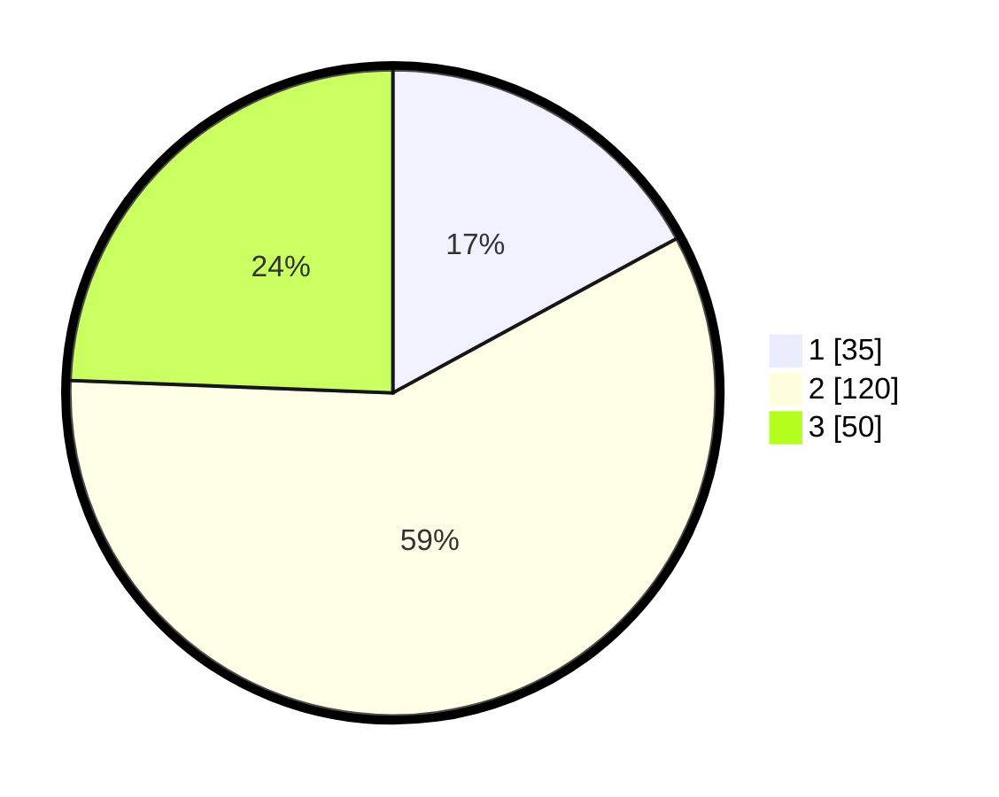

# Hasil

## Grafik

## Tabel

| No. | Nama Paslon    | Suara | Suara (raw) | Persentase |
|:--- |:-------------- | -----:| -----------:| ----------:|
| 1   | ANIES MUHAIMIN | 35    | [35][p-1]   | 17,07      |
| 2   | PRABOWO GIBRAN | 120   | [120][p-2]  | 58,54      |
| 3   | GANJAR MAHFUD  | 50    | [50][p-3]   | 24,39      |

[p-1]: https://github.com/gigit-pemilu/pemilu-2024-35-jawa-timur/blob/main/pilpres/hitung-suara/sub/35-jawa-timur/sub/07-malang/sub/24-singosari/sub/2001-wonorejo/sub/003-tps/sub/paslon-1.txt
[p-2]: https://github.com/gigit-pemilu/pemilu-2024-35-jawa-timur/blob/main/pilpres/hitung-suara/sub/35-jawa-timur/sub/07-malang/sub/24-singosari/sub/2001-wonorejo/sub/003-tps/sub/paslon-2.txt
[p-3]: https://github.com/gigit-pemilu/pemilu-2024-35-jawa-timur/blob/main/pilpres/hitung-suara/sub/35-jawa-timur/sub/07-malang/sub/24-singosari/sub/2001-wonorejo/sub/003-tps/sub/paslon-3.txt

## Foto C Plano

https://sirekap-obj-formc.kpu.go.id/b616/pemilu/ppwp/35/07/24/20/01/3507242001003-20240215-001645--6f4328ca-b2e2-4249-ab2f-be667657e6b5.jpg

https://sirekap-obj-formc.kpu.go.id/b616/pemilu/ppwp/35/07/24/20/01/3507242001003-20240215-001735--a5c51baa-e476-40e9-9b0d-a014d0bf1a22.jpg

https://sirekap-obj-formc.kpu.go.id/b616/pemilu/ppwp/35/07/24/20/01/3507242001003-20240215-002034--d888e154-3a7f-42c0-9dde-e0c2a7247249.jpg

## Metadata

| Key        | Value               |
| ---------- | ------------------- |
| Time Stamp | 2024-02-17 17:30:00 |

