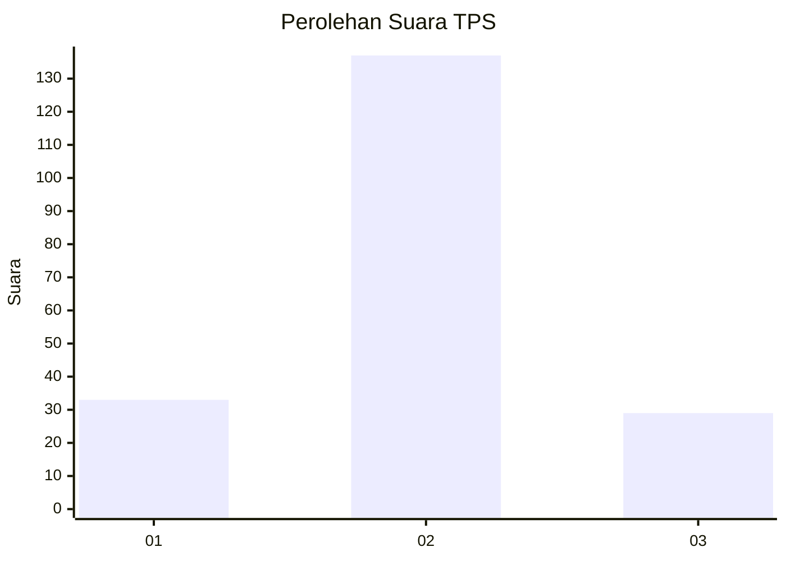

# Hasil

## Grafik

## Tabel

| No. | Nama Paslon    | Suara | Suara (raw) | Persentase |
|:--- |:-------------- | -----:| -----------:| ----------:|
| 1   | ANIES MUHAIMIN | 33    | [33][p-1]   | 16,58      |
| 2   | PRABOWO GIBRAN | 137   | [137][p-2]  | 68,84      |
| 3   | GANJAR MAHFUD  | 29    | [29][p-3]   | 14,57      |

[p-1]: https://github.com/gigit-pemilu/pemilu-2024-35-jawa-timur/blob/main/pilpres/hitung-suara/sub/35-jawa-timur/sub/07-malang/sub/24-singosari/sub/2001-wonorejo/sub/005-tps/sub/paslon-1.txt
[p-2]: https://github.com/gigit-pemilu/pemilu-2024-35-jawa-timur/blob/main/pilpres/hitung-suara/sub/35-jawa-timur/sub/07-malang/sub/24-singosari/sub/2001-wonorejo/sub/005-tps/sub/paslon-2.txt
[p-3]: https://github.com/gigit-pemilu/pemilu-2024-35-jawa-timur/blob/main/pilpres/hitung-suara/sub/35-jawa-timur/sub/07-malang/sub/24-singosari/sub/2001-wonorejo/sub/005-tps/sub/paslon-3.txt

## Foto C Plano

https://sirekap-obj-formc.kpu.go.id/16af/pemilu/ppwp/35/07/24/20/01/3507242001005-20240215-163708--d7e6586f-75bd-402a-b1e6-43e2cd8e515f.jpg

https://sirekap-obj-formc.kpu.go.id/16af/pemilu/ppwp/35/07/24/20/01/3507242001005-20240215-163718--d335b5e8-10dc-40a7-ad30-56322ccd9121.jpg

https://sirekap-obj-formc.kpu.go.id/16af/pemilu/ppwp/35/07/24/20/01/3507242001005-20240215-163727--e13317ab-6ea6-4e82-bf4b-c71c0e8ef5f0.jpg

## Metadata

| Key        | Value               |
| ---------- | ------------------- |
| Time Stamp | 2024-02-19 06:16:00 |

