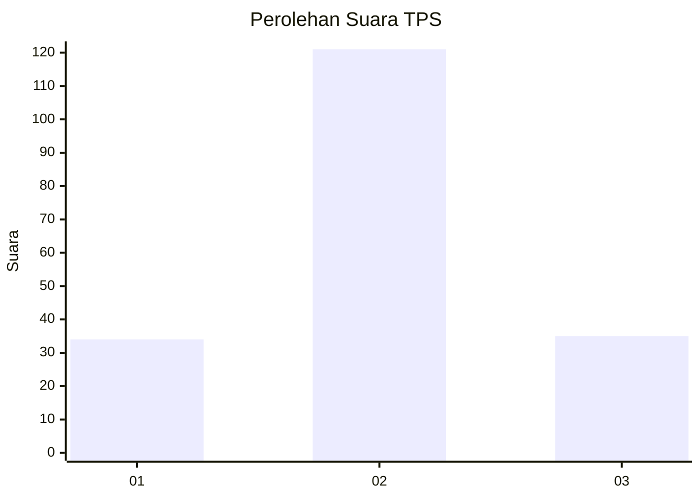
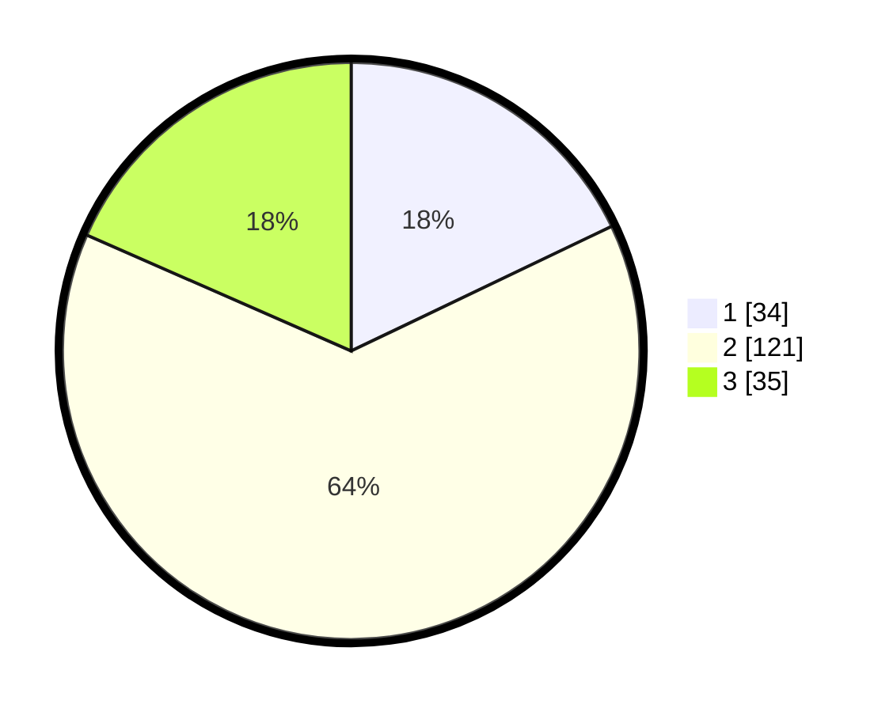

# Hasil

## Grafik

## Tabel

| No. | Nama Paslon    | Suara | Suara (raw) | Persentase |
|:--- |:-------------- | -----:| -----------:| ----------:|
| 1   | ANIES MUHAIMIN | 34    | [34][p-1]   | 17,89      |
| 2   | PRABOWO GIBRAN | 121   | [121][p-2]  | 63,68      |
| 3   | GANJAR MAHFUD  | 35    | [35][p-3]   | 18,42      |

[p-1]: https://github.com/gigit-pemilu/pemilu-2024/blob/main/pilpres/hitung-suara/sub/35-jawa-timur/sub/07-malang/sub/24-singosari/sub/2001-wonorejo/sub/006-tps/sub/paslon-1.txt
[p-2]: https://github.com/gigit-pemilu/pemilu-2024/blob/main/pilpres/hitung-suara/sub/35-jawa-timur/sub/07-malang/sub/24-singosari/sub/2001-wonorejo/sub/006-tps/sub/paslon-2.txt
[p-3]: https://github.com/gigit-pemilu/pemilu-2024/blob/main/pilpres/hitung-suara/sub/35-jawa-timur/sub/07-malang/sub/24-singosari/sub/2001-wonorejo/sub/006-tps/sub/paslon-3.txt

## Foto C Plano

https://sirekap-obj-formc.kpu.go.id/6555/pemilu/ppwp/35/07/24/20/01/3507242001006-20240215-010446--58ed0530-2e49-4c4f-b7fd-e20d3f8ec0e7.jpg

https://sirekap-obj-formc.kpu.go.id/6555/pemilu/ppwp/35/07/24/20/01/3507242001006-20240215-010550--9d0e5762-3452-4f59-855f-be3f1adb4c00.jpg

https://sirekap-obj-formc.kpu.go.id/6555/pemilu/ppwp/35/07/24/20/01/3507242001006-20240215-010703--e6582663-7eb8-4857-a2ec-14520572f217.jpg

## Metadata

| Key        | Value               |
| ---------- | ------------------- |
| Time Stamp | 2024-02-17 18:00:00 |

