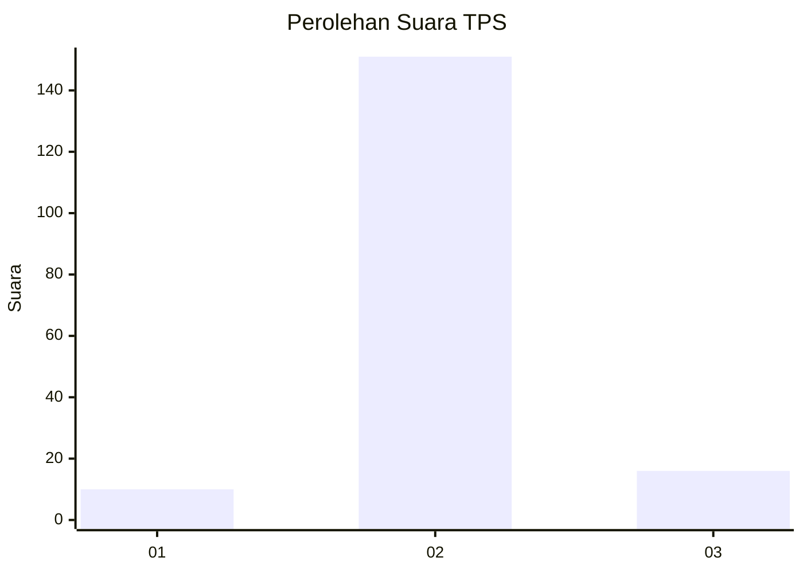
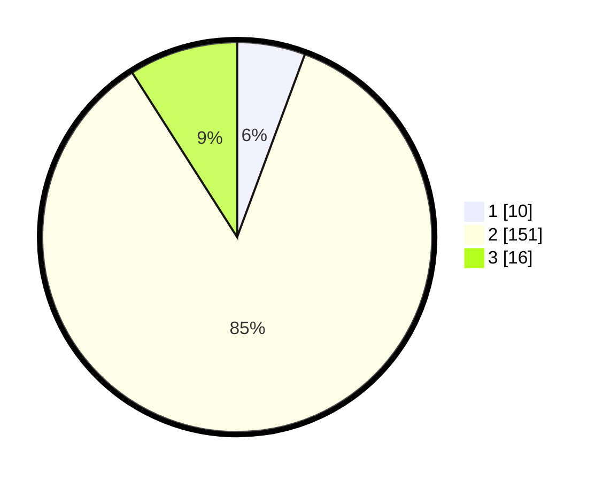

# Hasil

## Grafik

## Tabel

| No. | Nama Paslon    | Suara | Suara (raw) | Persentase |
|:--- |:-------------- | -----:| -----------:| ----------:|
| 1   | ANIES MUHAIMIN | 10    | [10][p-1]   | 5,65       |
| 2   | PRABOWO GIBRAN | 151   | [151][p-2]  | 85,31      |
| 3   | GANJAR MAHFUD  | 16    | [16][p-3]   | 9,04       |

[p-1]: https://github.com/gigit-pemilu/pemilu-2024-35-jawa-timur/blob/main/pilpres/hitung-suara/sub/35-jawa-timur/sub/07-malang/sub/24-singosari/sub/2001-wonorejo/sub/012-tps/sub/paslon-1.txt
[p-2]: https://github.com/gigit-pemilu/pemilu-2024-35-jawa-timur/blob/main/pilpres/hitung-suara/sub/35-jawa-timur/sub/07-malang/sub/24-singosari/sub/2001-wonorejo/sub/012-tps/sub/paslon-2.txt
[p-3]: https://github.com/gigit-pemilu/pemilu-2024-35-jawa-timur/blob/main/pilpres/hitung-suara/sub/35-jawa-timur/sub/07-malang/sub/24-singosari/sub/2001-wonorejo/sub/012-tps/sub/paslon-3.txt

## Foto C Plano

https://sirekap-obj-formc.kpu.go.id/768a/pemilu/ppwp/35/07/24/20/01/3507242001012-20240214-222313--a1d50ca2-f323-4295-a42b-3996154fe0e7.jpg

https://sirekap-obj-formc.kpu.go.id/768a/pemilu/ppwp/35/07/24/20/01/3507242001012-20240214-222503--86ddfa52-80ff-4b78-8ab4-c63e7e28eac0.jpg

https://sirekap-obj-formc.kpu.go.id/768a/pemilu/ppwp/35/07/24/20/01/3507242001012-20240214-222550--dbaded04-cd78-4ca1-8ba3-04be6f632364.jpg

## Metadata

| Key        | Value               |
| ---------- | ------------------- |
| Time Stamp | 2024-02-15 09:00:24 |

