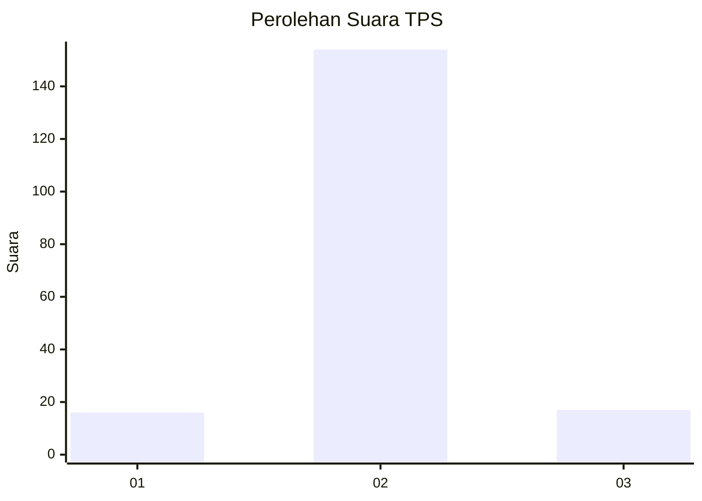
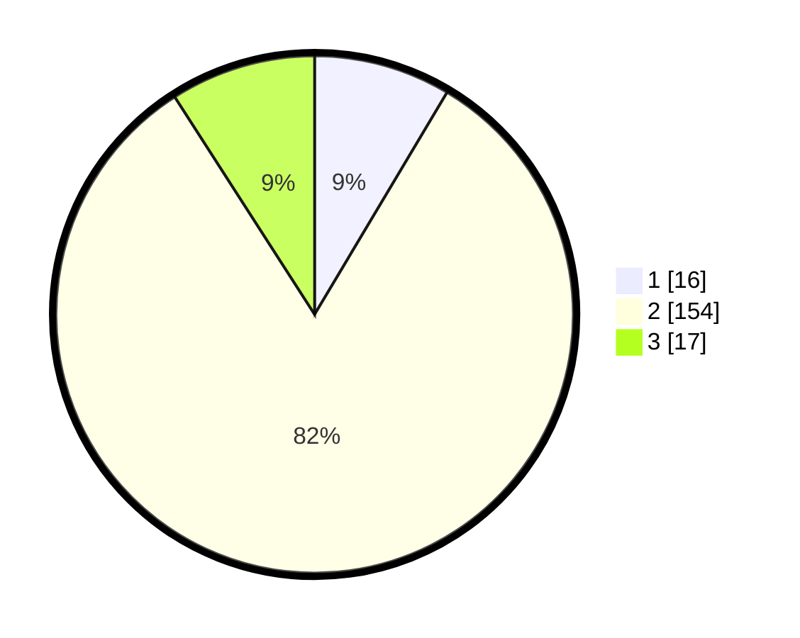

# Hasil

## Grafik

## Tabel

| No. | Nama Paslon    | Suara | Suara (raw) | Persentase |
|:--- |:-------------- | -----:| -----------:| ----------:|
| 1   | ANIES MUHAIMIN | 16    | [16][p-1]   | 8,56       |
| 2   | PRABOWO GIBRAN | 154   | [154][p-2]  | 82,35      |
| 3   | GANJAR MAHFUD  | 17    | [17][p-3]   | 9,09       |

[p-1]: https://github.com/gigit-pemilu/pemilu-2024-35-jawa-timur/blob/main/pilpres/hitung-suara/sub/35-jawa-timur/sub/07-malang/sub/24-singosari/sub/2001-wonorejo/sub/014-tps/sub/paslon-1.txt
[p-2]: https://github.com/gigit-pemilu/pemilu-2024-35-jawa-timur/blob/main/pilpres/hitung-suara/sub/35-jawa-timur/sub/07-malang/sub/24-singosari/sub/2001-wonorejo/sub/014-tps/sub/paslon-2.txt
[p-3]: https://github.com/gigit-pemilu/pemilu-2024-35-jawa-timur/blob/main/pilpres/hitung-suara/sub/35-jawa-timur/sub/07-malang/sub/24-singosari/sub/2001-wonorejo/sub/014-tps/sub/paslon-3.txt

## Foto C Plano

https://sirekap-obj-formc.kpu.go.id/3d21/pemilu/ppwp/35/07/24/20/01/3507242001014-20240214-193259--9ab40115-7ed9-4b0f-a03f-ee15c77ed2ac.jpg

https://sirekap-obj-formc.kpu.go.id/3d21/pemilu/ppwp/35/07/24/20/01/3507242001014-20240214-194458--f70735a0-4e14-4510-8bb1-3eb65369d50d.jpg

https://sirekap-obj-formc.kpu.go.id/3d21/pemilu/ppwp/35/07/24/20/01/3507242001014-20240214-194706--c03710a1-ee24-4c74-a606-1609cf6c3c61.jpg

## Metadata

| Key        | Value               |
| ---------- | ------------------- |
| Time Stamp | 2024-02-17 18:00:00 |

