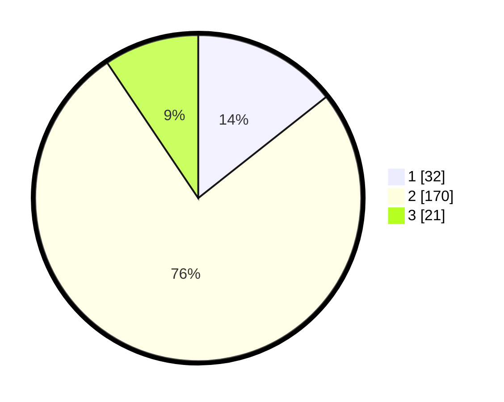

# Hasil

## Grafik

## Tabel

| No. | Nama Paslon    | Suara | Suara (raw) | Persentase |
|:--- |:-------------- | -----:| -----------:| ----------:|
| 1   | ANIES MUHAIMIN | 32    | [32][p-1]   | 14,35      |
| 2   | PRABOWO GIBRAN | 170   | [170][p-2]  | 76,23      |
| 3   | GANJAR MAHFUD  | 21    | [21][p-3]   | 9,42       |

[p-1]: https://github.com/gigit-pemilu/pemilu-2024/blob/main/pilpres/hitung-suara/sub/35-jawa-timur/sub/07-malang/sub/24-singosari/sub/2002-dengkol/sub/005-tps/sub/paslon-1.txt
[p-2]: https://github.com/gigit-pemilu/pemilu-2024/blob/main/pilpres/hitung-suara/sub/35-jawa-timur/sub/07-malang/sub/24-singosari/sub/2002-dengkol/sub/005-tps/sub/paslon-2.txt
[p-3]: https://github.com/gigit-pemilu/pemilu-2024/blob/main/pilpres/hitung-suara/sub/35-jawa-timur/sub/07-malang/sub/24-singosari/sub/2002-dengkol/sub/005-tps/sub/paslon-3.txt

## Foto C Plano

https://sirekap-obj-formc.kpu.go.id/43df/pemilu/ppwp/35/07/24/20/02/3507242002005-20240217-220211--44f51c13-471b-44a5-b207-f91b18fc775f.jpg

https://sirekap-obj-formc.kpu.go.id/43df/pemilu/ppwp/35/07/24/20/02/3507242002005-20240217-220351--72e93908-c1ca-4bd4-b363-f3f74fc4d924.jpg

https://sirekap-obj-formc.kpu.go.id/43df/pemilu/ppwp/35/07/24/20/02/3507242002005-20240217-220514--7437027c-38a0-423b-a908-edcd6337bb59.jpg

## Metadata

| Key        | Value               |
| ---------- | ------------------- |
| Time Stamp | 2024-02-19 06:16:00 |

