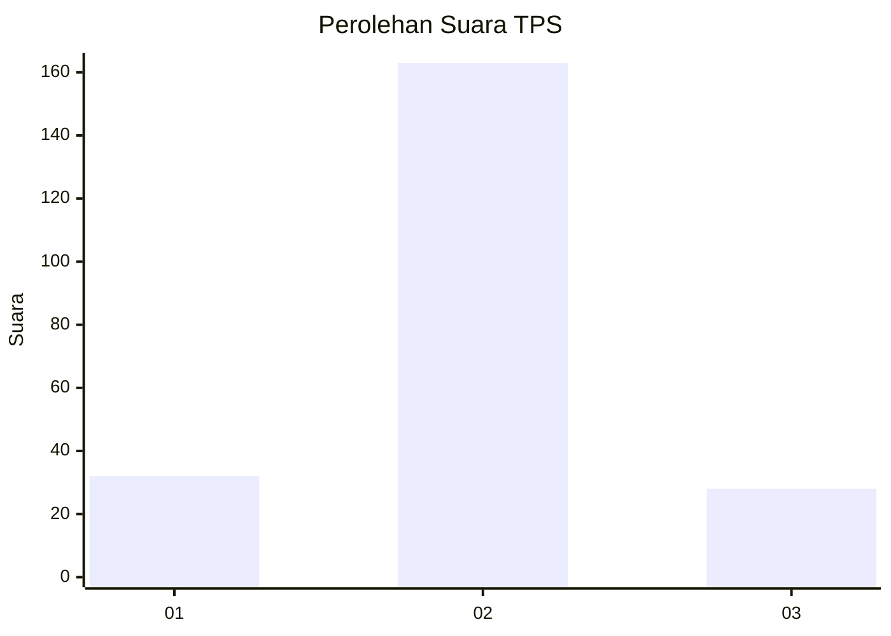
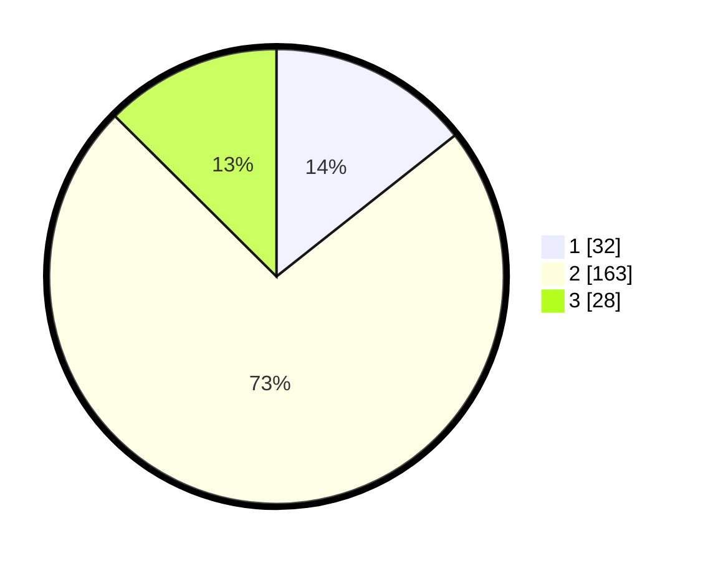

# Hasil

## Grafik

## Tabel

| No. | Nama Paslon    | Suara | Suara (raw) | Persentase |
|:--- |:-------------- | -----:| -----------:| ----------:|
| 1   | ANIES MUHAIMIN | 32    | [32][p-1]   | 14,35      |
| 2   | PRABOWO GIBRAN | 163   | [163][p-2]  | 73,09      |
| 3   | GANJAR MAHFUD  | 28    | [28][p-3]   | 12,56      |

[p-1]: https://github.com/gigit-pemilu/pemilu-2024/blob/main/pilpres/hitung-suara/sub/35-jawa-timur/sub/07-malang/sub/24-singosari/sub/2003-baturetno/sub/002-tps/sub/paslon-1.txt
[p-2]: https://github.com/gigit-pemilu/pemilu-2024/blob/main/pilpres/hitung-suara/sub/35-jawa-timur/sub/07-malang/sub/24-singosari/sub/2003-baturetno/sub/002-tps/sub/paslon-2.txt
[p-3]: https://github.com/gigit-pemilu/pemilu-2024/blob/main/pilpres/hitung-suara/sub/35-jawa-timur/sub/07-malang/sub/24-singosari/sub/2003-baturetno/sub/002-tps/sub/paslon-3.txt

## Foto C Plano

https://sirekap-obj-formc.kpu.go.id/9162/pemilu/ppwp/35/07/24/20/03/3507242003002-20240217-113701--5c60855f-ef92-4408-bcdd-178c5a0dc77a.jpg

https://sirekap-obj-formc.kpu.go.id/9162/pemilu/ppwp/35/07/24/20/03/3507242003002-20240216-105158--217a8ec4-4884-422e-a721-296bba409096.jpg

https://sirekap-obj-formc.kpu.go.id/9162/pemilu/ppwp/35/07/24/20/03/3507242003002-20240216-105348--0d3ad20e-90a4-45e1-aa7b-d7320be39a06.jpg

## Metadata

| Key        | Value               |
| ---------- | ------------------- |
| Time Stamp | 2024-02-19 06:16:00 |

