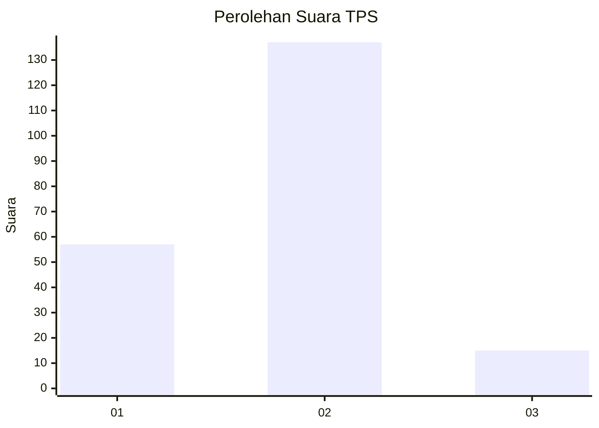
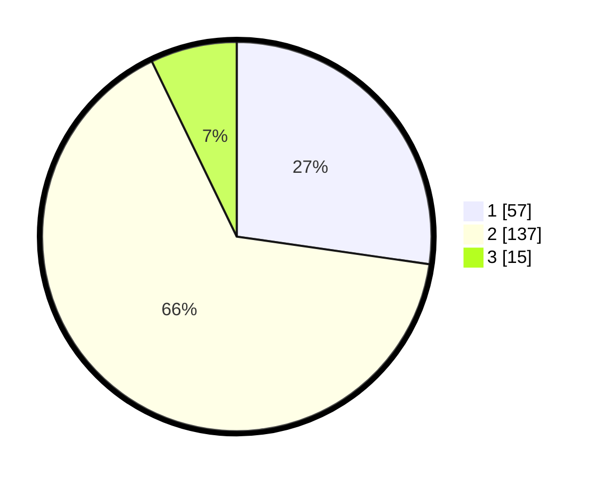

# Hasil

## Grafik

## Tabel

| No. | Nama Paslon    | Suara | Suara (raw) | Persentase |
|:--- |:-------------- | -----:| -----------:| ----------:|
| 1   | ANIES MUHAIMIN | 57    | [57][p-1]   | 27,27      |
| 2   | PRABOWO GIBRAN | 137   | [137][p-2]  | 65,55      |
| 3   | GANJAR MAHFUD  | 15    | [15][p-3]   | 7,18       |

[p-1]: https://github.com/gigit-pemilu/pemilu-2024-35-jawa-timur/blob/main/pilpres/hitung-suara/sub/35-jawa-timur/sub/07-malang/sub/24-singosari/sub/2003-baturetno/sub/012-tps/sub/paslon-1.txt
[p-2]: https://github.com/gigit-pemilu/pemilu-2024-35-jawa-timur/blob/main/pilpres/hitung-suara/sub/35-jawa-timur/sub/07-malang/sub/24-singosari/sub/2003-baturetno/sub/012-tps/sub/paslon-2.txt
[p-3]: https://github.com/gigit-pemilu/pemilu-2024-35-jawa-timur/blob/main/pilpres/hitung-suara/sub/35-jawa-timur/sub/07-malang/sub/24-singosari/sub/2003-baturetno/sub/012-tps/sub/paslon-3.txt

## Foto C Plano

https://sirekap-obj-formc.kpu.go.id/a5d0/pemilu/ppwp/35/07/24/20/03/3507242003012-20240214-141323--138eef20-5ee8-4dfb-ab1d-4fa03dea9267.jpg

https://sirekap-obj-formc.kpu.go.id/a5d0/pemilu/ppwp/35/07/24/20/03/3507242003012-20240214-141723--68d46072-0d86-4112-9eef-b0a89676df0d.jpg

https://sirekap-obj-formc.kpu.go.id/a5d0/pemilu/ppwp/35/07/24/20/03/3507242003012-20240214-141851--06dfcbb9-ccb5-4270-98bb-5adeeb40fd97.jpg

## Metadata

| Key        | Value               |
| ---------- | ------------------- |
| Time Stamp | 2024-02-14 21:46:01 |

