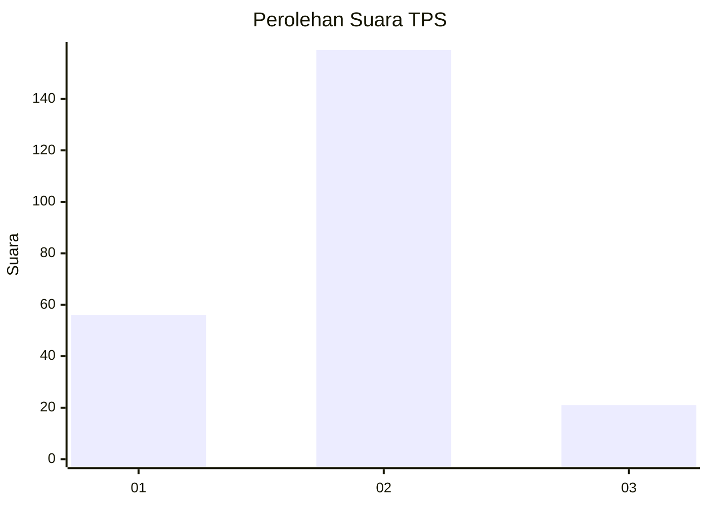
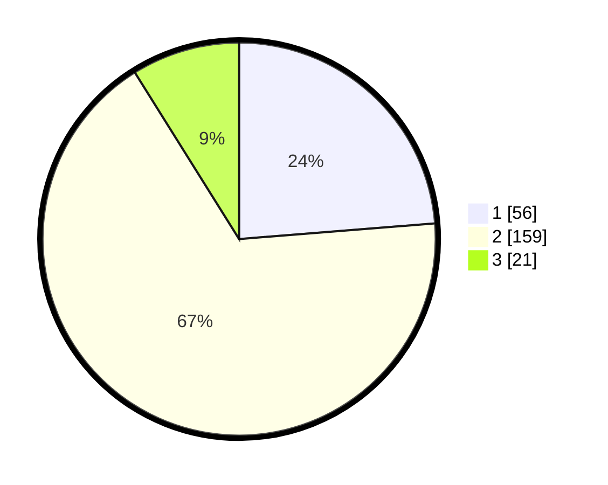

# Hasil

## Grafik

## Tabel

| No. | Nama Paslon    | Suara | Suara (raw) | Persentase |
|:--- |:-------------- | -----:| -----------:| ----------:|
| 1   | ANIES MUHAIMIN | 56    | [56][p-1]   | 23,73      |
| 2   | PRABOWO GIBRAN | 159   | [159][p-2]  | 67,37      |
| 3   | GANJAR MAHFUD  | 21    | [21][p-3]   | 8,90       |

[p-1]: https://github.com/gigit-pemilu/pemilu-2024/blob/main/pilpres/hitung-suara/sub/35-jawa-timur/sub/07-malang/sub/24-singosari/sub/2004-watugede/sub/003-tps/sub/paslon-1.txt
[p-2]: https://github.com/gigit-pemilu/pemilu-2024/blob/main/pilpres/hitung-suara/sub/35-jawa-timur/sub/07-malang/sub/24-singosari/sub/2004-watugede/sub/003-tps/sub/paslon-2.txt
[p-3]: https://github.com/gigit-pemilu/pemilu-2024/blob/main/pilpres/hitung-suara/sub/35-jawa-timur/sub/07-malang/sub/24-singosari/sub/2004-watugede/sub/003-tps/sub/paslon-3.txt

## Foto C Plano

https://sirekap-obj-formc.kpu.go.id/04b1/pemilu/ppwp/35/07/24/20/04/3507242004003-20240214-212914--ccc7b97e-0542-4798-880b-c98b0c65014f.jpg

https://sirekap-obj-formc.kpu.go.id/04b1/pemilu/ppwp/35/07/24/20/04/3507242004003-20240214-212925--fcd56d6d-49c7-4182-921d-5edf22649dc7.jpg

https://sirekap-obj-formc.kpu.go.id/04b1/pemilu/ppwp/35/07/24/20/04/3507242004003-20240214-212936--5916f71a-7165-4bb1-bfd3-440fb8ae8854.jpg

## Metadata

| Key        | Value               |
| ---------- | ------------------- |
| Time Stamp | 2024-02-15 18:00:26 |

