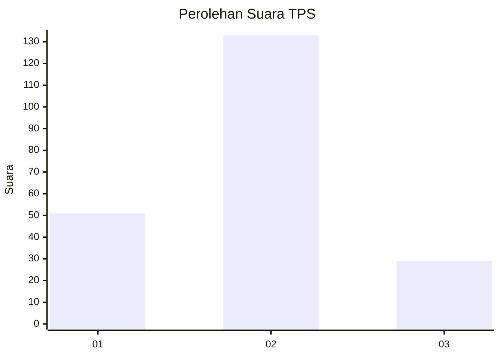
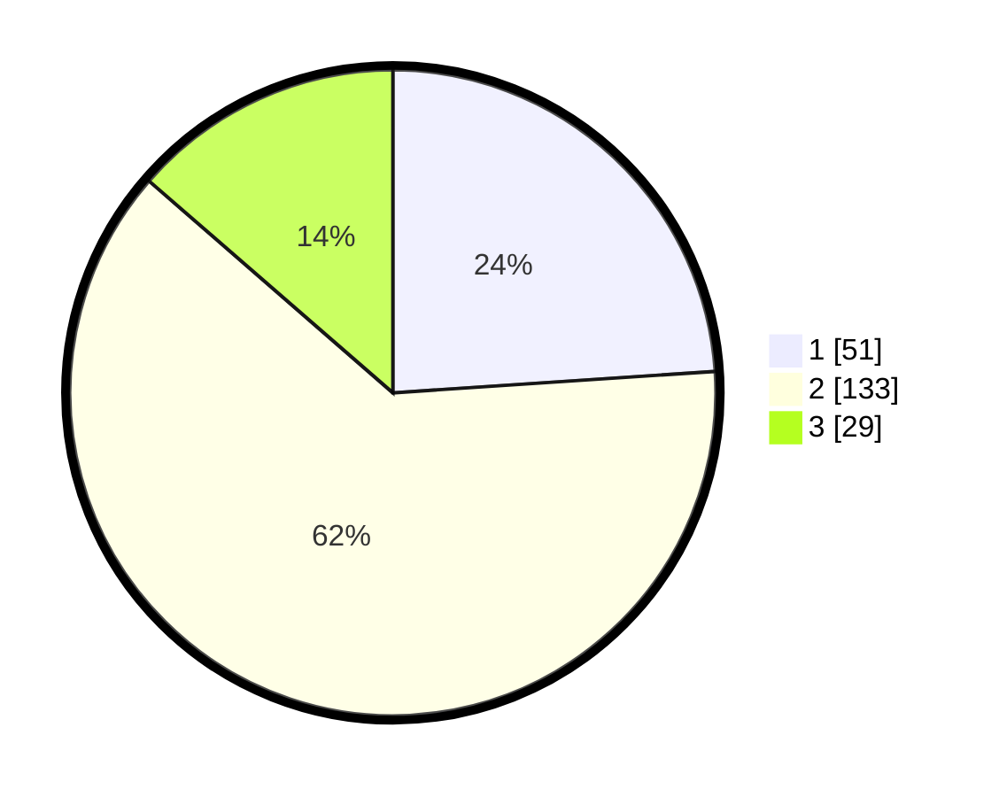

# Hasil

## Grafik

## Tabel

| No. | Nama Paslon    | Suara | Suara (raw) | Persentase |
|:--- |:-------------- | -----:| -----------:| ----------:|
| 1   | ANIES MUHAIMIN | 51    | [51][p-1]   | 23,94      |
| 2   | PRABOWO GIBRAN | 133   | [133][p-2]  | 62,44      |
| 3   | GANJAR MAHFUD  | 29    | [29][p-3]   | 13,62      |

[p-1]: https://github.com/gigit-pemilu/pemilu-2024/blob/main/pilpres/hitung-suara/sub/35-jawa-timur/sub/07-malang/sub/24-singosari/sub/2004-watugede/sub/004-tps/sub/paslon-1.txt
[p-2]: https://github.com/gigit-pemilu/pemilu-2024/blob/main/pilpres/hitung-suara/sub/35-jawa-timur/sub/07-malang/sub/24-singosari/sub/2004-watugede/sub/004-tps/sub/paslon-2.txt
[p-3]: https://github.com/gigit-pemilu/pemilu-2024/blob/main/pilpres/hitung-suara/sub/35-jawa-timur/sub/07-malang/sub/24-singosari/sub/2004-watugede/sub/004-tps/sub/paslon-3.txt

## Foto C Plano

https://sirekap-obj-formc.kpu.go.id/c541/pemilu/ppwp/35/07/24/20/04/3507242004004-20240215-011430--6e4bc2d5-f8df-4a79-bd2a-dcb830bc20e0.jpg

https://sirekap-obj-formc.kpu.go.id/c541/pemilu/ppwp/35/07/24/20/04/3507242004004-20240215-011444--969bfbdd-b907-4dfe-ab08-4253f5a5c5b7.jpg

https://sirekap-obj-formc.kpu.go.id/c541/pemilu/ppwp/35/07/24/20/04/3507242004004-20240215-011522--078b3098-b622-4cae-b3ef-ad78a5a4d4d1.jpg

## Metadata

| Key        | Value               |
| ---------- | ------------------- |
| Time Stamp | 2024-02-17 00:28:35 |

