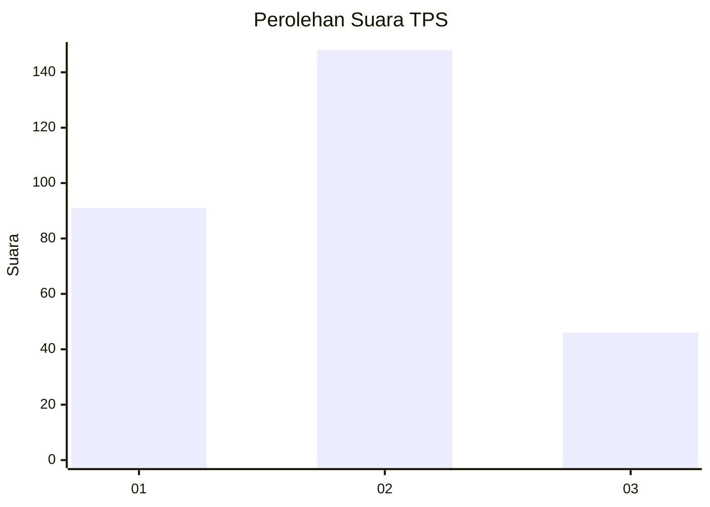
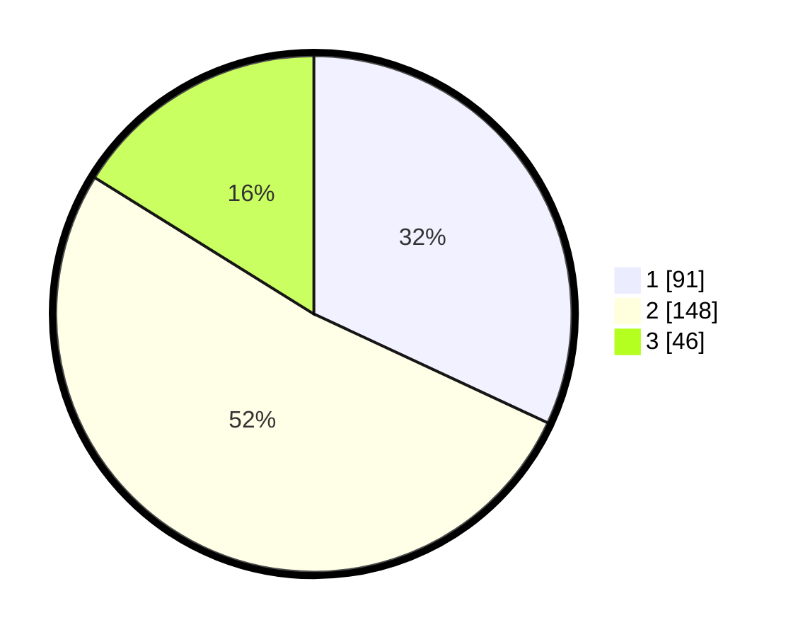

# Hasil

## Grafik

## Tabel

| No. | Nama Paslon    | Suara | Suara (raw) | Persentase |
|:--- |:-------------- | -----:| -----------:| ----------:|
| 1   | ANIES MUHAIMIN | 91    | [91][p-1]   | 31,93      |
| 2   | PRABOWO GIBRAN | 148   | [148][p-2]  | 51,93      |
| 3   | GANJAR MAHFUD  | 46    | [46][p-3]   | 16,14      |

[p-1]: https://github.com/gigit-pemilu/pemilu-2024/blob/main/pilpres/hitung-suara/sub/35-jawa-timur/sub/07-malang/sub/24-singosari/sub/2005-banjararum/sub/006-tps/sub/paslon-1.txt
[p-2]: https://github.com/gigit-pemilu/pemilu-2024/blob/main/pilpres/hitung-suara/sub/35-jawa-timur/sub/07-malang/sub/24-singosari/sub/2005-banjararum/sub/006-tps/sub/paslon-2.txt
[p-3]: https://github.com/gigit-pemilu/pemilu-2024/blob/main/pilpres/hitung-suara/sub/35-jawa-timur/sub/07-malang/sub/24-singosari/sub/2005-banjararum/sub/006-tps/sub/paslon-3.txt

## Foto C Plano

https://sirekap-obj-formc.kpu.go.id/1c82/pemilu/ppwp/35/07/24/20/05/3507242005006-20240215-032727--7437e5d7-6da1-4133-a2d7-4e47a6a1845d.jpg

https://sirekap-obj-formc.kpu.go.id/1c82/pemilu/ppwp/35/07/24/20/05/3507242005006-20240215-032620--af479447-07de-4b48-b206-943dd4741040.jpg

https://sirekap-obj-formc.kpu.go.id/1c82/pemilu/ppwp/35/07/24/20/05/3507242005006-20240215-032851--21b56e43-4a4c-46ec-91bd-91f0ec76c628.jpg

## Metadata

| Key        | Value               |
| ---------- | ------------------- |
| Time Stamp | 2024-02-15 18:00:26 |

