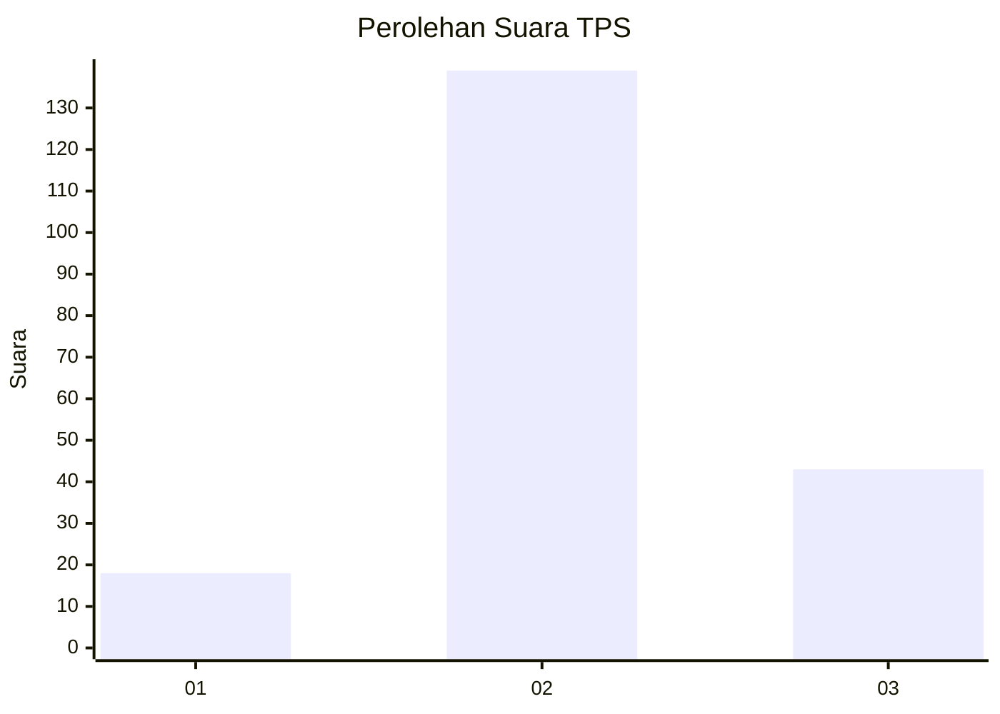
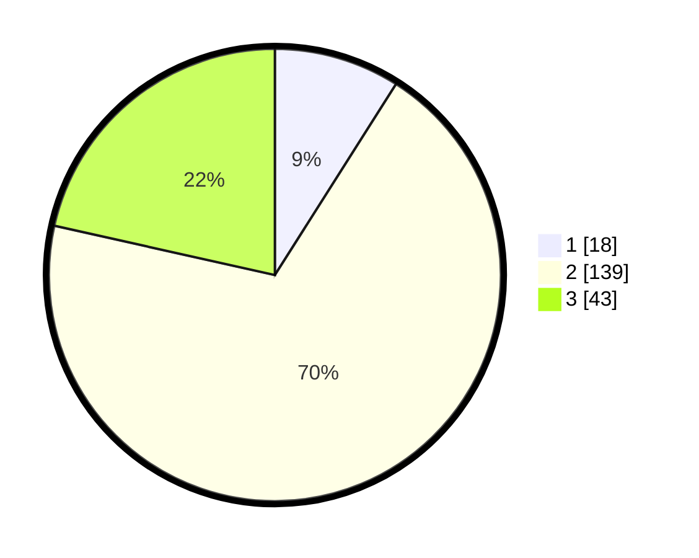

# Hasil

## Grafik

## Tabel

| No. | Nama Paslon    | Suara | Suara (raw) | Persentase |
|:--- |:-------------- | -----:| -----------:| ----------:|
| 1   | ANIES MUHAIMIN | 18    | [18][p-1]   | 9,00       |
| 2   | PRABOWO GIBRAN | 139   | [139][p-2]  | 69,50      |
| 3   | GANJAR MAHFUD  | 43    | [43][p-3]   | 21,50      |

[p-1]: https://github.com/gigit-pemilu/pemilu-2024/blob/main/pilpres/hitung-suara/sub/35-jawa-timur/sub/07-malang/sub/24-singosari/sub/2005-banjararum/sub/025-tps/sub/paslon-1.txt
[p-2]: https://github.com/gigit-pemilu/pemilu-2024/blob/main/pilpres/hitung-suara/sub/35-jawa-timur/sub/07-malang/sub/24-singosari/sub/2005-banjararum/sub/025-tps/sub/paslon-2.txt
[p-3]: https://github.com/gigit-pemilu/pemilu-2024/blob/main/pilpres/hitung-suara/sub/35-jawa-timur/sub/07-malang/sub/24-singosari/sub/2005-banjararum/sub/025-tps/sub/paslon-3.txt

## Foto C Plano

https://sirekap-obj-formc.kpu.go.id/aa50/pemilu/ppwp/35/07/24/20/05/3507242005025-20240215-072230--b4ec8165-ac1d-4010-921c-d13c1cf6c9f6.jpg

https://sirekap-obj-formc.kpu.go.id/aa50/pemilu/ppwp/35/07/24/20/05/3507242005025-20240215-072336--60d6f9d8-36c2-4c9b-b5d2-e6715fef7253.jpg

https://sirekap-obj-formc.kpu.go.id/aa50/pemilu/ppwp/35/07/24/20/05/3507242005025-20240215-072425--1cbde34a-1f18-4ef4-8747-0d9d755c363f.jpg

## Metadata

| Key        | Value               |
| ---------- | ------------------- |
| Time Stamp | 2024-02-15 18:00:26 |

