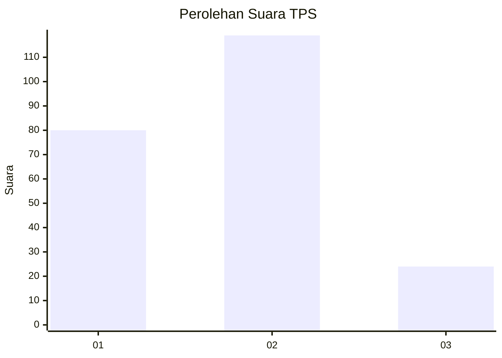
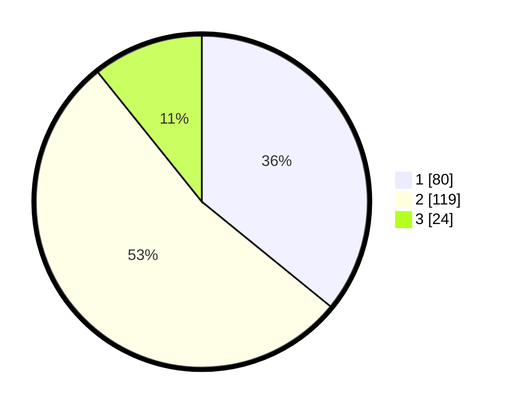

# Hasil

## Grafik

## Tabel

| No. | Nama Paslon    | Suara | Suara (raw) | Persentase |
|:--- |:-------------- | -----:| -----------:| ----------:|
| 1   | ANIES MUHAIMIN | 80    | [80][p-1]   | 35,87      |
| 2   | PRABOWO GIBRAN | 119   | [119][p-2]  | 53,36      |
| 3   | GANJAR MAHFUD  | 24    | [24][p-3]   | 10,76      |

[p-1]: https://github.com/gigit-pemilu/pemilu-2024/blob/main/pilpres/hitung-suara/sub/35-jawa-timur/sub/07-malang/sub/24-singosari/sub/2005-banjararum/sub/034-tps/sub/paslon-1.txt
[p-2]: https://github.com/gigit-pemilu/pemilu-2024/blob/main/pilpres/hitung-suara/sub/35-jawa-timur/sub/07-malang/sub/24-singosari/sub/2005-banjararum/sub/034-tps/sub/paslon-2.txt
[p-3]: https://github.com/gigit-pemilu/pemilu-2024/blob/main/pilpres/hitung-suara/sub/35-jawa-timur/sub/07-malang/sub/24-singosari/sub/2005-banjararum/sub/034-tps/sub/paslon-3.txt

## Foto C Plano

https://sirekap-obj-formc.kpu.go.id/8fc8/pemilu/ppwp/35/07/24/20/05/3507242005034-20240216-224943--4ae6c154-6788-4c77-98cf-bb3697a85397.jpg

https://sirekap-obj-formc.kpu.go.id/8fc8/pemilu/ppwp/35/07/24/20/05/3507242005034-20240216-224436--9f763a33-cf0e-410d-a20b-e31a9722e93e.jpg

https://sirekap-obj-formc.kpu.go.id/8fc8/pemilu/ppwp/35/07/24/20/05/3507242005034-20240216-224711--c1f4cde1-3800-4057-a650-2e26e9a05e46.jpg

## Metadata

| Key        | Value               |
| ---------- | ------------------- |
| Time Stamp | 2024-02-17 08:00:02 |

