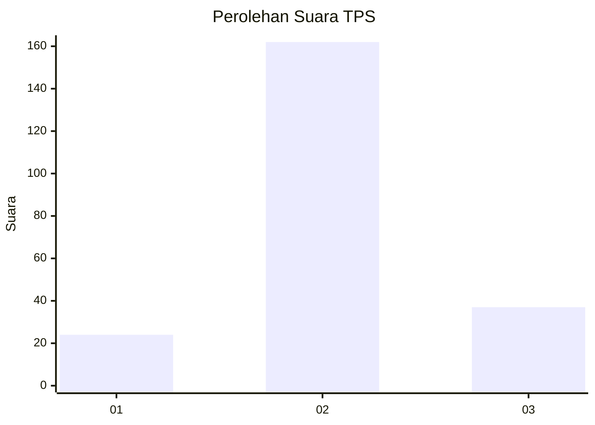
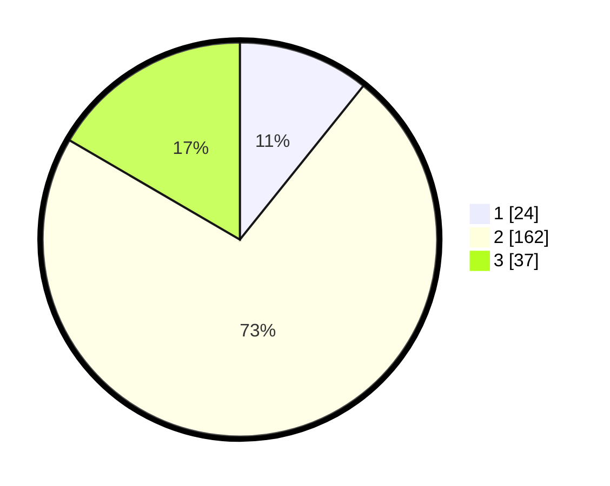

# Hasil

## Grafik

## Tabel

| No. | Nama Paslon    | Suara | Suara (raw) | Persentase |
|:--- |:-------------- | -----:| -----------:| ----------:|
| 1   | ANIES MUHAIMIN | 24    | [24][p-1]   | 10,76      |
| 2   | PRABOWO GIBRAN | 162   | [162][p-2]  | 72,65      |
| 3   | GANJAR MAHFUD  | 37    | [37][p-3]   | 16,59      |

[p-1]: https://github.com/gigit-pemilu/pemilu-2024/blob/main/pilpres/hitung-suara/sub/35-jawa-timur/sub/07-malang/sub/24-singosari/sub/2006-tunjungtirto/sub/002-tps/sub/paslon-1.txt
[p-2]: https://github.com/gigit-pemilu/pemilu-2024/blob/main/pilpres/hitung-suara/sub/35-jawa-timur/sub/07-malang/sub/24-singosari/sub/2006-tunjungtirto/sub/002-tps/sub/paslon-2.txt
[p-3]: https://github.com/gigit-pemilu/pemilu-2024/blob/main/pilpres/hitung-suara/sub/35-jawa-timur/sub/07-malang/sub/24-singosari/sub/2006-tunjungtirto/sub/002-tps/sub/paslon-3.txt

## Foto C Plano

https://sirekap-obj-formc.kpu.go.id/b778/pemilu/ppwp/35/07/24/20/06/3507242006002-20240215-223731--f177adfc-b45b-4e49-a02d-fe502d34799f.jpg

https://sirekap-obj-formc.kpu.go.id/b778/pemilu/ppwp/35/07/24/20/06/3507242006002-20240215-223907--05bb5cb1-bc83-434f-9bee-4fcd0178cf95.jpg

https://sirekap-obj-formc.kpu.go.id/b778/pemilu/ppwp/35/07/24/20/06/3507242006002-20240215-224628--0d084f53-8d36-4d47-9505-fbab01d4101f.jpg

## Metadata

| Key        | Value               |
| ---------- | ------------------- |
| Time Stamp | 2024-02-17 17:30:00 |

