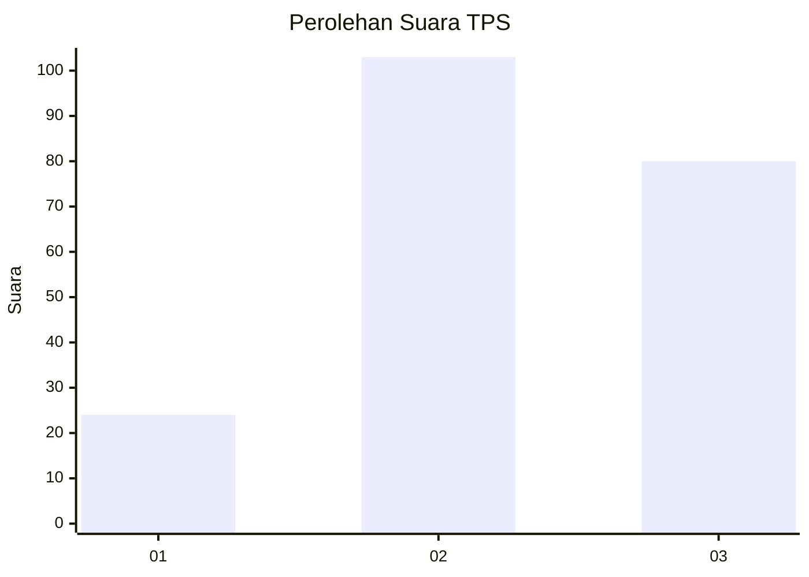
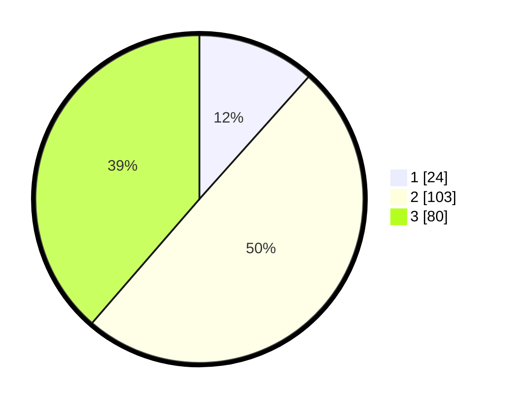

# Hasil

## Grafik

## Tabel

| No. | Nama Paslon    | Suara | Suara (raw) | Persentase |
|:--- |:-------------- | -----:| -----------:| ----------:|
| 1   | ANIES MUHAIMIN | 24    | [24][p-1]   | 11,59      |
| 2   | PRABOWO GIBRAN | 103   | [103][p-2]  | 49,76      |
| 3   | GANJAR MAHFUD  | 80    | [80][p-3]   | 38,65      |

[p-1]: https://github.com/gigit-pemilu/pemilu-2024-35-jawa-timur/blob/main/pilpres/hitung-suara/sub/35-jawa-timur/sub/07-malang/sub/24-singosari/sub/2006-tunjungtirto/sub/006-tps/sub/paslon-1.txt
[p-2]: https://github.com/gigit-pemilu/pemilu-2024-35-jawa-timur/blob/main/pilpres/hitung-suara/sub/35-jawa-timur/sub/07-malang/sub/24-singosari/sub/2006-tunjungtirto/sub/006-tps/sub/paslon-2.txt
[p-3]: https://github.com/gigit-pemilu/pemilu-2024-35-jawa-timur/blob/main/pilpres/hitung-suara/sub/35-jawa-timur/sub/07-malang/sub/24-singosari/sub/2006-tunjungtirto/sub/006-tps/sub/paslon-3.txt

## Foto C Plano

https://sirekap-obj-formc.kpu.go.id/154d/pemilu/ppwp/35/07/24/20/06/3507242006006-20240214-224055--5c671b04-af26-4908-a747-0e78d1e16270.jpg

https://sirekap-obj-formc.kpu.go.id/154d/pemilu/ppwp/35/07/24/20/06/3507242006006-20240214-224131--97526f2c-d05b-495a-bbc8-b20bbe21cf99.jpg

https://sirekap-obj-formc.kpu.go.id/154d/pemilu/ppwp/35/07/24/20/06/3507242006006-20240214-224219--22b90209-5378-4197-8b14-1b2097f6fe74.jpg

## Metadata

| Key        | Value               |
| ---------- | ------------------- |
| Time Stamp | 2024-02-17 18:30:00 |

