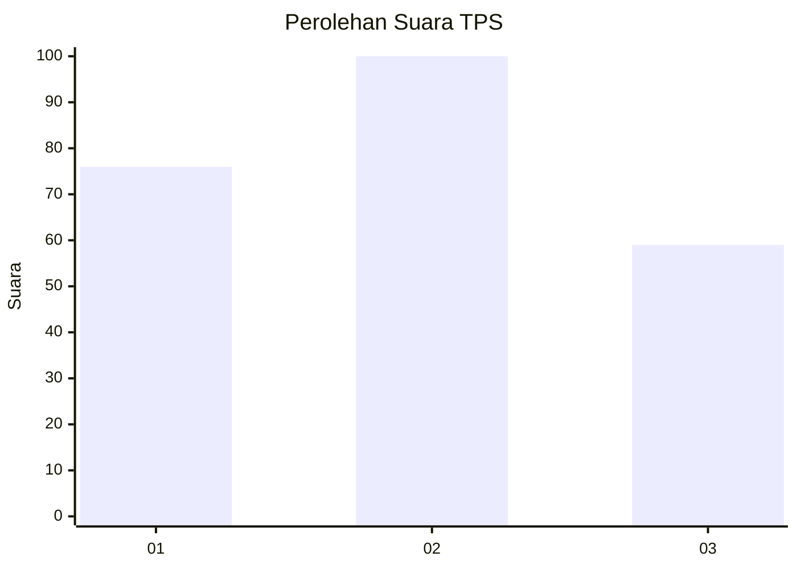
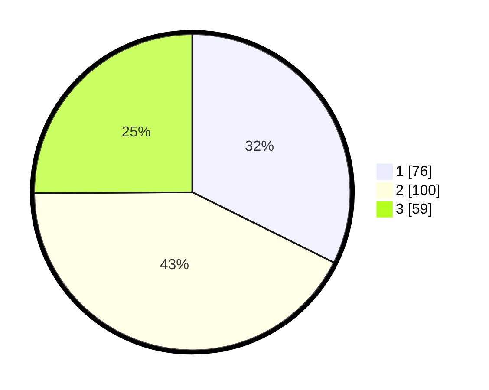

# Hasil

## Grafik

## Tabel

| No. | Nama Paslon    | Suara | Suara (raw) | Persentase |
|:--- |:-------------- | -----:| -----------:| ----------:|
| 1   | ANIES MUHAIMIN | 76    | [76][p-1]   | 32,34      |
| 2   | PRABOWO GIBRAN | 100   | [100][p-2]  | 42,55      |
| 3   | GANJAR MAHFUD  | 59    | [59][p-3]   | 25,11      |

[p-1]: https://github.com/gigit-pemilu/pemilu-2024-35-jawa-timur/blob/main/pilpres/hitung-suara/sub/35-jawa-timur/sub/07-malang/sub/24-singosari/sub/2006-tunjungtirto/sub/021-tps/sub/paslon-1.txt
[p-2]: https://github.com/gigit-pemilu/pemilu-2024-35-jawa-timur/blob/main/pilpres/hitung-suara/sub/35-jawa-timur/sub/07-malang/sub/24-singosari/sub/2006-tunjungtirto/sub/021-tps/sub/paslon-2.txt
[p-3]: https://github.com/gigit-pemilu/pemilu-2024-35-jawa-timur/blob/main/pilpres/hitung-suara/sub/35-jawa-timur/sub/07-malang/sub/24-singosari/sub/2006-tunjungtirto/sub/021-tps/sub/paslon-3.txt

## Foto C Plano

https://sirekap-obj-formc.kpu.go.id/5167/pemilu/ppwp/35/07/24/20/06/3507242006021-20240215-213212--544d2a99-d13a-408d-838c-9a05c8f8fb93.jpg

https://sirekap-obj-formc.kpu.go.id/5167/pemilu/ppwp/35/07/24/20/06/3507242006021-20240215-213509--667561e2-ff00-4cd7-ab4d-4a8016313313.jpg

https://sirekap-obj-formc.kpu.go.id/5167/pemilu/ppwp/35/07/24/20/06/3507242006021-20240215-213648--8d726886-34af-4e55-a7cd-6016c35eb299.jpg

## Metadata

| Key        | Value               |
| ---------- | ------------------- |
| Time Stamp | 2024-02-17 18:00:00 |

