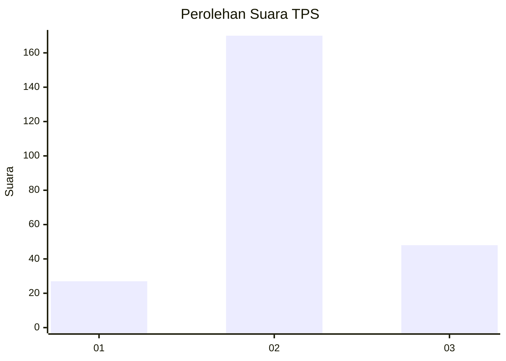
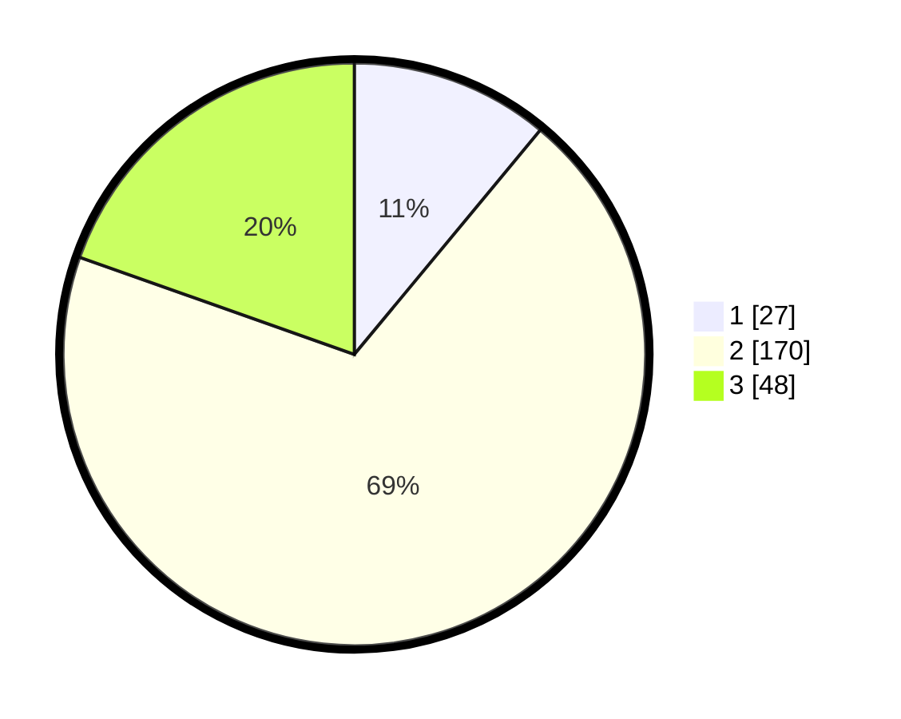

# Hasil

## Grafik

## Tabel

| No. | Nama Paslon    | Suara | Suara (raw) | Persentase |
|:--- |:-------------- | -----:| -----------:| ----------:|
| 1   | ANIES MUHAIMIN | 27    | [27][p-1]   | 11,02      |
| 2   | PRABOWO GIBRAN | 170   | [170][p-2]  | 69,39      |
| 3   | GANJAR MAHFUD  | 48    | [48][p-3]   | 19,59      |

[p-1]: https://github.com/gigit-pemilu/pemilu-2024/blob/main/pilpres/hitung-suara/sub/35-jawa-timur/sub/07-malang/sub/24-singosari/sub/2006-tunjungtirto/sub/025-tps/sub/paslon-1.txt
[p-2]: https://github.com/gigit-pemilu/pemilu-2024/blob/main/pilpres/hitung-suara/sub/35-jawa-timur/sub/07-malang/sub/24-singosari/sub/2006-tunjungtirto/sub/025-tps/sub/paslon-2.txt
[p-3]: https://github.com/gigit-pemilu/pemilu-2024/blob/main/pilpres/hitung-suara/sub/35-jawa-timur/sub/07-malang/sub/24-singosari/sub/2006-tunjungtirto/sub/025-tps/sub/paslon-3.txt

## Foto C Plano

https://sirekap-obj-formc.kpu.go.id/f1e8/pemilu/ppwp/35/07/24/20/06/3507242006025-20240214-201337--21043530-4f78-46b2-ba38-548ee140bf11.jpg

https://sirekap-obj-formc.kpu.go.id/f1e8/pemilu/ppwp/35/07/24/20/06/3507242006025-20240214-201433--3e427c97-e3c2-4c33-818d-cc1649a2ca60.jpg

https://sirekap-obj-formc.kpu.go.id/f1e8/pemilu/ppwp/35/07/24/20/06/3507242006025-20240214-201539--b9f145e4-d331-45b2-98d8-a696992f0b46.jpg

## Metadata

| Key        | Value               |
| ---------- | ------------------- |
| Time Stamp | 2024-02-17 18:30:00 |

